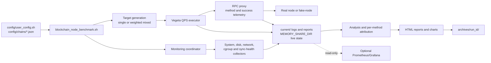

# Blockchain Node QPS Performance Benchmark Framework

[English](README.md) | [中文](README_ZH.md)

[](https://www.gnu.org/licenses/agpl-3.0)
[](COMMERCIAL.md)
[](https://www.python.org/downloads/)
[](https://www.gnu.org/software/bash/)

A production-oriented multi-chain blockchain node benchmark framework. It does
more than send RPC load: it generates chain-aware Vegeta workloads, routes
requests through a per-method proxy, collects system and node-health metrics,
measures its own monitoring overhead, produces HTML reports, archives every
run, and can optionally expose read-only Prometheus/Grafana telemetry.

## Architecture Overview



## 🎯 Key Features

- **36-chain template model**: chain support lives in `config/chains/*.json`,
  grouped by 6 RPC protocol families and backed by `tools/chain_adapters/`.
- **Custom RPC method extension**: `param_formats`, `_meta.rest_paths`, and
  optional `param_spec` let users add chain-specific methods with positional
  params, object params, REST path bindings, query values, or request bodies;
  validated methods can participate in weighted mixed workloads and
  per-method reporting.
- **Single or weighted mixed workloads**: users choose `single` or `mixed`;
  mixed mode uses `rpc_methods.mixed_weighted` from the selected chain template.
- **Per-method RPC attribution**: workload traffic passes through a proxy that
  records method, status, and latency, enabling method-level QPS, latency,
  error-rate, and resource-attribution reports.
- **Real sync-health model**: chain templates describe whether health is based
  on absolute height gap, conditional sync objects, reported lag, freshness, or
  boolean health signals.
- **Pluggable monitoring stack**: the coordinator starts unified system
  monitoring, provider-aware network monitoring, block-height/sync monitoring,
  cgroup collection, and real-time bottleneck detection.
- **Self-monitoring and observer-cost analysis**: the framework records
  monitoring CPU, memory, process count, I/O rate, and throughput so benchmark
  overhead is visible in reports.
- **Decoupled file lifecycle**: each run writes to `current/`, shares live state
  through `MEMORY_SHARE_DIR`, and archives durable outputs under `archives/`.
- **Deterministic fake-node closed-loop tests**: recorded fixtures let the
  framework validate request/response behavior without running all 36 real
  chain nodes.
- **Optional observability**: Prometheus/Grafana reads existing runtime
  artifacts through a read-only exporter and remains disabled by default.

For the full execution path, see [Framework Flow and Data Lifecycle](docs/en/framework-flow.md).

## 🚀 Quick Start

Use this path when you want to run the framework first and read the internals
afterwards.

### 1. Check Dependencies

Start with audit-only mode. It reports missing packages without changing your
machine:

```bash
bash scripts/install_deps.sh --check
```

Then install missing dependencies interactively:

```bash
bash scripts/install_deps.sh
```

For CI, Docker, or unattended Linux VMs:

```bash
bash scripts/install_deps.sh --yes
```

The installer checks system packages, Python packages, and Vegeta. It does not
edit project configuration, run benchmarks, touch Git state, or replace an
existing Vegeta binary. On externally-managed Python systems such as Debian 12+
or recent Ubuntu releases, it creates/uses a project `.venv` by default instead
of modifying system Python packages. Use `--system-python` only if you
explicitly want pip to use `--break-system-packages`.

### 2. Configure Required Runtime Values

Edit `config/user_config.sh` before running real benchmarks:

```bash
BLOCKCHAIN_NODE="solana"
RPC_MODE="single"
LOCAL_RPC_URL="http://localhost:8899"

BLOCKCHAIN_PROCESS_NAMES=(
    "agave-validator"
    "solana-validator"
    "validator"
)

CLOUD_PROVIDER="gcp"
CLOUD_REGION="us-central1"
MACHINE_TYPE="c3-standard-22"

LEDGER_DEVICE="sdb"
DATA_VOL_TYPE="hyperdisk-extreme"
DATA_VOL_MAX_IOPS="30000"
DATA_VOL_MAX_THROUGHPUT="700"
NETWORK_MAX_BANDWIDTH_GBPS=25
```

Use `ps aux`, `systemctl status`, your container runtime, and `lsblk` to verify
process and disk names. If these values do not match the host, reports can
still render but resource attribution may be misleading.

### 3A. Run on a VM or Bare-Metal Linux Host

```bash
./blockchain_node_benchmark.sh --quick
```

Use `screen` or `tmux` for standard and intensive runs because SSH disconnects
will otherwise stop the benchmark.

### 3B. Run Against a Kubernetes-Hosted Node

The benchmark entry script does not create Kubernetes monitoring resources.
Deploy and validate the collector first:

```bash
deploy/k8s/validate.sh --preflight
kubectl apply -f deploy/k8s/
kubectl rollout status -n blockchain-bench ds/blockchain-bench-collector
deploy/k8s/validate.sh --post-deploy
```

When the collector emits cgroup CSV rows, run the benchmark from your selected
runner with the same `config/user_config.sh` configuration:

```bash
./blockchain_node_benchmark.sh --quick
```

### 3C. Run a Local fake-node Closed Loop

Use fake-node when you want to validate chain templates, proxy extraction,
fixtures, per-method attribution, and HTML output without a real chain node.

See [Local closed-loop testing with fake-node](./docs/en/local-closed-loop-testing.md).

### 4. Find the Report

Current-run files are under the runtime `current/` directory. Durable results
are archived after the run. The key outputs are:

- `current/reports/performance_report_*.html`
- `current/logs/proxy_method.csv`
- `current/logs/performance_latest.csv`
- `archives/<run-id>/`

Prometheus/Grafana is disabled by default. Enable it only when you want the
optional read-only observability stack.


## ⚙️ Required Configuration

**Before running the framework**, you must configure the following parameters:
For the full configuration layer map and advanced options, see
[`config/README.md`](config/README.md).

### Required Configuration (in `config/user_config.sh`)

```bash
# 1. RPC Endpoint (Required)
LOCAL_RPC_URL="http://localhost:8899"  # Your blockchain node RPC endpoint
MAINNET_RPC_URL=""                     # Optional reference endpoint override; empty uses config/chains defaults

# 2. Blockchain Type (Required)
BLOCKCHAIN_NODE="solana"  # One of config/chains/*.json, e.g. solana, ethereum, bitcoin, cosmos-hub
RPC_MODE="single"         # Options: single | mixed

# 3. Blockchain Process Names (Required for monitoring)
BLOCKCHAIN_PROCESS_NAMES=(
    "agave-validator"    # Your actual blockchain node process name or command-line keyword
    "solana-validator"   # Add every possible name used by your deployment
    "validator"
)
# Check your process name with: ps aux | grep -i validator
```

`BLOCKCHAIN_PROCESS_NAMES` is the single user-facing node identity list. It is
used for monitoring attribution and also as systemd unit-name prefixes when
auto-detecting `DEPLOYMENT_MODE=vm_systemd`. Process names are
deployment-specific: Docker/Kubernetes deployments may expose container or pod
names, while VM deployments often use units such as `geth.service` or
`agave-validator.service`. If resource charts are empty or the runtime label is
wrong, check this list against `ps aux`, `systemctl status`, or your container
runtime. You can also set `DEPLOYMENT_MODE` explicitly.

### Cloud Disk and Machine Configuration (also in `config/user_config.sh`)

```bash
# 4. Cloud / Machine metadata for reports
CLOUD_PROVIDER="gcp"                  # Options: gcp | aws | azure | other
CLOUD_REGION="us-central1"            # Example: us-central1, ap-east-1
CLOUD_ZONE="us-central1-a"            # Optional outside GCP
MACHINE_TYPE="c3-standard-22"          # Example: c3-standard-22, m7i.4xlarge

# 5. DATA Device Configuration (Required)
LEDGER_DEVICE="sdb"                  # DATA device name (check with 'lsblk')
DATA_VOL_TYPE="hyperdisk-extreme"    # Examples: hyperdisk-extreme, hyperdisk-balanced, pd-ssd, gp3, io2, instance-store
DATA_VOL_MAX_IOPS="30000"            # Provisioned disk IOPS or equivalent baseline
DATA_VOL_MAX_THROUGHPUT="700"        # Provisioned disk throughput (MiB/s)

# 6. ACCOUNTS Device (Optional, but recommended for complete monitoring)
ACCOUNTS_DEVICE="sdc"                # Optional ACCOUNTS device name; leave empty for single-disk nodes
ACCOUNTS_VOL_TYPE="hyperdisk-extreme" # Examples: hyperdisk-extreme, hyperdisk-balanced, pd-ssd, gp3, io2, instance-store
ACCOUNTS_VOL_MAX_IOPS="30000"        # ACCOUNTS disk provisioned IOPS or equivalent baseline
ACCOUNTS_VOL_MAX_THROUGHPUT="700"    # ACCOUNTS disk throughput (MiB/s)

# 7. Network Configuration
NETWORK_MAX_BANDWIDTH_GBPS=25        # Your instance's network bandwidth (Gbps)
```

Some chains use optional auxiliary endpoints for indexers, REST/LCD APIs,
Substrate Sidecar, mirror nodes, or companion EVM/JSON-RPC routes. These are
configured in `config/user_config.sh` as `CHAIN_REST_URL`,
`CHAIN_INDEXER_URL`, `CHAIN_SIDECAR_URL`, `CHAIN_EVM_RPC_URL`,
`CHAIN_JSON_RPC_URL`, and `CHAIN_MIRROR_URL`. Leave them empty for fake-node
closed-loop tests and for chains whose selected methods all use `LOCAL_RPC_URL`.

Chain templates also include measured sample values such as `target_address`,
`target_tx_hash`, and `target_block_hash`. They can be overridden from
`config/user_config.sh` with `TARGET_ADDRESS`, `TARGET_TX_HASH`,
`TARGET_TXID`, `TARGET_BLOCK_HASH`, `TARGET_HEIGHT`, and related `TARGET_*`
variables. Leave them empty to use the template defaults.

**Quick Configuration Check:**
```bash
# Verify your blockchain process name
ps aux | grep -i validator
ps aux | grep -i agave

# Verify your data disks
lsblk

# Check your disk configuration:
# GCP: Compute Engine → Storage → Disks → select your disk
# AWS: EC2 → Volumes → select your volume
# - IOPS: provisioned IOPS value
# - Throughput: provisioned throughput value

# Check your instance network bandwidth:
# GCP: Compute Engine machine type docs or VM details
# AWS: EC2 → Instance Types → search your instance type → Networking
```

**Configuration File Locations:**
- `config/user_config.sh` - RPC endpoint, blockchain type, node process names, cloud metadata, disk devices, network bandwidth, monitoring intervals
- `config/config_loader.sh` - configuration loader, runtime detection, derived paths, and chain-template resolution
- `config/chains/*.json` - Per-chain RPC method templates, protocol family, parameter formats, and REST path mappings

Local fake-node closed-loop testing guide: [Local closed-loop testing and fake-node guide](docs/en/local-closed-loop-testing.md).

Kubernetes monitoring deployment for GKE, EKS, and self-managed clusters is
provided under [deploy/k8s](deploy/k8s/README.md). The repository validates the
manifests and K8s monitoring helpers with static and mocked tests, but live
cluster deployment depends on the operator's RBAC, admission policy, hostPath,
hostPID, and privileged-workload permissions.

**Note**: If you don't configure these parameters correctly, the framework will use default values which may not match your actual hardware, leading to inaccurate performance analysis.

## 🔌 Chain Templates, RPC Families, and Extension Model

The framework supports 36 chain templates under `config/chains/*.json`. Chains are grouped into protocol families by how requests are built and parsed:

| Family | Chains | Selection rule |
|---|---:|---|
| `jsonrpc` | 16 | Standard JSON-RPC 2.0 POST requests, method names in the body, positional/object params depending on the chain |
| `bitcoin_jsonrpc` | 4 | Bitcoin Core / UTXO-style JSON-RPC plus REST workarounds for public-node address queries |
| `rest` | 5 | REST-first chains where logical methods map to `_meta.rest_paths` |
| `substrate` | 5 | Polkadot SDK / Substrate RPC (`chain_*`, `state_*`, `system_*`) plus sidecar REST and EVM routing where needed |
| `tendermint` | 5 | Cosmos SDK / Tendermint / CometBFT REST-RPC paths, with EVM routing for hybrid chains |
| `hedera_dual` | 1 | Hedera Mirror REST and Hashio JSON-RPC Relay, routed per method |

This grouping is not based on chain brand, token, or ecosystem. It is based on the production request envelope, parameter shape, endpoint routing, authentication/header needs, response envelope, and block-height parser.

### How to Add a New Chain in an Existing Family

For the step-by-step operational guide, see [How to add a chain or RPC method](docs/en/how-to-add-chain.md).

If the new chain uses an existing RPC shape, add a chain template and record real fixtures:

1. Create `config/chains/<chain>.json`.
2. Set `_meta.adapter_family` to one of the 6 families.
3. Define `rpc_methods.single`, `rpc_methods.mixed`, and `rpc_methods.mixed_weighted`.
4. Define `param_formats.<method>` for common JSON-RPC-style methods.
5. For REST or sidecar paths, define `_meta.rest_paths.<method>`.
6. If a method needs explicit positional params, object fields, path bindings, query values, or a request body that existing formats cannot express, add `param_spec.<method>`.
7. Define `_meta.sync_health` so the monitor knows whether the chain uses block-height gap, reported lag, or freshness-only health.
8. Add real sample params under `params` using `${TARGET_*:-measured-default}` placeholders, such as `target_address`, `target_tx_hash`, `target_height`, `target_block_hash`, `target_storage_slot`, or method-specific samples.
9. Validate request construction, then record and verify fixtures:

```bash
python3 tools/chain_adapters/cli.py validate-template --chain <chain>

tools/fake-node/record_rpc_fixtures.sh <chain>

python3 tools/fake-node/check_fixture_coverage.py
```

### Example: Add an EVM-Compatible JSON-RPC Chain

```json
{
  "chain_type": "example-evm",
  "rpc_url": "LOCAL_RPC_URL",
  "param_formats": {
    "eth_getBalance": "address_latest",
    "eth_blockNumber": "no_params",
    "eth_getBlockByNumber": "block_number",
    "eth_call": "eth_call_object_latest"
  },
  "params": {
    "target_address": "${TARGET_ADDRESS:-0x0000000000000000000000000000000000000000}"
  },
  "rpc_methods": {
    "single": "eth_getBalance",
    "mixed": "eth_getBalance,eth_blockNumber,eth_getBlockByNumber,eth_call",
    "mixed_weighted": [
      {"method": "eth_getBalance", "weight": 40},
      {"method": "eth_blockNumber", "weight": 30},
      {"method": "eth_getBlockByNumber", "weight": 20},
      {"method": "eth_call", "weight": 10}
    ]
  },
  "_meta": {
    "adapter_family": "jsonrpc",
    "sync_health": {
      "mode": "absolute_gap",
      "local_probe": "adapter.health_check_request(local_rpc_url)",
      "target_probe": "adapter.health_check_request(mainnet_rpc_url)",
      "comparison": "target_minus_local",
      "threshold_env": "BLOCK_HEIGHT_DIFF_THRESHOLD",
      "time_threshold_env": "BLOCK_HEIGHT_TIME_THRESHOLD",
      "threshold_unit": "block",
      "notes": "Compare eth_blockNumber from local and target RPC endpoints."
    },
    "original_public_endpoints": [
      {"url": "https://example-rpc.invalid", "auth": false}
    ]
  }
}
```

### Example: Add a Method with Explicit Parameter Bindings

Use `param_spec` when a method cannot be represented clearly by a built-in
`param_formats` value. This keeps the request construction rule attached to the
specific `chain + method`, which avoids assuming two methods with the same
input names have the same request shape.

```json
{
  "param_spec": {
    "eth_getBalance": {
      "transport": "jsonrpc_list",
      "params": [
        {"source": "address"},
        {"literal": "latest"}
      ]
    },
    "example_getByHeight": {
      "transport": "jsonrpc_dict",
      "fields": {
        "height": {"source": "target_height", "type": "int"},
        "encoding": {"literal": "json"}
      }
    }
  }
}
```

Supported transports are `jsonrpc_list`, `jsonrpc_dict`, `rest_path`,
`rest_query`, and `rest_body`. Validate the template before running a benchmark:

```bash
python3 tools/chain_adapters/cli.py validate-template --chain <chain>
```

### Example: Add a REST Method to an Existing Chain

For a REST-style method, the method name is a logical key and `_meta.rest_paths` defines the actual HTTP request:

```json
{
  "param_formats": {
    "GET /v1/accounts/{addr}/transactions": "path_addr"
  },
  "rpc_methods": {
    "mixed": "GET /v1/accounts/{addr},GET /v1/accounts/{addr}/transactions",
    "mixed_weighted": [
      {"method": "GET /v1/accounts/{addr}", "weight": 70},
      {"method": "GET /v1/accounts/{addr}/transactions", "weight": 30}
    ]
  },
  "_meta": {
    "adapter_family": "rest",
    "sync_health": {
      "mode": "absolute_gap",
      "local_probe": "adapter.health_check_request(local_rpc_url)",
      "target_probe": "adapter.health_check_request(mainnet_rpc_url)",
      "comparison": "target_minus_local",
      "threshold_env": "BLOCK_HEIGHT_DIFF_THRESHOLD",
      "time_threshold_env": "BLOCK_HEIGHT_TIME_THRESHOLD",
      "threshold_unit": "block",
      "notes": "Compare the numeric height returned by the REST health probe."
    },
    "rest_paths": {
      "GET /v1/accounts/{addr}/transactions": {
        "method": "GET",
        "path": "/v1/accounts/{address}/transactions"
      }
    }
  }
}
```

### Sync Health Model

`block_height_monitor.sh` writes a memory JSON cache and CSV stream that are consumed by `bottleneck_detector.sh`, reports, and charts. Chain sync behavior is configured by `_meta.sync_health` in each chain template.

Supported modes:

- `absolute_gap`: both local and target RPC endpoints return numeric heights or slots; health is based on `target - local` and `BLOCK_HEIGHT_DIFF_THRESHOLD`.
- `conditional_gap`: a chain may return a sync object only while catching up; when it reports "not syncing", the node is treated as healthy.
- `reported_lag`: the local node reports its own lag value, such as slots behind.
- `freshness_only`: the probe returns a monotonic cursor or liveness signal, not a canonical block height; health is based on probe success and sustained unhealthy duration.
- `health_only`: only a boolean or coarse health result is available.

The framework intentionally reuses `BLOCK_HEIGHT_TIME_THRESHOLD` for sustained unhealthy states across all modes. New threshold variables should only be added when a chain exposes a genuinely different unit that cannot be mapped onto the existing diff/time model.

### RPC Method Matching and Response Fixtures

RPC matching is strict by `chain + method + fixture`, not by parameter name alone. Two methods may both accept `address` or `tx_hash`, but their response structures can be different. For that reason:

- `param_formats`, `_meta.rest_paths`, and optional `param_spec` define how the request is built.
- `tools/fake-node/record_rpc_fixtures.py` records the real request and response.
- `tools/fake-node/fixtures/<chain>/<fixture>.json` replays the chain-specific response.
- `tools/fake-node/validate_fixture_authenticity.py` can be run after local fixture recording to reject placeholders, HTTP errors, and JSON-RPC semantic errors.

If a new method fits an existing adapter's parameter formats, no Python or Go code is required. If it needs a new request envelope, new auth behavior, a new endpoint routing rule, or a new response-height parser, add or extend a `tools/chain_adapters/<family>.py` adapter and update fake-node method mapping.


## ▶️ Runtime Command Reference

### Choose Your Runtime Path

The framework has two deployment paths:

- **VM / bare metal / systemd Linux**: configure `config/user_config.sh`,
  install dependencies, then run `./blockchain_node_benchmark.sh --quick`.
  The entry script starts the benchmark, proxy, monitors, attribution, and
  report generation on the local machine.
- **GKE / EKS / self-managed Kubernetes**: the entry script does **not** create
  cluster resources for you. Before running benchmark traffic against a node in
  Kubernetes, deploy and verify the collector DaemonSet under
  [`deploy/k8s`](deploy/k8s/README.md), including its image, RBAC,
  `hostPath` mounts, `hostPID`, security context, and runtime path settings.
  After the collector is emitting cgroup CSV data, run the benchmark entry from
  your chosen runner with the normal `config/user_config.sh` settings.

Use the VM path for ordinary Linux hosts. Use the Kubernetes path only when the
blockchain node process or container is running inside a cluster and you need
node/container-level attribution.

### Prerequisites

The fastest way is to use the bundled dependency installer:

```bash
# Interactive install (asks before each step that needs sudo)
bash scripts/install_deps.sh

# Non-interactive (CI / Docker / unattended VMs)
bash scripts/install_deps.sh --yes

# Audit only — check what's missing without installing anything
bash scripts/install_deps.sh --check

# Show all flags
bash scripts/install_deps.sh --help
```

The installer covers:
- **System packages** (`sysstat bc jq net-tools procps python3-pip` plus Python venv/virtualenv support) — auto-detects apt/yum/dnf/apk and distro-specific package names
- **Python packages** (from `requirements.txt`) — uses an active virtualenv when present, creates a project `.venv` on PEP 668 systems, and only uses `--break-system-packages` when `--system-python` is explicitly provided
- **vegeta v12.12.0** — pinned version, SHA256 verified, installed to `~/bin/vegeta`

Supported distros: Ubuntu, Debian, RHEL, CentOS, Rocky, AlmaLinux, Amazon Linux, Fedora, Alpine.

<details>
<summary>Manual install (if you prefer step-by-step control)</summary>

```bash
# Install Vegeta v12.12.0 (QPS testing tool)
wget https://github.com/tsenart/vegeta/releases/download/v12.12.0/vegeta_12.12.0_linux_amd64.tar.gz
tar -xzf vegeta_12.12.0_linux_amd64.tar.gz
sudo mv vegeta /usr/local/bin/
vegeta -version  # Verify installation

# Debian/Ubuntu: install system monitoring tools
sudo apt-get install -y sysstat bc jq net-tools procps
# sysstat → iostat/mpstat/sar  |  bc → arithmetic in shell scripts
# jq → JSON parsing  |  net-tools → netstat  |  procps → ps/top

# Debian/Ubuntu: install Python and virtual environment support
sudo apt-get install python3 python3-venv

# CentOS/RHEL/Rocky/Alma/Amazon Linux:
# sudo yum install -y sysstat bc jq net-tools procps-ng python3-pip python3-virtualenv
# # or, on dnf-based systems:
# sudo dnf install -y sysstat bc jq net-tools procps-ng python3-pip python3-virtualenv

# Create virtual environment
python3 -m venv node-env

# Activate virtual environment
source node-env/bin/activate

# Check Python version (requires Python 3.8+)
python3 --version

# Install Python dependencies (from project root directory)
pip3 install -r requirements.txt
# Note: on Debian 12+ (PEP 668), if you skip the venv above, use:
#   pip3 install --user --break-system-packages -r requirements.txt

# Verify all tools are installed
which vegeta    # QPS testing tool
which iostat    # I/O monitoring tool
which mpstat    # CPU monitoring tool
which sar       # Network monitoring tool
```

</details>

### VM / Bare Metal Basic Usage

```bash
# Quick test (15+ minutes) - can run directly
./blockchain_node_benchmark.sh --quick

# Standard test (90+ minutes) - recommended to use screen
screen -S benchmark_$(date +%m%d_%H%M)
./blockchain_node_benchmark.sh --standard
# ⚠️ MUST press Ctrl+a then d to detach before closing SSH!

# Intensive test (up to 8 hours) - MUST use screen/tmux
screen -S benchmark_$(date +%m%d_%H%M)
./blockchain_node_benchmark.sh --intensive
# ⚠️ MUST press Ctrl+a then d to detach before closing SSH!
```

**⚠️ Critical**: For tests longer than 30 minutes, you **MUST**:
1. Use `screen` or `tmux` 
2. **Detach the session** (Ctrl+a, then d for screen) before closing SSH
3. Otherwise the test will stop when SSH disconnects!

See [Best Practices](#best-practices-for-long-running-tests) for detailed instructions.

### Kubernetes Basic Usage

For Kubernetes targets, complete the cluster-side monitoring setup first:

```bash
# 1. Confirm the target cluster and permissions.
kubectl config current-context
kubectl get nodes -o wide
kubectl auth can-i create daemonsets.apps --all-namespaces
kubectl auth can-i get nodes/proxy
# Or run: deploy/k8s/validate.sh --preflight

# 2. Build and push the collector image, or patch the DaemonSet image
#    to one already available in your registry.
docker build -t REGISTRY/blockchain-node-benchmark/collector:latest \
    -f deploy/k8s/Dockerfile .
docker push REGISTRY/blockchain-node-benchmark/collector:latest

# 3. Review deploy/k8s/03-configmap.yaml and deploy/k8s/04-daemonset.yaml.
#    Set DEPLOYMENT_MODE to k8s_gke, k8s_eks, or k8s_other as appropriate.

# 4. Apply the Kubernetes monitoring resources.
kubectl apply -f deploy/k8s/
kubectl rollout status -n blockchain-bench ds/blockchain-bench-collector
kubectl logs -f -n blockchain-bench ds/blockchain-bench-collector
# Or run: deploy/k8s/validate.sh --post-deploy
```

When the DaemonSet logs show the cgroup CSV header and periodic rows, run
`./blockchain_node_benchmark.sh --quick` or a longer benchmark from your
selected runner. The framework assumes your cluster operator has already
reviewed and approved the required Kubernetes permissions.

For the full command-by-command workflow, including what each step does and how
to verify readiness, see [Kubernetes Operator Runbook](deploy/k8s/README.md#kubernetes-operator-runbook).

### Custom Testing

```bash
# Custom intensive test with specific parameters
./blockchain_node_benchmark.sh --intensive \
    --initial-qps 1000 \
    --max-qps 10000 \
    --step-qps 500 \
    --duration 300 \
    --mixed  # Use mixed RPC method testing
```


## 📚 Documentation

Start with the current flow documents. These files describe the maintained
runtime path.

### Core Documentation

#### [Framework Flow and Data Lifecycle](./docs/en/framework-flow.md)
- Entry command to QPS execution, monitoring, analysis, report generation, and archive.
- Decoupled file lifecycle: `current/`, `archives/`, and `MEMORY_SHARE_DIR`.
- Pluggable monitoring, sync-health, per-method attribution, and observer-cost calculation.
- Optional Prometheus/Grafana flow and its read-only boundaries.

#### [Module Guide](./docs/en/module-guide.md)
- Responsibilities, inputs, outputs, and extension boundaries for each major module.
- Configuration, chain adapters, benchmark core, proxy, monitoring, analysis, reports, archive, fake-node, and observability.

#### [Configuration Layer Guide](./config/README.md)
- User-facing configuration in `config/user_config.sh`.
- Runtime path registry and generated file locations.
- Chain template format and environment overrides.

#### [Kubernetes Operator Runbook](./deploy/k8s/README.md)
- GKE, EKS, and self-managed Kubernetes monitoring deployment.
- Preflight checks, DaemonSet deployment, and post-deploy validation.

#### [Prometheus / Grafana Observability](./deploy/observability/README.md)
- Optional read-only exporter and local Prometheus/Grafana stack.
- Runtime artifact paths and dashboard startup/shutdown commands.

#### [GitHub PR Gates and Branch Protection](./docs/en/github-pr-gates.md)
- PR CI, CODEOWNERS, pull request template, and branch protection settings.
- What GitHub can validate automatically and what maintainers should smoke-test manually.

#### [Contributing](./CONTRIBUTING.md)
- Local validation commands by change type.
- Development, review, and public-repository hygiene rules.

#### Chain Extension and Closed-Loop Testing
- [How to add a chain or RPC method](./docs/en/how-to-add-chain.md)
- [Local closed-loop testing with fake-node](./docs/en/local-closed-loop-testing.md)

## ⚙️ Configuration Reference

The required runtime values are listed in
[Required Configuration](#-required-configuration). For the complete
configuration layer, defaults, and environment overrides, use
[Configuration Layer Guide](./config/README.md).

### Advanced Configuration

**Bottleneck Detection Thresholds** (`config/internal_config.sh`):
```bash
BOTTLENECK_CPU_THRESHOLD=85
BOTTLENECK_MEMORY_THRESHOLD=90
BOTTLENECK_DISK_UTIL_THRESHOLD=90
BOTTLENECK_DISK_LATENCY_THRESHOLD=50
NETWORK_UTILIZATION_THRESHOLD=80
```

**Monitoring Intervals** (`config/user_config.sh`):
```bash
MONITOR_INTERVAL=5              # Default monitoring interval (seconds)
HIGH_FREQ_INTERVAL=1            # High-frequency monitoring interval
ULTRA_HIGH_FREQ_INTERVAL=0.5    # Ultra-high-frequency monitoring interval
```


## 📊 Testing Modes

| Mode | Duration      | QPS Range       | Step Size | Use Case |
|------|---------------|-----------------|-----------|----------|
| **Quick** | 15+ minutes   | 1000-3000       | 500 QPS | Basic performance verification |
| **Standard** | 90+ minutes   | 20000-50000     | 500 QPS | Comprehensive performance evaluation |
| **Intensive** | Up to 8 hours | 50000-unlimited | 250 QPS | Intelligent bottleneck detection |


## 🔍 Monitoring Metrics

The monitoring system is file-contract based. The active CSV schema depends on
the selected provider, configured devices, runtime mode, and available cgroup
signals. Consumers read columns by name rather than assuming a fixed field
count.

Primary runtime files:

- `performance_<session>.csv`: unified system, disk, network, sync-health, QPS,
  cgroup, and provider marker data.
- `performance_latest.csv`: symlink to the active performance CSV, used by
  analysis and bottleneck detection.
- `monitoring_overhead_<session>.csv`: monitoring process cost, blockchain
  process cost, and system resource breakdown.
- `block_height_monitor_<session>.csv`: chain sync-health data, including height
  gap, reported lag, freshness, or health-only signals depending on the chain.
- `network_<session>.csv`: provider-aware network details for GCP gVNIC/virtio,
  AWS ENA, or generic Linux interfaces.
- `proxy_method.csv`: per-workload RPC method telemetry from the proxy,
  including HTTP transport success and RPC-level success/failure summaries
  without storing full response bodies.

The framework also writes short-lived JSON state under `MEMORY_SHARE_DIR` for
runtime decisions, including latest metrics, QPS status, bottleneck state, and
sync-health cache.

### Runtime Output Directory Layout

By default, all runtime artifacts are written under `blockchain-node-benchmark-result/`. You can override the base path with `BLOCKCHAIN_BENCHMARK_DATA_DIR`.

```text
blockchain-node-benchmark-result/
├── current/
│   ├── logs/
│   │   ├── performance_YYYYMMDD_HHMMSS.csv
│   │   ├── performance_latest.csv
│   │   ├── proxy_method.csv
│   │   ├── monitoring_overhead_YYYYMMDD_HHMMSS.csv
│   │   ├── block_height_monitor_YYYYMMDD_HHMMSS.csv
│   │   ├── network_YYYYMMDD_HHMMSS.csv
│   │   └── *.log
│   ├── reports/
│   │   ├── performance_report_<lang>_YYYYMMDD_HHMMSS.html
│   │   ├── *.png
│   │   ├── *.svg
│   │   └── per_method_charts/
│   ├── vegeta_results/
│   │   ├── vegeta_<qps>qps_YYYYMMDD_HHMMSS.json
│   │   └── vegeta_<qps>qps_YYYYMMDD_HHMMSS.txt
│   ├── tmp/
│   │   ├── targets_single.json
│   │   ├── targets_mixed.json
│   │   ├── qps_test_status
│   │   └── monitor_pids.txt
│   ├── error_logs/
│   └── python_errors/
└── archives/
```

Shared real-time state is stored separately in the memory-share directory, usually under `/dev/shm/blockchain-node-benchmark/` on Linux. These files are intentionally short-lived and are consumed by the runtime decision chain:

- `latest_metrics.json` and `unified_metrics.json`: latest system-monitor samples used by the QPS executor and bottleneck detector.
- `block_height_monitor_cache.json`: latest chain sync-health sample produced by `block_height_monitor.sh`.
- `block_height_time_exceeded.flag`: persistent sync-health failure flag after `BLOCK_HEIGHT_TIME_THRESHOLD`.
- `qps_status.json` and `bottleneck_status.json`: current QPS and bottleneck decision state.

### Bottleneck Detection

Bottleneck detection combines resource pressure, RPC quality, and node health:

- CPU, memory, disk, network, and provider NIC saturation are resource signals.
- RPC success rate, latency, and error rate determine whether the workload is
  actually degraded.
- Sync-health status prevents a resource-only signal from being misread when
  the node itself is behind, unhealthy, or stale.
- Sustained unhealthy states reuse `BLOCK_HEIGHT_TIME_THRESHOLD` where possible.


## 📈 Generated Reports

After each run, reports are generated under:

```text
blockchain-node-benchmark-result/current/reports/
blockchain-node-benchmark-result/archives/run_<number>_<session>/reports/
```

Typical outputs include:

- `performance_report_en_<timestamp>.html` - English HTML report
- `performance_report_zh_<timestamp>.html` - Chinese HTML report
- `*.png` charts generated from available current-run data
- `per_method_charts/` when proxy method data is available

### HTML Report Sections

The report is data-aware. Sections appear with real charts when upstream data is
available, and explain missing inputs when a local or Docker smoke test cannot
produce a given signal.

- **Configuration and Data Quality**: configured chain, cloud/provider metadata,
  machine type, devices, proxy records, and usable sample counts.
- **Performance Summary**: QPS, latency, success rate, and workload state.
- **System-Level Bottleneck Criteria**: resource pressure plus RPC quality and
  sync-health context.
- **Disk Performance**: provider-aware storage baselines, iostat samples,
  latency, utilization, normalized IOPS, and throughput.
- **Sync Health**: block-height gap, reported lag, freshness, or health-only
  status depending on chain capability.
- **Per-Method Attribution**: workload method QPS, latency, RPC failure rate,
  success/failure counts, and resource attribution. Sync-health probe methods
  are excluded.
- **Monitoring Overhead**: framework observer cost and comparison with the
  blockchain node process.
- **Chart Gallery**: charts generated from the current run, with notices for
  unavailable inputs.


## 📋 Usage Examples

### Example 1: Standard Performance Test
```bash
# Run standard test
./blockchain_node_benchmark.sh --standard

# View results
ls blockchain-node-benchmark-result/current/reports/
# performance_report_en_YYYYMMDD_HHMMSS.html
# performance_report_zh_YYYYMMDD_HHMMSS.html
# per_method_charts/
# ... charts generated from available data
```

### Example 2: Custom Intensive Test
```bash
# Custom intensive test with specific parameters
./blockchain_node_benchmark.sh --intensive \
    --initial-qps 2000 \
    --max-qps 15000 \
    --step-qps 1000 \
    --mixed  # Use mixed RPC method testing
```

### Example 3: Check System Status
```bash
# Check QPS testing engine status
./core/master_qps_executor.sh --status

# Check monitoring system status
./monitoring/monitoring_coordinator.sh status

# View test history
./tools/benchmark_archiver.sh --list
```


## 🚨 Troubleshooting

### Common Issues

#### 1. Dependencies Missing
```bash
# Audit only; makes no changes.
bash scripts/install_deps.sh --check

# Interactive install; asks before installing missing packages.
bash scripts/install_deps.sh
```

#### 2. Network Interface Detection Issues
```bash
# Check detected network interface
echo $NETWORK_INTERFACE

# List all network interfaces
ip link show

# Manually specify network interface if auto-detection fails
export NETWORK_INTERFACE="eth0"    # Replace with your interface name
# Or add to config/user_config.sh:
# NETWORK_INTERFACE="eth0"

# Common interface names:
# - GCP: ens4, eth0, gve-backed interfaces depending on image/machine family
# - AWS: eth0, ens5
# - Other clouds: eth0, ens3
# - Local: eth0, enp0s3, wlan0
```

#### 3. Missing System Monitoring Tools
```bash
# Preferred: use the dependency checker.
bash scripts/install_deps.sh --check

# Manual examples:
sudo apt-get install sysstat  # Ubuntu/Debian
sudo yum install sysstat      # CentOS/RHEL
```

#### 4. Python Dependencies Issues
```bash
# Preferred: use the dependency checker.
bash scripts/install_deps.sh --check

# If you use the project virtualenv:
source .venv/bin/activate
pip install -r requirements.txt

# Check specific packages
python3 -c "import matplotlib, pandas, numpy; print('All packages OK')"
```

#### 5. Permission Issues
```bash
# Grant execution permissions
chmod +x blockchain_node_benchmark.sh
chmod +x core/master_qps_executor.sh
chmod +x monitoring/monitoring_coordinator.sh
```

### Log File Locations

All logs are stored in `blockchain-node-benchmark-result/current/logs/`:

- **QPS Test Log**: `master_qps_executor.log` - QPS test progress and results
- **Monitoring Log**: `unified_monitor.log` - System monitoring data
- **Bottleneck Detection**: `bottleneck_detector.log` - Bottleneck detection events
- **Disk Analysis**: `disk_bottleneck_detector.log` - Disk performance analysis
- **Performance Data**: `performance_YYYYMMDD_HHMMSS.csv` - Unified performance metrics; schema varies by provider, devices, runtime mode, and available collectors
- **Monitoring Overhead**: `monitoring_overhead_YYYYMMDD_HHMMSS.csv` - Monitoring process cost, blockchain process cost, and system resource breakdown
- **Provider-Aware Network**: `network_YYYYMMDD_HHMMSS.csv` - NIC metrics with GCP gVNIC, GCP virtio, AWS ENA, or generic fallback fields
- **Block Height / Sync Health Monitor**: `block_height_monitor_YYYYMMDD_HHMMSS.csv` - Chain sync-health data; records height gap, reported lag, freshness, or health-only signals depending on chain capability

### Viewing Test Progress

If your terminal disconnects during testing, you can reconnect and view progress:

```bash
# View QPS test progress in real-time
tail -f blockchain-node-benchmark-result/current/logs/master_qps_executor.log

# Check current test status
ps aux | grep vegeta | grep -v grep

# View latest performance data
tail -20 blockchain-node-benchmark-result/current/logs/performance_latest.csv

# Check if bottleneck detected
cat /dev/shm/blockchain-node-benchmark/bottleneck_status.json | jq '.'

# View completed test results
ls -lt blockchain-node-benchmark-result/current/vegeta_results/ | head -10
```

### After Test Completion

Once testing is complete, all results are archived:

```bash
# View archived results
ls -lt blockchain-node-benchmark-result/archives/

# Access a specific test run
cd blockchain-node-benchmark-result/archives/run_001_YYYYMMDD_HHMMSS/

# View logs
cat logs/master_qps_executor.log

# On a Linux desktop host:
xdg-open reports/performance_report_en_*.html

# On a server:
# download reports/performance_report_en_*.html and open it locally.
```

### Best Practices for Long-Running Tests

**⚠️ CRITICAL**: To prevent SSH disconnection from stopping your test, you **MUST** use one of these methods:

#### Method 1: Use screen (Recommended)

```bash
# Step 1: Create screen session with unique name
screen -S benchmark_$(date +%m%d_%H%M)
# Example: benchmark_1030_2200

# Step 2: Start test
./blockchain_node_benchmark.sh --intensive

# Step 3: ⚠️ IMPORTANT - Detach before closing SSH
# Press: Ctrl+a, then press d
# You should see: [detached from xxx.benchmark_1030_2200]

# Step 4: Now you can safely close SSH
exit

# Step 5: Reconnect anytime
# List all screen sessions
screen -ls

# Reconnect to specific session
# If shows "(Detached)" - use simple reconnect:
screen -r benchmark_1030_2200
# Or use PID:
screen -r 12345

# If shows "(Attached)" - use force reconnect:
screen -d -r 12345
# This detaches any existing connection and reconnects you
```

**Common Issues:**

```bash
# Problem: Multiple sessions with same name
screen -ls
# Shows: 13813.benchmark, 19327.benchmark, 54872.benchmark

# Solution 1: Use PID to reconnect to latest
screen -r 13813

# Solution 2: Clean up old sessions
screen -X -S 19327 quit
screen -X -S 54872 quit

# Solution 3: Kill all and start fresh
killall screen
```

**Why detach is critical**: If you close SSH without detaching, the test will stop!

#### Method 2: Use tmux

```bash
# Step 1: Create tmux session
tmux new -s benchmark

# Step 2: Start test
./blockchain_node_benchmark.sh --intensive

# Step 3: ⚠️ IMPORTANT - Detach before closing SSH
# Press: Ctrl+b, then press d

# Step 4: Reconnect anytime
tmux attach -t benchmark
```

#### Method 3: Use nohup
```
nohup ./blockchain_node_benchmark.sh --intensive > test.log 2>&1 &
# View progress: tail -f test.log
```


## 🔧 Advanced Features

### Test Result Archiving
```bash
# List historical tests
./tools/benchmark_archiver.sh --list

# Compare test results
./tools/benchmark_archiver.sh --compare run_001_YYYYMMDD_HHMMSS run_002_YYYYMMDD_HHMMSS

# Clean up old tests
./tools/benchmark_archiver.sh --cleanup --keep 10
```

### Custom Analysis
```bash
# Most users should start from the generated HTML report.
ls blockchain-node-benchmark-result/current/reports/

# Optional: validate the latest archived run.
./tools/framework_data_quality_checker.sh
```

### Batch Testing
```bash
# Run multiple test modes
for mode in quick standard intensive; do
    echo "Running $mode test..."
    ./blockchain_node_benchmark.sh --$mode
    sleep 60  # Wait for system recovery
done
```


## 🤝 Contributing

We welcome contributions! By contributing to this project, you agree to the following:

### Contributor License Terms

By submitting a pull request, you agree that:
- Your contributions may be licensed under AGPL 3.0 or later and under the project's commercial licensing terms
- You grant the project maintainers the right to use and sublicense your contributions in commercial versions
- You have the right to submit the contributions (no third-party IP conflicts)

### Development Environment Setup
```bash
# Clone the repository
git clone <repository-url>
cd blockchain-node-benchmark

# Install development dependencies
pip3 install -r requirements.txt

# Verify installation
python3 --version
bash --version
```

### Contribution Guidelines

1. **Fork and Branch**: Create a feature branch from `main`
2. **Code Style**: Follow PEP 8 for Python, use shellcheck for bash scripts
3. **Documentation**: Update relevant documentation
4. **Commit Messages**: Use clear, descriptive commit messages
5. **Pull Request**: Submit PR with detailed description

### Adding New Monitoring Metrics
1. Prefer a sidecar/exporter or a focused collector module when the metric does not need to become part of the benchmark CSV contract.
2. If the metric must be persisted in `performance_*.csv`, update the CSV registry and the writer path together.
3. Add contract tests for row width, required fields, and report behavior before changing runtime monitoring.
4. Add corresponding analysis and visualization logic only after the runtime data contract is stable.

### Questions?

Open an issue with the `question` label for any contribution-related questions.


## 📄 License

This project is dual-licensed:

### Open Source License (AGPL 3.0 or later)
- Commercial and non-commercial use are allowed under AGPL terms
- If you modify, distribute, or provide network access to the software, follow the AGPL source-disclosure requirements
- See [LICENSE](LICENSE) for full terms

### Commercial Licensing Option
- Available for proprietary use cases that need terms different from the AGPL
- Closed-source integration allowed
- No AGPL obligations under a separate written commercial agreement
- Enterprise support available
- See [COMMERCIAL.md](COMMERCIAL.md) for details

**Contact:** Open a GitHub Issue with label `commercial-license` for commercial licensing inquiries
