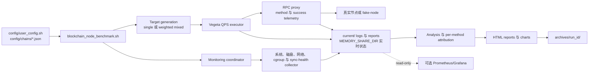

# 区块链节点 QPS 性能基准测试框架

[English](README.md) | [中文](README_ZH.md)

[](https://www.gnu.org/licenses/agpl-3.0)
[](COMMERCIAL.md)
[](https://www.python.org/downloads/)
[](https://www.gnu.org/software/bash/)

一个面向生产环境的多链区块链节点性能基准测试框架。它不只是发送 RPC
压测流量，还会生成 chain-aware Vegeta workload，通过 proxy 记录每个 RPC
method 的表现，采集系统与节点健康指标，统计监控系统自身开销，生成 HTML
报告，归档每次运行，并可选通过 Prometheus/Grafana 暴露只读观测数据。

## 架构概览



## 🎯 核心特性

- **36 链模板模型**：链支持集中在 `config/chains/*.json`，按 6 个 RPC
  protocol family 归类，并由 `tools/chain_adapters/` 生成真实请求。
- **自定义 RPC method 扩展**：通过 `param_formats`、`_meta.rest_paths` 和
  可选 `param_spec`，用户可以新增带位置参数、对象参数、REST path 绑定、
  query 参数或 request body 的链特定 method；验证通过后可参与 weighted
  mixed workload 和 per-method 报告。
- **Single 或 weighted mixed workload**：用户选择 `single` 或 `mixed`；
  mixed 模式读取 chain template 中的 `rpc_methods.mixed_weighted`。
- **Per-method RPC 归因**：workload 流量经过 proxy，记录 method、status、
  request-to-response latency，用于生成 method 级 QPS、P50/P90/P99 延迟、
  错误率、成功/失败请求数和资源归因。
- **真实 sync-health 模型**：chain template 声明该链使用高度差、条件同步对象、
  节点自报 lag、freshness 或 boolean health 信号。
- **可插拔监控栈**：coordinator 统一启动系统监控、provider-aware 网络监控、
  block-height/sync-health、cgroup 采集和实时瓶颈检测。
- **自我监控与 observer-cost 分析**：框架会记录监控系统自身 CPU、内存、
  进程数量、I/O rate 和吞吐量，让 benchmark 开销在报告中可见。
- **解耦文件生命周期**：每次运行写入 `current/`，通过 `MEMORY_SHARE_DIR`
  共享实时状态，并将最终结果归档到 `archives/`。
- **fake-node 确定性闭环测试**：通过录制 fixture 验证 36 链请求/响应行为，
  不需要同时部署所有真实节点。
- **可选观测出口**：Prometheus/Grafana 通过只读 exporter 读取运行产物，
  默认关闭。

完整执行链路见：[框架流程与数据生命周期](docs/zh/framework-flow.md)。

## 🚀 快速开始

如果你想先把框架跑起来，再阅读内部设计，按下面顺序执行。

### 1. 检查依赖

先使用只检查模式。它只报告缺失依赖，不会修改机器环境：

```bash
bash scripts/install_deps.sh --check
```

然后使用交互模式安装缺失依赖：

```bash
bash scripts/install_deps.sh
```

CI、Docker 或无人值守 Linux VM 可以使用：

```bash
bash scripts/install_deps.sh --yes
```

该脚本会检查系统包、Python 包和 Vegeta。它不会修改项目配置、不会运行
benchmark、不会触碰 Git 状态，也不会替换已有 Vegeta 二进制。在 Debian 12+
或较新的 Ubuntu 这类 externally-managed Python 系统上，脚本默认创建/使用
项目 `.venv`，避免修改系统 Python 包。只有当你明确希望 pip 使用
`--break-system-packages` 时，才使用 `--system-python`。

### 2. 配置必需运行参数

运行真实 benchmark 前，编辑 `config/user_config.sh`：

```bash
BLOCKCHAIN_NODE="solana"
RPC_MODE="single"
LOCAL_RPC_URL="http://localhost:8899"

BLOCKCHAIN_PROCESS_NAMES=(
    "agave-validator"
    "solana-validator"
    "validator"
)

CLOUD_PROVIDER="gcp"
CLOUD_REGION="us-central1"
MACHINE_TYPE="c3-standard-22"

LEDGER_DEVICE="sdb"
DATA_VOL_TYPE="hyperdisk-extreme"
DATA_VOL_MAX_IOPS="30000"
DATA_VOL_MAX_THROUGHPUT="700"
NETWORK_MAX_BANDWIDTH_GBPS=25
```

请用 `ps aux`、`systemctl status`、容器运行时和 `lsblk` 确认进程名与磁盘名。
如果这些值和真实主机不匹配，报告仍可能生成，但资源归因会不准确。

### 3A. 在 VM 或裸机 Linux 主机运行

```bash
./blockchain_node_benchmark.sh --quick
```

标准测试和密集测试建议使用 `screen` 或 `tmux`，否则 SSH 断开会终止 benchmark。

### 3B. 对 Kubernetes 中的节点运行

benchmark 入口脚本不会自动创建 Kubernetes 监控资源。请先部署并验证 collector：

```bash
deploy/k8s/validate.sh --preflight
kubectl apply -f deploy/k8s/
kubectl rollout status -n blockchain-bench ds/blockchain-bench-collector
deploy/k8s/validate.sh --post-deploy
```

当 collector 开始持续输出 cgroup CSV 数据行后，再从选定的 runner 使用同一份
`config/user_config.sh` 配置运行 benchmark：

```bash
./blockchain_node_benchmark.sh --quick
```

### 3C. 运行本地 fake-node 闭环

如果你想在没有真实区块链节点的情况下验证 chain template、proxy extraction、
fixture、per-method attribution 和 HTML 输出，请使用 fake-node。

见：[使用 fake-node 进行本地闭环测试](./docs/zh/local-closed-loop-testing.md)。

### 4. 查看报告

当前运行文件位于 runtime `current/` 目录，最终结果会在运行结束后归档。关键输出：

- `current/reports/performance_report_*.html`
- `current/logs/proxy_method.csv`
- `current/logs/performance_latest.csv`
- `archives/<run-id>/`

Prometheus/Grafana 默认关闭。只有需要可选只读观测栈时再开启。


## ⚙️ 必需配置

**在运行框架之前**，您必须配置以下参数：
完整配置层级和高级选项说明请查看
[`config/README.md`](config/README.md)。

### 必需配置（在 `config/user_config.sh` 中）

```bash
# 1. RPC 端点（必需）
LOCAL_RPC_URL="http://localhost:8899"  # 您的区块链节点 RPC 端点
MAINNET_RPC_URL=""                     # 可选主网参考端点覆盖；留空则使用 config/chains 默认值

# 2. 区块链类型（必需）
BLOCKCHAIN_NODE="solana"  # config/chains/*.json 中的链名，例如 solana、ethereum、bitcoin、cosmos-hub
RPC_MODE="single"         # 选项：single | mixed

# 3. 区块链进程名称（监控必需）
BLOCKCHAIN_PROCESS_NAMES=(
    "agave-validator"    # 您实际的区块链节点进程名或命令行关键字
    "solana-validator"   # 添加当前部署中所有可能出现的名称
    "validator"
)
# 使用以下命令检查您的进程名称：ps aux | grep -i validator
```

`BLOCKCHAIN_PROCESS_NAMES` 是唯一需要用户维护的节点身份列表。它用于监控
归因，也会作为 systemd unit 前缀用于自动识别 `DEPLOYMENT_MODE=vm_systemd`。
进程名和部署方式强相关：Docker/Kubernetes 环境中可能看到 container 或 pod
名称，VM 环境中常见 `geth.service` 或 `agave-validator.service`。如果报告中的
资源图表为空，或 runtime label 不正确，优先检查这里是否匹配真实的
`ps aux`、`systemctl status` 或容器运行时输出；也可以显式设置
`DEPLOYMENT_MODE`。

### 云磁盘与机器配置（同样在 `config/user_config.sh` 中）

```bash
# 4. 云厂商 / 机器信息（用于报告展示）
CLOUD_PROVIDER="gcp"                  # 选项：gcp | aws | azure | other
CLOUD_REGION="us-central1"            # 示例：us-central1、ap-east-1
CLOUD_ZONE="us-central1-a"            # 非 GCP 环境可留空
MACHINE_TYPE="c3-standard-22"          # 示例：c3-standard-22、m7i.4xlarge

# 5. DATA 设备配置（必需）
LEDGER_DEVICE="sdb"                  # DATA 设备名称（使用 'lsblk' 检查）
DATA_VOL_TYPE="hyperdisk-extreme"    # 示例：hyperdisk-extreme、hyperdisk-balanced、pd-ssd、gp3、io2、instance-store
DATA_VOL_MAX_IOPS="30000"            # 预配置磁盘 IOPS 或等效基线
DATA_VOL_MAX_THROUGHPUT="700"        # 预配置磁盘吞吐量（MiB/s）

# 6. ACCOUNTS 设备（可选，但建议配置以进行完整监控）
ACCOUNTS_DEVICE="sdc"                # 可选 ACCOUNTS 设备名称；单盘节点可留空
ACCOUNTS_VOL_TYPE="hyperdisk-extreme" # 示例：hyperdisk-extreme、hyperdisk-balanced、pd-ssd、gp3、io2、instance-store
ACCOUNTS_VOL_MAX_IOPS="30000"        # ACCOUNTS 磁盘 IOPS 或等效基线
ACCOUNTS_VOL_MAX_THROUGHPUT="700"    # ACCOUNTS 磁盘吞吐量（MiB/s）

# 7. 网络配置
NETWORK_MAX_BANDWIDTH_GBPS=25        # 您的实例网络带宽（Gbps）
```

部分链的某些方法会使用可选辅助端点，例如 indexer、REST/LCD API、
Substrate Sidecar、mirror node 或 companion EVM/JSON-RPC route。这些变量
统一在 `config/user_config.sh` 中配置：`CHAIN_REST_URL`、
`CHAIN_INDEXER_URL`、`CHAIN_SIDECAR_URL`、`CHAIN_EVM_RPC_URL`、
`CHAIN_JSON_RPC_URL`、`CHAIN_MIRROR_URL`。fake-node 本地闭环测试时请保持
为空；如果当前链和当前方法全部走 `LOCAL_RPC_URL`，也不需要配置。

chain template 中也保留了实测样本值，例如 `target_address`、
`target_tx_hash`、`target_block_hash`。如果需要替换为您自己节点上的真实
样本，可以在 `config/user_config.sh` 中配置 `TARGET_ADDRESS`、
`TARGET_TX_HASH`、`TARGET_TXID`、`TARGET_BLOCK_HASH`、`TARGET_HEIGHT` 等
`TARGET_*` 变量。留空则使用模板默认值。

**快速配置检查：**
```bash
# 验证您的区块链进程名称
ps aux | grep -i validator
ps aux | grep -i agave

# 验证您的数据磁盘
lsblk

# 检查您的磁盘配置：
# GCP：Compute Engine → Storage → Disks → 选择对应磁盘
# AWS：EC2 → Volumes → 选择对应卷
# - IOPS：预配置 IOPS 值
# - 吞吐量：预配置吞吐量值

# 检查您的实例网络带宽：
# GCP：查看 Compute Engine machine type 文档或 VM 详情
# AWS：EC2 → Instance Types → 搜索实例类型 → Networking
```

**配置文件位置：**
- `config/user_config.sh` - RPC 端点、区块链类型、节点进程名称、云厂商信息、磁盘设备、网络带宽、监控间隔
- `config/config_loader.sh` - 配置加载器、运行时探测、派生路径和 chain template 解析
- `config/chains/*.json` - 每条链的 RPC method 模板、协议 family、参数格式和 REST path 映射

本地 fake-node 闭环测试手册：[本地闭环测试与 fake-node 使用指南](docs/zh/local-closed-loop-testing.md)。

GKE、EKS 和自建 Kubernetes 集群的监控部署入口位于
[deploy/k8s](deploy/k8s/README.md)。仓库内已通过静态测试和 mock API 测试验证
manifest 与 K8s 监控 helper，但真实集群部署仍取决于使用者自己的 RBAC、
admission policy、hostPath、hostPID 和 privileged workload 权限配置。

**注意**：如果您没有正确配置这些参数，框架将使用默认值，这可能与您的实际硬件不匹配，导致性能分析不准确。

## 🔌 Chain Template、RPC Family 与扩展模型

框架当前通过 `config/chains/*.json` 支持 36 个 chain template。链不是按品牌、token 或生态归类，而是按真实 RPC 请求与解析方式归入 6 个 family：

| Family | 链数量 | 判断依据 |
|---|---:|---|
| `jsonrpc` | 16 | 标准 JSON-RPC 2.0 POST，请求体包含 method，params 按链使用数组或对象 |
| `bitcoin_jsonrpc` | 4 | Bitcoin Core / UTXO 风格 JSON-RPC，公共节点不支持的 address 查询使用 REST workaround |
| `rest` | 5 | REST 为主，逻辑 method 通过 `_meta.rest_paths` 映射到 HTTP path/body |
| `substrate` | 5 | Polkadot SDK / Substrate RPC，如 `chain_*`、`state_*`、`system_*`，必要时路由到 sidecar REST 或 EVM RPC |
| `tendermint` | 5 | Cosmos SDK / Tendermint / CometBFT REST-RPC 路径，混合 EVM 链按 method 路由 |
| `hedera_dual` | 1 | Hedera 特殊双协议：Mirror REST + Hashio JSON-RPC Relay |

也就是说，family 的判断标准是：请求 envelope、参数结构、endpoint 路由、认证/header、响应 envelope、区块高度解析方式是否一致。

### 如何在现有 family 内新增一条链

完整实操手册见：[如何新增区块链或 RPC Method](docs/zh/how-to-add-chain.md)。

如果新链的 RPC 形态属于现有 family，通常只需要新增配置并录制真实 fixture：

1. 新建 `config/chains/<chain>.json`。
2. 设置 `_meta.adapter_family` 为 6 个 family 之一。
3. 配置 `rpc_methods.single`、`rpc_methods.mixed`、`rpc_methods.mixed_weighted`。
4. 对常见 JSON-RPC 类 method，配置 `param_formats.<method>`。
5. 对 REST 或 sidecar method，配置 `_meta.rest_paths.<method>`。
6. 如果 method 需要显式声明位置参数、对象字段、path 绑定、query 参数或 request body，并且现有格式无法表达，配置 `param_spec.<method>`。
7. 配置 `_meta.sync_health`，声明该链使用区块高度差、节点自报 lag，还是只能使用 freshness/health 信号。
8. 在 `params` 中使用 `${TARGET_*:-measured-default}` 形式准备真实样本，例如 `target_address`、`target_tx_hash`、`target_height`、`target_block_hash`、`target_storage_slot`。
9. 先验证请求构造，再录制并验证：

```bash
python3 tools/chain_adapters/cli.py validate-template --chain <chain>

tools/fake-node/record_rpc_fixtures.sh <chain>

python3 tools/fake-node/check_fixture_coverage.py
```

### 示例：新增一条 EVM-compatible JSON-RPC 链

```json
{
  "chain_type": "example-evm",
  "rpc_url": "LOCAL_RPC_URL",
  "param_formats": {
    "eth_getBalance": "address_latest",
    "eth_blockNumber": "no_params",
    "eth_getBlockByNumber": "block_number",
    "eth_call": "eth_call_object_latest"
  },
  "params": {
    "target_address": "${TARGET_ADDRESS:-0x0000000000000000000000000000000000000000}"
  },
  "rpc_methods": {
    "single": "eth_getBalance",
    "mixed": "eth_getBalance,eth_blockNumber,eth_getBlockByNumber,eth_call",
    "mixed_weighted": [
      {"method": "eth_getBalance", "weight": 40},
      {"method": "eth_blockNumber", "weight": 30},
      {"method": "eth_getBlockByNumber", "weight": 20},
      {"method": "eth_call", "weight": 10}
    ]
  },
  "_meta": {
    "adapter_family": "jsonrpc",
    "sync_health": {
      "mode": "absolute_gap",
      "local_probe": "adapter.health_check_request(local_rpc_url)",
      "target_probe": "adapter.health_check_request(mainnet_rpc_url)",
      "comparison": "target_minus_local",
      "threshold_env": "BLOCK_HEIGHT_DIFF_THRESHOLD",
      "time_threshold_env": "BLOCK_HEIGHT_TIME_THRESHOLD",
      "threshold_unit": "block",
      "notes": "比较 local 和 target RPC endpoint 返回的 eth_blockNumber。"
    },
    "original_public_endpoints": [
      {"url": "https://example-rpc.invalid", "auth": false}
    ]
  }
}
```

### 示例：使用显式参数绑定新增 method

当内置 `param_formats` 不能清晰表达某个 method 的参数结构时，使用
`param_spec`。这样请求构造规则会绑定到具体的 `chain + method`，不会因为
两个 method 都使用 `address` 或 `tx_hash` 就误认为它们有相同请求结构。

```json
{
  "param_spec": {
    "eth_getBalance": {
      "transport": "jsonrpc_list",
      "params": [
        {"source": "address"},
        {"literal": "latest"}
      ]
    },
    "example_getByHeight": {
      "transport": "jsonrpc_dict",
      "fields": {
        "height": {"source": "target_height", "type": "int"},
        "encoding": {"literal": "json"}
      }
    }
  }
}
```

支持的 transport 包括 `jsonrpc_list`、`jsonrpc_dict`、`rest_path`、
`rest_query`、`rest_body`。压测前先验证模板：

```bash
python3 tools/chain_adapters/cli.py validate-template --chain <chain>
```

### 示例：给现有 REST 链新增一个 RPC method

REST 类 method 的名字可以是逻辑 key，真实 HTTP 请求由 `_meta.rest_paths` 定义：

```json
{
  "param_formats": {
    "GET /v1/accounts/{addr}/transactions": "path_addr"
  },
  "rpc_methods": {
    "mixed": "GET /v1/accounts/{addr},GET /v1/accounts/{addr}/transactions",
    "mixed_weighted": [
      {"method": "GET /v1/accounts/{addr}", "weight": 70},
      {"method": "GET /v1/accounts/{addr}/transactions", "weight": 30}
    ]
  },
  "_meta": {
    "adapter_family": "rest",
    "sync_health": {
      "mode": "absolute_gap",
      "local_probe": "adapter.health_check_request(local_rpc_url)",
      "target_probe": "adapter.health_check_request(mainnet_rpc_url)",
      "comparison": "target_minus_local",
      "threshold_env": "BLOCK_HEIGHT_DIFF_THRESHOLD",
      "time_threshold_env": "BLOCK_HEIGHT_TIME_THRESHOLD",
      "threshold_unit": "block",
      "notes": "比较 REST health probe 返回的数值高度。"
    },
    "rest_paths": {
      "GET /v1/accounts/{addr}/transactions": {
        "method": "GET",
        "path": "/v1/accounts/{address}/transactions"
      }
    }
  }
}
```

### Sync Health 模型

`block_height_monitor.sh` 会写入内存 JSON cache 和 CSV，供 `bottleneck_detector.sh`、报告和图表消费。每条链如何解释同步健康信号，以 chain template 中的 `_meta.sync_health` 为准。

支持的模式：

- `absolute_gap`：本地节点和 target/mainnet endpoint 都返回数值高度或 slot，使用 `target - local` 与 `BLOCK_HEIGHT_DIFF_THRESHOLD` 判断。
- `conditional_gap`：只有节点正在同步时才返回同步对象；如果返回“未同步中 / not syncing”，视为当前健康。
- `reported_lag`：本地节点直接返回自己的 lag 值，例如落后多少 slot。
- `freshness_only`：probe 返回的是单调游标或 liveness 信号，不是严格区块高度；主要根据 probe 成功与持续不健康时间判断。
- `health_only`：只能获取 boolean 或粗粒度健康状态。

框架会尽量复用已有的 `BLOCK_HEIGHT_TIME_THRESHOLD` 来判断“持续不健康”。只有当某条链暴露了完全无法映射到现有 diff/time 语义的新单位时，才应该新增阈值变量。

### RPC method 与响应结构如何匹配

框架不是只按参数名匹配响应，也不会认为“都传 `tx_hash` 就能共用响应”。匹配粒度是 `chain + method + fixture`：

- `param_formats`、`_meta.rest_paths` 和可选的 `param_spec` 决定请求如何构造。
- `tools/fake-node/record_rpc_fixtures.py` 记录真实 request/response。
- `tools/fake-node/fixtures/<chain>/<fixture>.json` 保存并回放对应链、对应 method 的真实响应。
- `tools/fake-node/validate_fixture_authenticity.py` 可在本地重新录制 fixture evidence 后运行，用于拒绝 placeholder、HTTP 错误和 JSON-RPC 语义错误。

如果新增 method 的参数格式现有 adapter 已能表达，则通常不需要改 Python 或 Go。如果它需要新的请求 envelope、新认证方式、新 endpoint 路由规则，或新的区块高度解析方式，就需要扩展 `tools/chain_adapters/<family>.py` 和 fake-node 的 method 映射。


## ▶️ 运行命令参考

### 选择运行路径

框架有两种部署路径：

- **VM / 裸机 / systemd Linux**：配置 `config/user_config.sh`，安装依赖，
  然后运行 `./blockchain_node_benchmark.sh --quick`。入口脚本会在本机启动
  benchmark、proxy、monitor、per-method attribution 和报告生成。
- **GKE / EKS / 自建 Kubernetes**：入口脚本**不会**自动创建集群资源。
  如果目标区块链节点运行在 Kubernetes 中，需要先部署并验证
  [`deploy/k8s`](deploy/k8s/README.md) 下的 collector DaemonSet，包括镜像、
  RBAC、`hostPath`、`hostPID`、security context 和 runtime path 配置。
  当 collector 已经可以持续输出 cgroup CSV 数据后，再从选定的 runner
  按正常方式配置 `config/user_config.sh` 并运行 benchmark 入口。

普通 Linux 主机使用 VM 路径即可。只有当区块链节点进程或容器运行在集群内，
并且需要节点/容器级资源归因时，才需要使用 Kubernetes 路径。

### 前置条件

最快的方式是使用项目自带的依赖安装脚本：

```bash
# 交互式安装（每个需要 sudo 的步骤会先询问）
bash scripts/install_deps.sh

# 非交互式（CI / Docker / 无人值守 VM）
bash scripts/install_deps.sh --yes

# 仅检查模式 — 只列出缺什么，不做任何修改
bash scripts/install_deps.sh --check

# 查看所有参数
bash scripts/install_deps.sh --help
```

安装器涵盖：
- **系统包**（`sysstat bc jq net-tools procps python3-pip` 以及 Python venv/virtualenv 支持）— 自动检测 apt/yum/dnf/apk 和不同发行版的软件包名
- **Python 包**（来自 `requirements.txt`）— 有 active virtualenv 时安装到该环境；PEP 668 系统默认创建项目 `.venv`；只有显式传入 `--system-python` 才会使用 `--break-system-packages`
- **vegeta v12.12.0** — 锁定版本，SHA256 校验，安装到 `~/bin/vegeta`

支持的发行版：Ubuntu、Debian、RHEL、CentOS、Rocky、AlmaLinux、Amazon Linux、Fedora、Alpine。

<details>
<summary>手动安装（如果您希望逐步控制）</summary>

```bash
# 安装 Vegeta v12.12.0（QPS 测试工具）
wget https://github.com/tsenart/vegeta/releases/download/v12.12.0/vegeta_12.12.0_linux_amd64.tar.gz
tar -xzf vegeta_12.12.0_linux_amd64.tar.gz
sudo mv vegeta /usr/local/bin/
vegeta -version  # 验证安装

# Debian/Ubuntu：安装系统监控工具
sudo apt-get install -y sysstat bc jq net-tools procps
# sysstat → iostat/mpstat/sar  |  bc → shell 脚本中的算术运算
# jq → JSON 解析  |  net-tools → netstat  |  procps → ps/top

# Debian/Ubuntu：安装 Python 和虚拟环境支持
sudo apt-get install python3 python3-venv

# CentOS/RHEL/Rocky/Alma/Amazon Linux：
# sudo yum install -y sysstat bc jq net-tools procps-ng python3-pip python3-virtualenv
# # 或在 dnf-based 系统上：
# sudo dnf install -y sysstat bc jq net-tools procps-ng python3-pip python3-virtualenv

# 创建虚拟环境
python3 -m venv node-env

# 激活虚拟环境
source node-env/bin/activate

# 检查 Python 版本（需要 Python 3.8+）
python3 --version

# 安装 Python 依赖（从项目根目录执行）
pip3 install -r requirements.txt
# 注意：在 Debian 12+（PEP 668）上，如果您跳过了上面的 venv，请使用：
#   pip3 install --user --break-system-packages -r requirements.txt

# 验证所有工具已安装
which vegeta    # QPS 测试工具
which iostat    # I/O 监控工具
which mpstat    # CPU 监控工具
which sar       # 网络监控工具
```

</details>

### VM / 裸机基本使用

```bash
# 快速测试（15+ 分钟）- 可以直接运行
./blockchain_node_benchmark.sh --quick

# 标准测试（90+ 分钟）- 建议使用 screen
screen -S benchmark_$(date +%m%d_%H%M)
./blockchain_node_benchmark.sh --standard
# ⚠️ 关闭 SSH 前必须按 Ctrl+a 然后 d 分离会话！

# 密集测试（最多 8 小时）- 必须使用 screen/tmux
screen -S benchmark_$(date +%m%d_%H%M)
./blockchain_node_benchmark.sh --intensive
# ⚠️ 关闭 SSH 前必须按 Ctrl+a 然后 d 分离会话！
```

**⚠️ 关键提示**：对于超过 30 分钟的测试，你**必须**：
1. 使用 `screen` 或 `tmux`
2. **分离会话**（screen 按 Ctrl+a, 然后 d）后再关闭 SSH
3. 否则 SSH 断开时测试会停止！

详见下方[长时间测试最佳实践](#长时间测试最佳实践)。

### Kubernetes 基本使用

Kubernetes 目标需要先完成集群侧监控部署：

```bash
# 1. 确认目标集群和权限。
kubectl config current-context
kubectl get nodes -o wide
kubectl auth can-i create daemonsets.apps --all-namespaces
kubectl auth can-i get nodes/proxy
# 或执行：deploy/k8s/validate.sh --preflight

# 2. 构建并推送 collector 镜像，或将 DaemonSet 镜像改为您已有的镜像地址。
docker build -t REGISTRY/blockchain-node-benchmark/collector:latest \
    -f deploy/k8s/Dockerfile .
docker push REGISTRY/blockchain-node-benchmark/collector:latest

# 3. 检查 deploy/k8s/03-configmap.yaml 和 deploy/k8s/04-daemonset.yaml。
#    根据集群类型设置 DEPLOYMENT_MODE 为 k8s_gke、k8s_eks 或 k8s_other。

# 4. 部署 Kubernetes 监控资源。
kubectl apply -f deploy/k8s/
kubectl rollout status -n blockchain-bench ds/blockchain-bench-collector
kubectl logs -f -n blockchain-bench ds/blockchain-bench-collector
# 或执行：deploy/k8s/validate.sh --post-deploy
```

当 DaemonSet 日志中出现 cgroup CSV header 并持续输出数据行后，再从选定的
runner 执行 `./blockchain_node_benchmark.sh --quick` 或更长时间的测试。
框架默认集群管理员已经审阅并批准所需的 Kubernetes 权限。

完整的逐步命令、每一步会发生什么、如何判断可以进入下一步，请查看
[Kubernetes Operator Runbook](deploy/k8s/README.md#kubernetes-operator-runbook)。

### 自定义测试

```bash
# 自定义密集测试，指定参数
./blockchain_node_benchmark.sh --intensive \
    --initial-qps 1000 \
    --max-qps 10000 \
    --step-qps 500 \
    --duration 300 \
    --mixed  # 使用混合 RPC 方法测试
```


## 📚 文档

请优先阅读以下当前流程文档。这些文件描述的是当前维护中的运行链路。

### 核心文档

#### [框架流程与数据生命周期](./docs/zh/framework-flow.md)
- 从入口命令到 QPS 执行、监控、分析、报告生成和归档的完整链路。
- 解耦文件生命周期：`current/`、`archives/` 和 `MEMORY_SHARE_DIR`。
- 可插拔监控、sync-health、per-method 归因和 observer-cost 计算。
- 可选 Prometheus/Grafana 数据流及其只读边界。

#### [模块说明](./docs/zh/module-guide.md)
- 按模块说明职责、输入、输出和扩展边界。
- 覆盖配置、chain adapter、benchmark core、proxy、monitoring、analysis、report、archive、fake-node 和 observability。

#### [配置层说明](./config/README.md)
- `config/user_config.sh` 中的用户配置。
- runtime path registry 和生成文件位置。
- chain template 格式与环境变量覆盖。

#### [Kubernetes Operator Runbook](./deploy/k8s/README.md)
- GKE、EKS 和自建 Kubernetes 的监控部署路径。
- preflight 检查、DaemonSet 部署和 post-deploy 验证。

#### [Prometheus / Grafana Observability](./deploy/observability/README.md)
- 可选只读 exporter 和本地 Prometheus/Grafana 栈。
- runtime artifact 路径和 dashboard 启停命令。

#### [GitHub PR Gate 与分支保护](./docs/zh/github-pr-gates.md)
- PR CI、CODEOWNERS、Pull Request 模板和分支保护设置。
- GitHub 可以自动验证的内容，以及维护者需要手动 smoke 的内容。

#### [Contributing](./CONTRIBUTING.md)
- 按变更类型划分的本地验证命令。
- 开发、review 和公开仓库 hygiene 规则。

#### Chain 扩展与本地闭环测试
- [如何新增区块链或 RPC Method](./docs/zh/how-to-add-chain.md)
- [使用 fake-node 进行本地闭环测试](./docs/zh/local-closed-loop-testing.md)

## ⚙️ 配置参考

必需运行参数已经在上文“必需配置”中列出。完整配置层级、默认值和
环境变量覆盖方式请查看[配置层说明](./config/README.md)。

### 高级配置

**瓶颈检测阈值**（`config/internal_config.sh`）：
```bash
BOTTLENECK_CPU_THRESHOLD=85
BOTTLENECK_MEMORY_THRESHOLD=90
BOTTLENECK_DISK_UTIL_THRESHOLD=90
BOTTLENECK_DISK_LATENCY_THRESHOLD=50
NETWORK_UTILIZATION_THRESHOLD=80
```

**监控间隔**（`config/user_config.sh`）：
```bash
MONITOR_INTERVAL=5              # 默认监控间隔（秒）
HIGH_FREQ_INTERVAL=1            # 高频监控间隔
ULTRA_HIGH_FREQ_INTERVAL=0.5    # 超高频监控间隔
```


## 📊 测试模式

| 模式 | 持续时间 | QPS 范围      | 步长 | 使用场景 |
|------|----------|-------------|------|----------|
| **快速** | 15+ 分钟 | 1000-3000   | 500 QPS | 基本性能验证 |
| **标准** | 90+ 分钟 | 20000-50000 | 500 QPS | 全面性能评估 |
| **密集** | 最多 8 小时 | 50000-无限制   | 250 QPS | 智能瓶颈检测 |


## 🔍 监控指标

监控系统基于文件契约运行。实际 CSV schema 会根据云厂商、设备配置、runtime
mode 和可用 cgroup 信号变化。消费者按列名读取，不应该依赖固定字段数量。

主要运行文件：

- `performance_<session>.csv`：统一系统、磁盘、网络、sync-health、QPS、
  cgroup 和 provider 标记数据。
- `performance_latest.csv`：指向当前 performance CSV 的 symlink，供分析和
  bottleneck detection 使用。
- `monitoring_overhead_<session>.csv`：监控进程开销、区块链节点进程开销和
  系统资源拆分。
- `block_height_monitor_<session>.csv`：链同步健康数据，根据链能力记录高度差、
  reported lag、freshness 或 health-only 信号。
- `network_<session>.csv`：GCP gVNIC/virtio、AWS ENA 或通用 Linux 网卡的
  provider-aware 网络详情。
- `proxy_method.csv`：proxy 记录的 workload RPC method telemetry，包含
  HTTP transport success 与 RPC-level success/failure 摘要，不保存完整响应体。

框架还会在 `MEMORY_SHARE_DIR` 写入短生命周期 JSON 状态，用于运行时判定，
包括 latest metrics、QPS 状态、bottleneck 状态和 sync-health cache。

### 运行后文件夹结构

默认情况下，所有运行产物会写入 `blockchain-node-benchmark-result/`。可以通过 `BLOCKCHAIN_BENCHMARK_DATA_DIR` 覆盖基础目录。

```text
blockchain-node-benchmark-result/
├── current/
│   ├── logs/
│   │   ├── performance_YYYYMMDD_HHMMSS.csv
│   │   ├── performance_latest.csv
│   │   ├── proxy_method.csv
│   │   ├── monitoring_overhead_YYYYMMDD_HHMMSS.csv
│   │   ├── block_height_monitor_YYYYMMDD_HHMMSS.csv
│   │   ├── network_YYYYMMDD_HHMMSS.csv
│   │   └── *.log
│   ├── reports/
│   │   ├── performance_report_<lang>_YYYYMMDD_HHMMSS.html
│   │   ├── *.png
│   │   ├── *.svg
│   │   └── per_method_charts/
│   ├── vegeta_results/
│   │   ├── vegeta_<qps>qps_YYYYMMDD_HHMMSS.json
│   │   └── vegeta_<qps>qps_YYYYMMDD_HHMMSS.txt
│   ├── tmp/
│   │   ├── targets_single.json
│   │   ├── targets_mixed.json
│   │   ├── qps_test_status
│   │   └── monitor_pids.txt
│   ├── error_logs/
│   └── python_errors/
└── archives/
```

实时共享状态会单独放在 memory-share 目录中，Linux 下通常是 `/dev/shm/blockchain-node-benchmark/`。这些文件是短生命周期运行态文件，由判定链路直接消费：

- `latest_metrics.json` 和 `unified_metrics.json`：统一监控器写入的最新系统指标，供 QPS executor 和 bottleneck detector 使用。
- `block_height_monitor_cache.json`：`block_height_monitor.sh` 生产的最新同步健康样本。
- `block_height_time_exceeded.flag`：同步健康异常持续超过 `BLOCK_HEIGHT_TIME_THRESHOLD` 后写入的持续异常标志。
- `qps_status.json` 和 `bottleneck_status.json`：当前 QPS 与瓶颈判定状态。

### 瓶颈检测

瓶颈检测会结合资源压力、RPC 质量和节点健康状态：

- CPU、内存、磁盘、网络和 provider NIC 饱和度是资源信号。
- RPC 成功率、延迟和错误率用于判断 workload 是否真的退化。
- sync-health 状态用于避免在节点落后、不健康或 stale 时误读资源信号。
- 持续不健康状态尽量复用 `BLOCK_HEIGHT_TIME_THRESHOLD`。


## 📈 生成的报告

每次运行后，报告会生成在：

```text
blockchain-node-benchmark-result/current/reports/
blockchain-node-benchmark-result/archives/run_<number>_<session>/reports/
```

典型输出包括：

- `performance_report_en_<timestamp>.html` - 英文 HTML 报告
- `performance_report_zh_<timestamp>.html` - 中文 HTML 报告
- `*.png` - 根据当前运行可用数据生成的图表
- `per_method_charts/` - 当 proxy method 数据可用时生成

### HTML 报告章节

报告会根据数据可用性生成内容。真实数据存在时展示图表；Docker/mock
场景无法产生某类信号时，会解释缺失原因。

- **配置与数据质量**：链、云厂商/机器元数据、设备、proxy 记录和有效样本数。
- **性能摘要**：QPS、延迟、成功率和 workload 状态。
- **系统级瓶颈判定**：资源压力结合 RPC 质量和 sync-health 背景。
- **磁盘性能**：provider-aware 存储基线、iostat 样本、延迟、利用率、
  normalized IOPS 和吞吐量。
- **Sync Health**：根据链能力展示高度差、reported lag、freshness 或
  health-only 状态。
- **Per-Method 归因**：workload method 的 QPS、request-to-response
  P50/P90/P99 延迟、RPC 失败率、成功/失败请求数和资源归因；
  sync-health probe method 会被排除。
- **监控开销**：框架 observer cost 以及与区块链节点进程的资源对比。
- **图表库**：基于当前运行生成的图表，以及缺失输入的提示。


## 📋 使用示例

### 示例 1：标准性能测试
```bash
# 运行标准测试
./blockchain_node_benchmark.sh --standard

# 查看结果
ls blockchain-node-benchmark-result/current/reports/
# performance_report_en_YYYYMMDD_HHMMSS.html
# performance_report_zh_YYYYMMDD_HHMMSS.html
# per_method_charts/
# ... 基于可用数据生成的图表
```

### 示例 2：自定义密集测试
```bash
# 自定义密集测试，指定参数
./blockchain_node_benchmark.sh --intensive \
    --initial-qps 2000 \
    --max-qps 15000 \
    --step-qps 1000 \
    --mixed  # 使用混合 RPC 方法测试
```

### 示例 3：检查系统状态
```bash
# 检查 QPS 测试引擎状态
./core/master_qps_executor.sh --status

# 检查监控系统状态
./monitoring/monitoring_coordinator.sh status

# 查看测试历史
./tools/benchmark_archiver.sh --list
```


## 🚨 故障排除

### 常见问题

#### 1. 依赖缺失
```bash
# 只检查，不修改环境。
bash scripts/install_deps.sh --check

# 交互式安装缺失依赖。
bash scripts/install_deps.sh
```

#### 2. 网络接口检测问题
```bash
# 检查检测到的网络接口
echo $NETWORK_INTERFACE

# 列出所有网络接口
ip link show

# 如果自动检测失败，手动指定网络接口
export NETWORK_INTERFACE="eth0"    # 替换为您的接口名称
# 或添加到 config/user_config.sh：
# NETWORK_INTERFACE="eth0"

# 常见接口名称：
# - GCP：ens4、eth0，具体取决于镜像和机器族
# - AWS：eth0、ens5
# - 其他云：eth0、ens3
# - 本地：eth0、enp0s3、wlan0
```

#### 3. 缺少系统监控工具
```bash
# 推荐先使用依赖检查脚本。
bash scripts/install_deps.sh --check

# 手动安装示例：
sudo apt-get install sysstat  # Ubuntu/Debian
sudo yum install sysstat      # CentOS/RHEL
```

#### 4. Python 依赖问题
```bash
# 推荐先使用依赖检查脚本。
bash scripts/install_deps.sh --check

# 如果使用项目虚拟环境：
source .venv/bin/activate
pip install -r requirements.txt

# 检查特定包
python3 -c "import matplotlib, pandas, numpy; print('All packages OK')"
```

#### 5. 权限问题
```bash
# 授予执行权限
chmod +x blockchain_node_benchmark.sh
chmod +x core/master_qps_executor.sh
chmod +x monitoring/monitoring_coordinator.sh
```

### 日志文件位置

所有日志存储在 `blockchain-node-benchmark-result/current/logs/` 目录下：

- **QPS测试日志**：`master_qps_executor.log` - QPS测试进度和结果
- **监控日志**：`unified_monitor.log` - 系统监控数据
- **瓶颈检测**：`bottleneck_detector.log` - 瓶颈检测事件
- **磁盘分析**：`disk_bottleneck_detector.log` - 磁盘性能分析
- **性能数据**：`performance_YYYYMMDD_HHMMSS.csv` - 统一性能指标；schema 会根据云厂商、设备、runtime mode 和可用 collector 变化
- **监控开销**：`monitoring_overhead_YYYYMMDD_HHMMSS.csv` - 监控进程开销、区块链节点进程开销和系统资源拆分
- **Provider-Aware 网络**：`network_YYYYMMDD_HHMMSS.csv` - 包含 GCP gVNIC、GCP virtio、AWS ENA 或通用 fallback 字段的网卡指标
- **区块高度 / 同步健康监控**：`block_height_monitor_YYYYMMDD_HHMMSS.csv` - 链同步健康数据；根据链能力记录高度差、reported lag、freshness 或 health-only 信号

### 查看测试进度

如果终端在测试期间断开连接，可以重新连接并查看进度：

```bash
# 实时查看QPS测试进度
tail -f blockchain-node-benchmark-result/current/logs/master_qps_executor.log

# 检查当前测试状态
ps aux | grep vegeta | grep -v grep

# 查看最新性能数据
tail -20 blockchain-node-benchmark-result/current/logs/performance_latest.csv

# 检查是否检测到瓶颈
cat /dev/shm/blockchain-node-benchmark/bottleneck_status.json | jq '.'

# 查看已完成的测试结果
ls -lt blockchain-node-benchmark-result/current/vegeta_results/ | head -10
```

### 测试完成后

测试完成后，所有结果都会被归档：

```bash
# 查看归档结果
ls -lt blockchain-node-benchmark-result/archives/

# 访问特定测试运行
cd blockchain-node-benchmark-result/archives/run_001_YYYYMMDD_HHMMSS/

# 查看日志
cat logs/master_qps_executor.log

# 在 Linux 桌面环境查看报告：
xdg-open reports/performance_report_zh_*.html

# 在服务器环境：
# 下载 reports/performance_report_zh_*.html 后在本地浏览器打开。
```

### 长时间测试最佳实践

**⚠️ 关键提示**：为防止 SSH 断开导致测试中断，你**必须**使用以下方法之一：

#### 方法 1：使用 screen（推荐）

```bash
# 步骤 1：创建带唯一名称的 screen 会话
screen -S benchmark_$(date +%m%d_%H%M)
# 示例：benchmark_1030_2200

# 步骤 2：启动测试
./blockchain_node_benchmark.sh --intensive

# 步骤 3：⚠️ 重要 - 关闭 SSH 前必须分离会话
# 按键：Ctrl+a，然后按 d
# 你会看到：[detached from xxx.benchmark_1030_2200]

# 步骤 4：现在可以安全关闭 SSH
exit

# 步骤 5：随时重新连接
# 列出所有 screen 会话
screen -ls

# 重新连接到特定会话
# 如果显示 "(Detached)" - 使用简单重连：
screen -r benchmark_1030_2200
# 或使用 PID：
screen -r 12345

# 如果显示 "(Attached)" - 使用强制重连：
screen -d -r 12345
# 这会断开现有连接并重新连接你
```

**常见问题：**

```bash
# 问题：多个同名会话
screen -ls
# 显示：13813.benchmark, 19327.benchmark, 54872.benchmark

# 解决方案 1：使用 PID 连接到最新的会话
screen -r 13813

# 解决方案 2：清理旧会话
screen -X -S 19327 quit
screen -X -S 54872 quit

# 解决方案 3：杀掉所有会话重新开始
killall screen
```

**为什么分离很关键**：如果不分离就关闭 SSH，测试会停止！

#### 方法 2：使用 tmux

```bash
# 步骤 1：创建 tmux 会话
tmux new -s benchmark

# 步骤 2：启动测试
./blockchain_node_benchmark.sh --intensive

# 步骤 3：⚠️ 重要 - 关闭 SSH 前必须分离会话
# 按键：Ctrl+b，然后按 d

# 步骤 4：随时重新连接
tmux attach -t benchmark
```

#### 方法 3：使用 nohup
```
nohup ./blockchain_node_benchmark.sh --intensive > test.log 2>&1 &
# 查看进度：tail -f test.log
```


## 🔧 高级功能

### 测试结果归档
```bash
# 列出历史测试
./tools/benchmark_archiver.sh --list

# 比较测试结果
./tools/benchmark_archiver.sh --compare run_001_YYYYMMDD_HHMMSS run_002_YYYYMMDD_HHMMSS

# 清理旧测试
./tools/benchmark_archiver.sh --cleanup --keep 10
```

### 自定义分析
```bash
# 大多数用户应先查看生成的 HTML 报告。
ls blockchain-node-benchmark-result/current/reports/

# 可选：校验最新归档运行的数据质量。
./tools/framework_data_quality_checker.sh
```

### 批量测试
```bash
# 运行多个测试模式
for mode in quick standard intensive; do
    echo "Running $mode test..."
    ./blockchain_node_benchmark.sh --$mode
    sleep 60  # 等待系统恢复
done
```


## 🤝 贡献

我们欢迎贡献！贡献本项目即表示您同意以下条款：

### 贡献者授权条款

提交 Pull Request 即表示您同意：
- 您的贡献可以在 AGPL 3.0 或更高版本以及项目商业授权条款下授权
- 您授予项目维护者在商业版本中使用和再授权您贡献的权利
- 您有权提交这些贡献（无第三方知识产权冲突）

### 开发环境设置
```bash
# 克隆仓库
git clone <repository-url>
cd blockchain-node-benchmark

# 安装开发依赖
pip3 install -r requirements.txt

# 验证安装
python3 --version
bash --version
```

### 贡献指南

1. **Fork 和分支**：从 `main` 创建功能分支
2. **代码风格**：Python 遵循 PEP 8，bash 脚本使用 shellcheck
3. **文档**：更新相关文档
4. **提交信息**：使用清晰、描述性的提交信息
5. **Pull Request**：提交 PR 并附上详细说明

### 添加新的监控指标
1. 如果指标不需要进入 benchmark CSV contract，优先使用 sidecar/exporter 或独立 collector 模块。
2. 如果指标必须持久化到 `performance_*.csv`，需要同时更新 CSV registry 和写入路径。
3. 修改运行时监控前，先增加 row width、required fields、report behavior 相关 contract tests。
4. 运行时数据 contract 稳定后，再添加对应的分析和可视化逻辑。

### 社区与支持

- 可复现 bug、功能请求、chain/RPC 支持请求请使用 GitHub Issues。
- 安装、配置、路线讨论和运行经验请使用 GitHub Discussions。
- 漏洞、泄露密钥、私有 RPC endpoint 或敏感 benchmark artifact 请按
  [SECURITY.md](SECURITY.md) 处理。
- 支持渠道说明见 [SUPPORT.md](SUPPORT.md)。


## 📄 许可证

本项目采用双许可证模式：

### 开源许可证（AGPL 3.0 或更高版本）
- 商业和非商业用途都可以在 AGPL 条款下使用
- 如果修改、分发，或通过网络向用户提供该软件，需要遵守 AGPL 的源码公开要求
- 详见 [LICENSE](LICENSE) 文件

### 商业授权选项
- 面向需要不同于 AGPL 条款的专有使用场景
- 允许闭源集成
- 在单独签署的商业授权协议下无 AGPL 义务
- 提供企业支持
- 详见 [COMMERCIAL.md](COMMERCIAL.md) 文件

**联系方式：** 在 GitHub 提交 Issue 并添加 `commercial-license` 标签咨询商业许可
