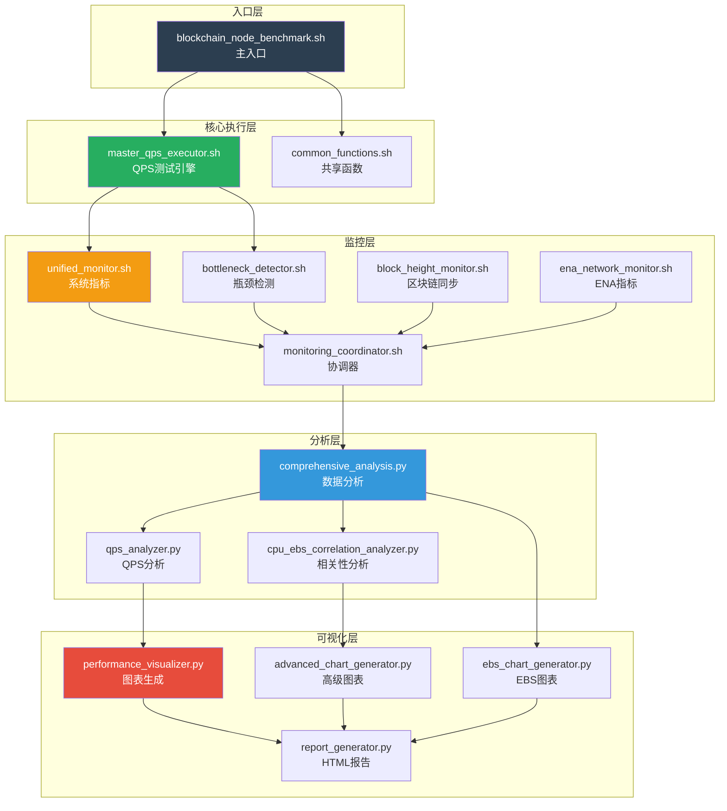
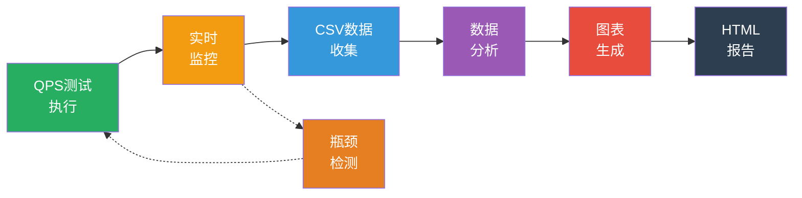
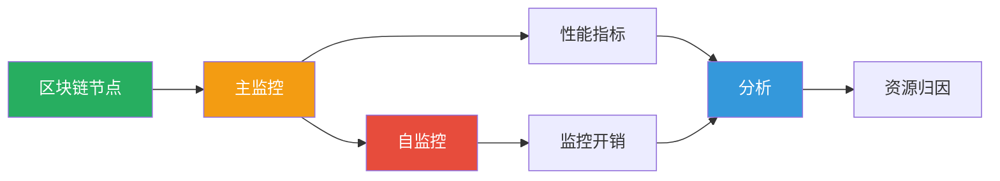

# 架构概览

## 系统架构

区块链节点基准测试框架基于**4层模块化架构**构建，分离关注点并支持各组件的独立开发和测试。



## 数据流

框架通过清晰的管道处理数据：



### 数据流阶段

1. **测试执行** → 使用Vegeta生成QPS负载
2. **实时监控** → 系统指标收集（CPU、内存、EBS、网络、ENA）
3. **数据收集** → 包含73-79个性能指标的CSV文件
4. **分析** → 统计分析和相关性检测
5. **可视化** → 生成32个专业图表
6. **报告** → 综合HTML报告（双语）

**反馈循环：** 瓶颈检测器可触发提前终止测试

## 第1层：核心执行层

### 组件

#### 1. master_qps_executor.sh
**用途：** QPS测试编排引擎

**关键职责：**
- 使用Vegeta生成负载
- QPS递增（1000 → 10000+ QPS）
- 测试模式管理（快速/标准/密集）
- RPC方法选择（单一/混合）
- 结果收集和验证

**测试模式：**
```bash
# 快速模式（15+分钟）
- 初始QPS：1000
- 最大QPS：3000
- 步长：500 QPS
- 持续时间：每级别60秒

# 标准模式（90+分钟）
- 初始QPS：1000
- 最大QPS：5000
- 步长：500 QPS
- 持续时间：每级别180秒

# 密集模式（8+小时）
- 初始QPS：1000
- 最大QPS：10000+
- 步长：250 QPS
- 持续时间：每级别300秒
- 检测到瓶颈时自动停止
```

## 第2层：监控层

### 关键组件

#### 1. unified_monitor.sh
**用途：** 综合系统指标收集

**监控指标（73-79个字段）：**

**CPU指标（6个字段）：**
- `cpu_usage`：整体CPU利用率
- `cpu_usr`：用户模式CPU
- `cpu_sys`：系统模式CPU
- `cpu_iowait`：I/O等待时间
- `cpu_idle`：空闲百分比
- `cpu_steal`：被窃取时间（虚拟化）

**内存指标（3个字段）：**
- `mem_used`：已用内存（MB）
- `mem_total`：总内存（MB）
- `mem_usage`：内存利用率（%）

**EBS存储指标（2个设备42个字段）：**
- 每设备IOPS（读/写/总计）
- 吞吐量（MiB/s）
- 延迟（r_await/w_await/avg_await）
- 队列深度（aqu-sz）
- 利用率（%）
- AWS标准IOPS/吞吐量

**网络指标（10个字段）：**
- 带宽（Gbps）
- 每秒数据包（PPS）
- 连接数
- 利用率（%）

**ENA指标（6个字段，条件性）：**
- 带宽限制超出
- PPS限制超出
- 连接跟踪超出
- 可用连接数

**监控开销（2个字段）：**
- 监控消耗的IOPS
- 监控消耗的吞吐量

**区块高度（6个字段）：**
- 本地区块高度
- 主网区块高度
- 高度差异
- 同步状态

**QPS性能（3个字段）：**
- 当前QPS
- 延迟（p50/p95/p99）
- 成功率

#### 2. bottleneck_detector.sh
**用途：** 6维实时瓶颈检测

**检测维度：**

1. **CPU瓶颈（权重：25%）**
   - 阈值：85%
   - 指标：cpu_usage, cpu_iowait

2. **内存瓶颈（权重：20%）**
   - 阈值：90%
   - 指标：mem_usage

3. **EBS瓶颈（权重：30%）**
   - IOPS利用率 > 90%
   - 延迟 > 50ms
   - 利用率 > 90%

4. **网络瓶颈（权重：15%）**
   - 带宽利用率 > 80%
   - PPS利用率 > 80%

5. **ENA瓶颈（权重：5%）**
   - 限制超出 > 0

6. **RPC瓶颈（权重：5%）**
   - 延迟增加 > 50%
   - 错误率 > 5%

### 自监控机制

框架实现**双层监控**以跟踪区块链节点和监控系统本身：



**自监控指标：**
- 监控进程的CPU使用
- 内存消耗
- 监控生成的IOPS
- 消耗的吞吐量
- 进程数
- 数据完整性

**目的：**
- 量化监控开销
- 确保准确的资源归因
- 验证生产环境影响
- 优化监控效率

详见 [监控机制](./monitoring-mechanism-zh.md)。

## 第3层：分析层

### 组件

#### 1. comprehensive_analysis.py
**用途：** 主分析编排器

**分析类型：**
- 统计分析（均值、中位数、p95、p99）
- 趋势分析（移动平均、平滑）
- 相关性分析（Pearson、Spearman）
- 瓶颈识别
- 性能悬崖检测

#### 2. qps_analyzer.py
**用途：** QPS特定性能分析

**分析重点：**
- QPS vs 延迟关系
- 成功率趋势
- 吞吐量效率
- 性能下降点

#### 3. cpu_ebs_correlation_analyzer.py
**用途：** CPU-EBS相关性分析

**关键相关性：**
- CPU I/O等待 vs EBS利用率
- CPU I/O等待 vs I/O队列长度
- CPU I/O等待 vs 读/写延迟
- 用户CPU vs 读请求
- 系统CPU vs 写请求

## 第4层：可视化层

### 图表类别（共32个）

#### 高级分析图表（9个）
1. `pearson_correlation_analysis.png` - Pearson相关性分析
2. `linear_regression_analysis.png` - 线性回归分析
3. `negative_correlation_analysis.png` - 负相关分析
4. `ena_limitation_trends.png` - ENA限制趋势
5. `ena_connection_capacity.png` - ENA连接容量
6. `ena_comprehensive_status.png` - ENA综合状态
7. `comprehensive_correlation_matrix.png` - 综合相关性矩阵
8. `performance_trend_analysis.png` - 性能趋势分析
9. `performance_correlation_heatmap.png` - 相关性热力图

#### EBS专业图表（7个）
10. `ebs_aws_capacity_planning.png` - AWS容量规划分析
11. `ebs_iostat_performance.png` - Iostat性能分析
12. `ebs_bottleneck_correlation.png` - 瓶颈相关性分析
13. `ebs_performance_overview.png` - EBS性能概览
14. `ebs_bottleneck_analysis.png` - EBS瓶颈分析
15. `ebs_aws_standard_comparison.png` - EBS AWS标准对比
16. `ebs_time_series_analysis.png` - EBS时间序列

#### 核心性能图表（11个）
17. `performance_overview.png` - 性能概览图表
18. `cpu_ebs_correlation_visualization.png` - CPU-EBS相关性分析
19. `device_performance_comparison.png` - 设备性能对比
20. `await_threshold_analysis.png` - I/O延迟阈值分析
21. `monitoring_overhead_analysis.png` - 监控开销分析
22. `qps_trend_analysis.png` - QPS趋势分析
23. `resource_efficiency_analysis.png` - 资源效率分析
24. `bottleneck_identification.png` - 瓶颈识别图表
25. `block_height_sync_chart.png` - 区块高度同步图表
26. `smoothed_trend_analysis.png` - 平滑趋势分析
27. `util_threshold_analysis.png` - 利用率阈值分析

#### 附加分析图表（5个）
28. `resource_distribution_chart.png` - 资源分布图表
29. `monitoring_impact_chart.png` - 监控影响分析
30. `comprehensive_analysis_charts.png` - 综合分析图表
31. `performance_cliff_analysis.png` - 性能悬崖分析
32. `qps_performance_analysis.png` - QPS性能分析

### 统一图表样式

**Flat UI Colors配色方案：**
- 表格标题：7种不同颜色
- 信息框：`#3498DB`（蓝色）
- 成功：`#27AE60`（绿色）
- 警告：`#F39C12`（橙色）
- 错误：`#E74C3C`（红色）

**响应式设计：**
- 移动端viewport meta标签
- 断点：768px、1200px
- 网格布局：`auto-fit, minmax(280px, 1fr)`
- 小屏幕表格横向滚动

### 报告生成

**HTML报告特性：**
- 双语支持（英文/中文）
- 32个嵌入式图表
- 交互式章节
- 性能摘要
- 瓶颈分析
- 配置状态
- 监控开销分析
- EBS基准对比
- ENA网络状态
- 区块高度同步状态

## 性能特征

### 资源使用

**监控开销：**
- CPU：1-3%（典型）
- 内存：100-200 MB
- IOPS：< 0.01（读取/proc虚拟文件系统）
- 吞吐量：< 0.01 MiB/s

**分析开销：**
- CPU：10-20%（分析期间）
- 内存：500 MB - 2 GB（取决于数据大小）
- 磁盘：处理期间的临时文件

### 可扩展性

**数据量：**
- 支持每次测试1000+数据点
- 处理多个设备（2+ EBS卷）
- 同时处理73-79个指标

**测试持续时间：**
- 快速：7分钟
- 标准：15分钟
- 密集：最多2小时

**QPS范围：**
- 最小：1000 QPS
- 最大：10000+ QPS（检测到瓶颈时自动停止）

## 扩展性

### 添加新指标

1. **监控层：**
   ```bash
   # 添加到unified_monitor.sh
   new_metric=$(collect_new_metric)
   echo "$new_metric" >> performance.csv
   ```

2. **分析层：**
   ```python
   # 添加到comprehensive_analysis.py
   df['new_metric_analyzed'] = analyze_new_metric(df['new_metric'])
   ```

3. **可视化层：**
   ```python
   # 添加到performance_visualizer.py
   plot_new_metric(df['new_metric_analyzed'])
   ```

### 添加新区块链支持

1. **配置：**
   ```bash
   # 添加到user_config.sh
   BLOCKCHAIN_NODE="new_blockchain"
   BLOCKCHAIN_PROCESS_NAMES=("new_process")
   ```

2. **RPC方法：**
   ```bash
   # 添加到target_generator.sh
   generate_new_blockchain_targets()
   ```

3. **监控：**
   - 框架自动适应
   - 无需代码更改

## 总结

框架架构提供：

✅ **模块化：** 具有清晰接口的独立层  
✅ **可扩展性：** 处理高QPS和大数据集  
✅ **可扩展性：** 易于添加新指标和区块链  
✅ **可靠性：** 全面的错误处理和验证  
✅ **可观察性：** 自监控和详细日志  
✅ **专业性：** 32个图表和双语报告

**关键设计原则：**
- 关注点分离
- 数据驱动架构
- 实时反馈循环
- 全面可观察性
- 生产就绪质量

更多详情：
- [配置指南](./configuration-guide-zh.md)
- [监控机制](./monitoring-mechanism-zh.md)
- [区块链测试特性](./blockchain-testing-features-zh.md)
