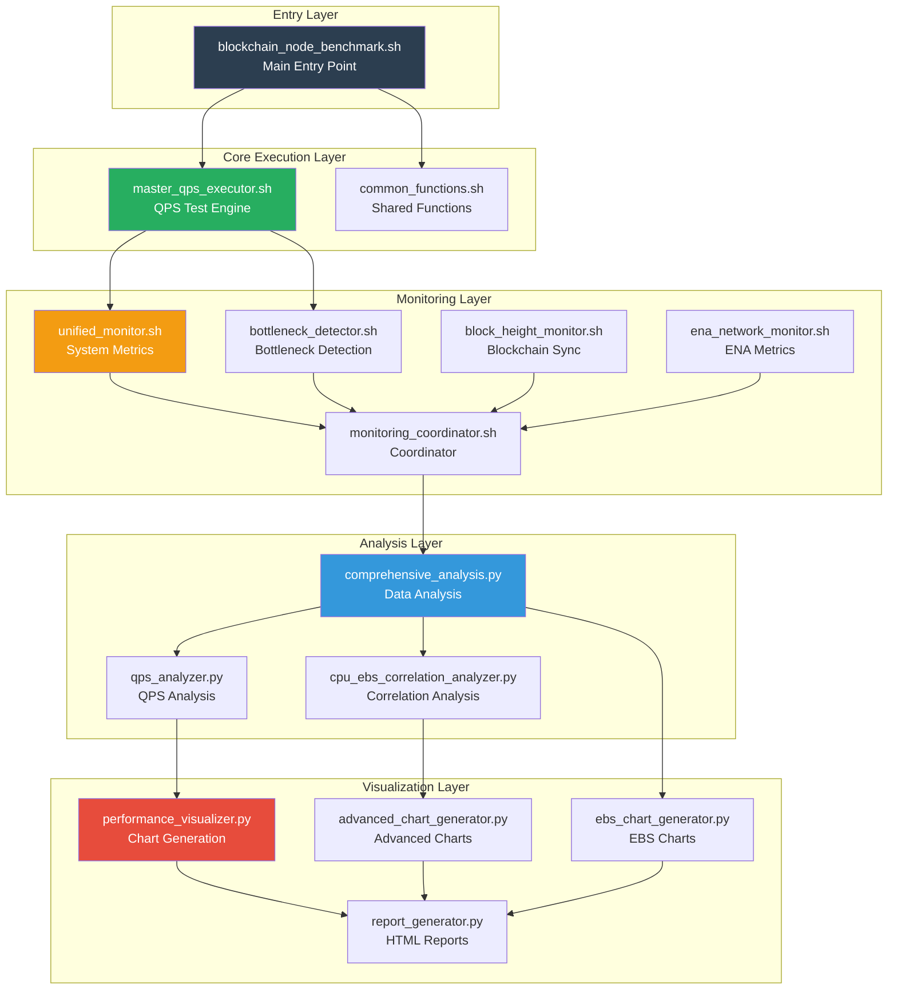
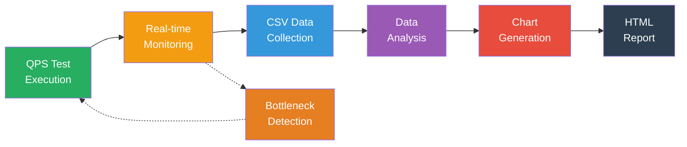
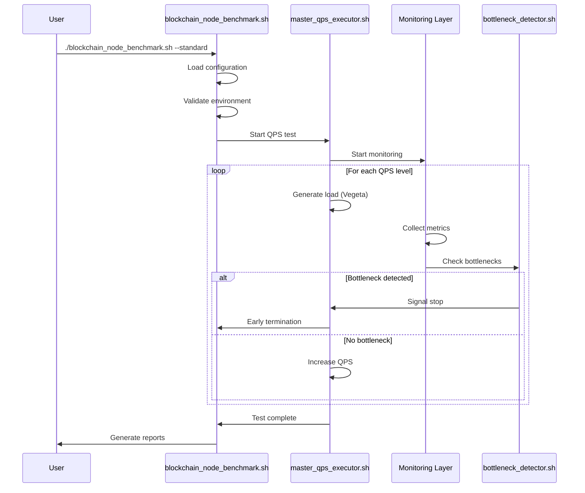
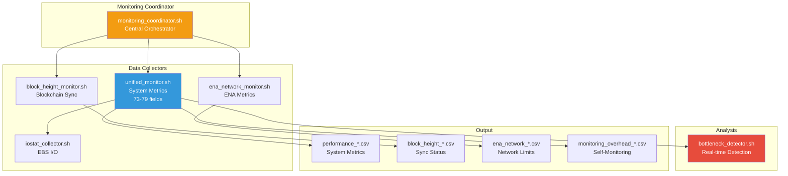
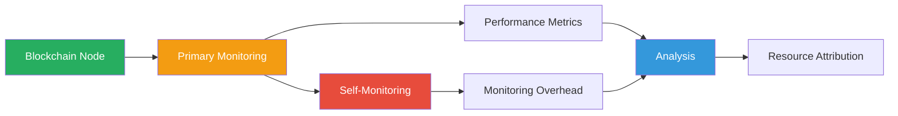
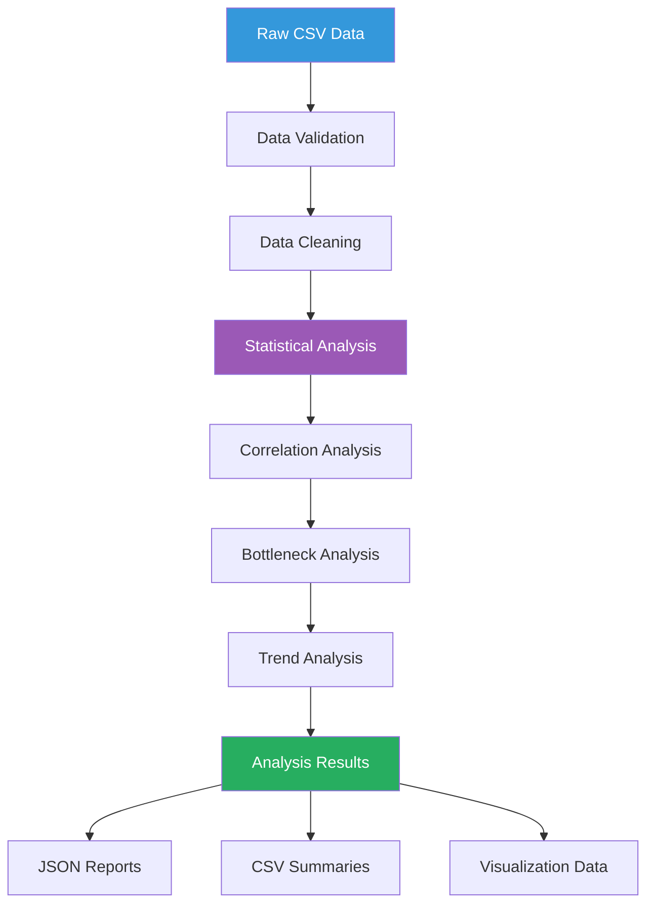
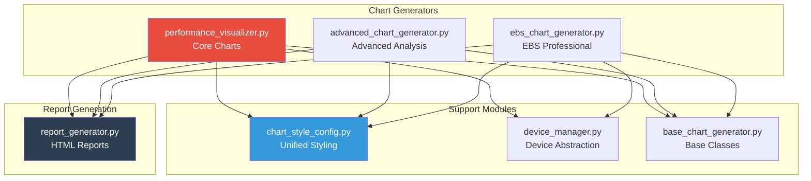
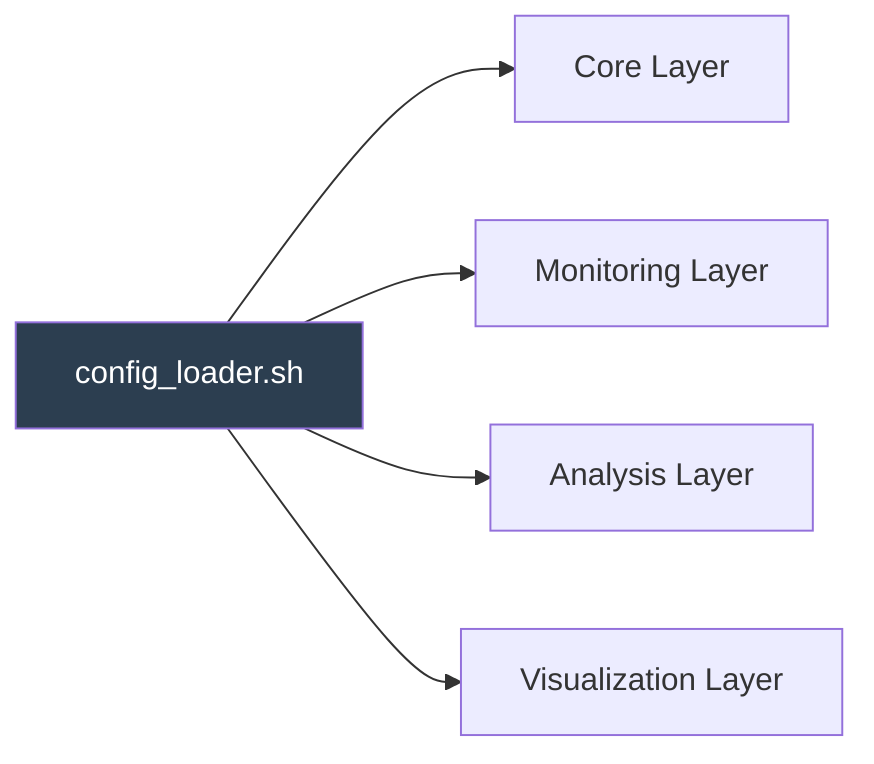
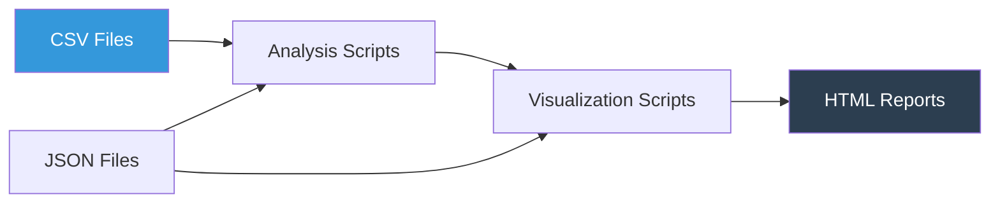
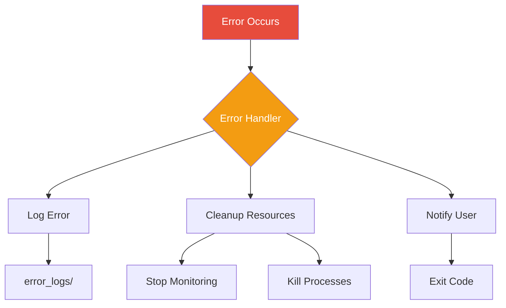

# Architecture Overview

## System Architecture

The Blockchain Node Benchmark Framework is built on a **4-layer modular architecture** that separates concerns and enables independent development and testing of each component.



## Data Flow

The framework processes data through a clear pipeline:



### Data Flow Stages

1. **Test Execution** → QPS load generation using Vegeta
2. **Real-time Monitoring** → System metrics collection (CPU, Memory, EBS, Network, ENA)
3. **Data Collection** → CSV files with 73-79 performance metrics
4. **Analysis** → Statistical analysis and correlation detection
5. **Visualization** → 32 professional charts generation
6. **Reporting** → Comprehensive HTML reports (bilingual)

**Feedback Loop:** Bottleneck detector can trigger early test termination

## Layer 1: Core Execution Layer

### Components

#### 1. master_qps_executor.sh
**Purpose:** QPS test orchestration engine

**Key Responsibilities:**
- Load generation using Vegeta
- QPS ramping (1000 → 10000+ QPS)
- Test mode management (Quick/Standard/Intensive)
- RPC method selection (Single/Mixed)
- Result collection and validation

**Test Modes:**
```bash
# Quick Mode (15+ minutes)
- Initial QPS: 1000
- Max QPS: 3000
- Step: 500 QPS
- Duration: 60s per level

# Standard Mode (90+ minutes)
- Initial QPS: 1000
- Max QPS: 5000
- Step: 500 QPS
- Duration: 180s per level

# Intensive Mode (8+ hours)
- Initial QPS: 1000
- Max QPS: 10000+
- Step: 250 QPS
- Duration: 300s per level
- Auto-stops on bottleneck detection
```

**Data Output:**
- QPS test results (success rate, latency, throughput)
- Performance CSV with timestamp-aligned metrics

#### 2. common_functions.sh
**Purpose:** Shared utility functions

**Key Functions:**
- Logging (DEBUG, INFO, WARN, ERROR, FATAL)
- Error handling and recovery
- Path management
- Process management
- Data validation

**Usage Pattern:**
```bash
source "${SCRIPT_DIR}/core/common_functions.sh"

log_info "Starting benchmark..."
validate_config
check_prerequisites
```

### Execution Flow



## Layer 2: Monitoring Layer

### Architecture



### Key Components

#### 1. unified_monitor.sh
**Purpose:** Comprehensive system metrics collection

**Monitored Metrics (73-79 fields):**

**CPU Metrics (6 fields):**
- `cpu_usage`: Overall CPU utilization
- `cpu_usr`: User mode CPU
- `cpu_sys`: System mode CPU
- `cpu_iowait`: I/O wait time
- `cpu_idle`: Idle percentage
- `cpu_steal`: Stolen time (virtualization)

**Memory Metrics (3 fields):**
- `mem_used`: Used memory (MB)
- `mem_total`: Total memory (MB)
- `mem_usage`: Memory utilization (%)

**EBS Storage Metrics (42 fields for 2 devices):**
- Per-device IOPS (read/write/total)
- Throughput (MiB/s)
- Latency (r_await/w_await/avg_await)
- Queue depth (aqu-sz)
- Utilization (%)
- AWS standard IOPS/Throughput

**Network Metrics (10 fields):**
- Bandwidth (Gbps)
- Packets per second (PPS)
- Connection count
- Utilization (%)

**ENA Metrics (6 fields, conditional):**
- Bandwidth allowance exceeded
- PPS allowance exceeded
- Connection tracking exceeded
- Available connections

**Monitoring Overhead (2 fields):**
- IOPS consumed by monitoring
- Throughput consumed by monitoring

**Block Height (6 fields):**
- Local block height
- Mainnet block height
- Height difference
- Sync status

**QPS Performance (3 fields):**
- Current QPS
- Latency (p50/p95/p99)
- Success rate

**Data Collection Frequency:**
- Default: 5 seconds
- High-frequency: 1 second (bottleneck detection)
- Ultra-high-frequency: 0.5 seconds (critical analysis)

#### 2. bottleneck_detector.sh
**Purpose:** Real-time bottleneck detection with 6-dimensional analysis

**Detection Dimensions:**

1. **CPU Bottleneck (Weight: 25%)**
   - Threshold: 85%
   - Metrics: cpu_usage, cpu_iowait

2. **Memory Bottleneck (Weight: 20%)**
   - Threshold: 90%
   - Metrics: mem_usage

3. **EBS Bottleneck (Weight: 30%)**
   - IOPS utilization > 90%
   - Latency > 50ms
   - Utilization > 90%

4. **Network Bottleneck (Weight: 15%)**
   - Bandwidth utilization > 80%
   - PPS utilization > 80%

5. **ENA Bottleneck (Weight: 5%)**
   - Allowance exceeded > 0

6. **RPC Bottleneck (Weight: 5%)**
   - Latency increase > 50%
   - Error rate > 5%

**Detection Algorithm:**
```python
bottleneck_score = (
    cpu_score * 0.25 +
    memory_score * 0.20 +
    ebs_score * 0.30 +
    network_score * 0.15 +
    ena_score * 0.05 +
    rpc_score * 0.05
)

if bottleneck_score > 0.7:
    trigger_early_termination()
```

#### 3. monitoring_coordinator.sh
**Purpose:** Orchestrate all monitoring tasks

**Responsibilities:**
- Start/stop monitoring processes
- Synchronize data collection
- Manage monitoring lifecycle
- Handle monitoring failures

**Process Management:**
```bash
# Start monitoring
start_monitoring() {
    unified_monitor.sh &
    block_height_monitor.sh &
    ena_network_monitor.sh &
    bottleneck_detector.sh &
}

# Stop monitoring
stop_monitoring() {
    kill_monitoring_processes
    wait_for_completion
    validate_data_integrity
}
```

### Self-Monitoring Mechanism

The framework implements **dual-layer monitoring** to track both the blockchain node and the monitoring system itself:



**Self-Monitoring Metrics:**
- CPU usage by monitoring processes
- Memory consumption
- IOPS generated by monitoring
- Throughput consumed
- Process count
- Data completeness

**Purpose:**
- Quantify monitoring overhead
- Ensure accurate resource attribution
- Validate production environment impact
- Optimize monitoring efficiency

See [Monitoring Mechanism](./monitoring-mechanism.md) for detailed architecture.

## Layer 3: Analysis Layer

### Components

#### 1. comprehensive_analysis.py
**Purpose:** Master analysis orchestrator

**Analysis Types:**
- Statistical analysis (mean, median, p95, p99)
- Trend analysis (moving averages, smoothing)
- Correlation analysis (Pearson, Spearman)
- Bottleneck identification
- Performance cliff detection

**Output:**
- Analyzed CSV files
- Statistical summaries
- Correlation matrices
- Bottleneck reports

#### 2. qps_analyzer.py
**Purpose:** QPS-specific performance analysis

**Analysis Focus:**
- QPS vs latency relationship
- Success rate trends
- Throughput efficiency
- Performance degradation points

#### 3. cpu_ebs_correlation_analyzer.py
**Purpose:** CPU-EBS correlation analysis

**Key Correlations:**
- CPU I/O wait vs EBS utilization
- CPU I/O wait vs I/O queue length
- CPU I/O wait vs read/write latency
- User CPU vs read requests
- System CPU vs write requests

**Statistical Methods:**
- Pearson correlation coefficient
- P-value significance testing
- Linear regression analysis

### Analysis Pipeline



## Layer 4: Visualization Layer

### Chart Generation Architecture



### Chart Categories (32 Total)

#### Advanced Analysis Charts (9 charts)
1. `pearson_correlation_analysis.png` - Pearson Correlation Analysis
2. `linear_regression_analysis.png` - Linear Regression Analysis
3. `negative_correlation_analysis.png` - Negative Correlation Analysis
4. `ena_limitation_trends.png` - ENA Limitation Trends
5. `ena_connection_capacity.png` - ENA Connection Capacity
6. `ena_comprehensive_status.png` - ENA Comprehensive Status
7. `comprehensive_correlation_matrix.png` - Comprehensive Correlation Matrix
8. `performance_trend_analysis.png` - Performance Trend Analysis
9. `performance_correlation_heatmap.png` - Performance Correlation Heatmap

#### EBS Professional Charts (7 charts)
10. `ebs_aws_capacity_planning.png` - AWS Capacity Planning Analysis
11. `ebs_iostat_performance.png` - Iostat Performance Analysis
12. `ebs_bottleneck_correlation.png` - Bottleneck Correlation Analysis
13. `ebs_performance_overview.png` - EBS Performance Overview
14. `ebs_bottleneck_analysis.png` - EBS Bottleneck Analysis
15. `ebs_aws_standard_comparison.png` - EBS AWS Standard Comparison
16. `ebs_time_series_analysis.png` - EBS Time Series Analysis

#### Core Performance Charts (11 charts)
17. `performance_overview.png` - Performance Overview
18. `cpu_ebs_correlation_visualization.png` - CPU-EBS Correlation Analysis
19. `device_performance_comparison.png` - Device Performance Comparison
20. `await_threshold_analysis.png` - I/O Latency Threshold Analysis
21. `monitoring_overhead_analysis.png` - Monitoring Overhead Analysis
22. `qps_trend_analysis.png` - QPS Trend Analysis
23. `resource_efficiency_analysis.png` - Resource Efficiency Analysis
24. `bottleneck_identification.png` - Bottleneck Identification
25. `block_height_sync_chart.png` - Block Height Sync Chart
26. `smoothed_trend_analysis.png` - Smoothed Trend Analysis
27. `util_threshold_analysis.png` - Utilization Threshold Analysis

#### Additional Analysis Charts (5 charts)
28. `resource_distribution_chart.png` - Resource Distribution Chart
29. `monitoring_impact_chart.png` - Monitoring Impact Analysis
30. `comprehensive_analysis_charts.png` - Comprehensive Analysis Charts
31. `performance_cliff_analysis.png` - Performance Cliff Analysis
32. `qps_performance_analysis.png` - QPS Performance Analysis

### Unified Chart Styling

**Flat UI Colors Scheme:**
- Table headers: 7 distinct colors
- Info boxes: `#3498DB` (blue)
- Success: `#27AE60` (green)
- Warning: `#F39C12` (orange)
- Error: `#E74C3C` (red)

**Responsive Design:**
- Viewport meta tag for mobile
- Breakpoints: 768px, 1200px
- Grid layouts: `auto-fit, minmax(280px, 1fr)`
- Table horizontal scrolling on small screens

### Report Generation

**HTML Report Features:**
- Bilingual support (English/Chinese)
- 32 embedded charts
- Interactive sections
- Performance summaries
- Bottleneck analysis
- Configuration status
- Monitoring overhead analysis
- EBS baseline comparison
- ENA network status
- Block height sync status

**Report Sections:**
1. Performance Summary
2. Configuration Status
3. Block Height Analysis
4. EBS Performance Analysis
5. Chart Gallery (32 charts)
6. Monitoring Overhead Analysis
7. EBS Baseline Analysis
8. ENA Network Analysis
9. CPU-EBS Correlation
10. Production Resource Planning

## Integration Points

### Configuration Integration



All layers access configuration through `config_loader.sh`:
- Environment variables
- Dynamic detection results
- Platform-specific settings

### Data Integration



**Data Formats:**
- **CSV:** Time-series performance metrics
- **JSON:** Bottleneck events, configuration, statistics
- **PNG:** Generated charts
- **HTML:** Final reports

### Error Handling Integration



## Performance Characteristics

### Resource Usage

**Monitoring Overhead:**
- CPU: 1-3% (typical)
- Memory: 100-200 MB
- IOPS: < 0.01 (reads /proc virtual filesystem)
- Throughput: < 0.01 MiB/s

**Analysis Overhead:**
- CPU: 10-20% (during analysis)
- Memory: 500 MB - 2 GB (depends on data size)
- Disk: Temporary files during processing

### Scalability

**Data Volume:**
- Supports 1000+ data points per test
- Handles multiple devices (2+ EBS volumes)
- Processes 73-79 metrics simultaneously

**Test Duration:**
- Quick: 7 minutes
- Standard: 15 minutes
- Intensive: Up to 2 hours

**QPS Range:**
- Minimum: 1000 QPS
- Maximum: 10000+ QPS (auto-stops on bottleneck)

## Extensibility

### Adding New Metrics

1. **Monitoring Layer:**
   ```bash
   # Add to unified_monitor.sh
   new_metric=$(collect_new_metric)
   echo "$new_metric" >> performance.csv
   ```

2. **Analysis Layer:**
   ```python
   # Add to comprehensive_analysis.py
   df['new_metric_analyzed'] = analyze_new_metric(df['new_metric'])
   ```

3. **Visualization Layer:**
   ```python
   # Add to performance_visualizer.py
   plot_new_metric(df['new_metric_analyzed'])
   ```

### Adding New Blockchain Support

1. **Configuration:**
   ```bash
   # Add to user_config.sh
   BLOCKCHAIN_NODE="new_blockchain"
   BLOCKCHAIN_PROCESS_NAMES=("new_process")
   ```

2. **RPC Methods:**
   ```bash
   # Add to target_generator.sh
   generate_new_blockchain_targets()
   ```

3. **Monitoring:**
   - Framework automatically adapts
   - No code changes needed

## Summary

The framework's architecture provides:

✅ **Modularity:** Independent layers with clear interfaces  
✅ **Scalability:** Handles high QPS and large datasets  
✅ **Extensibility:** Easy to add new metrics and blockchains  
✅ **Reliability:** Comprehensive error handling and validation  
✅ **Observability:** Self-monitoring and detailed logging  
✅ **Professionalism:** 32 charts and bilingual reports

**Key Design Principles:**
- Separation of concerns
- Data-driven architecture
- Real-time feedback loops
- Comprehensive observability
- Production-ready quality

For more details:
- [Configuration Guide](./configuration-guide.md)
- [Monitoring Mechanism](./monitoring-mechanism.md)
- [Blockchain Testing Features](./blockchain-testing-features.md)
