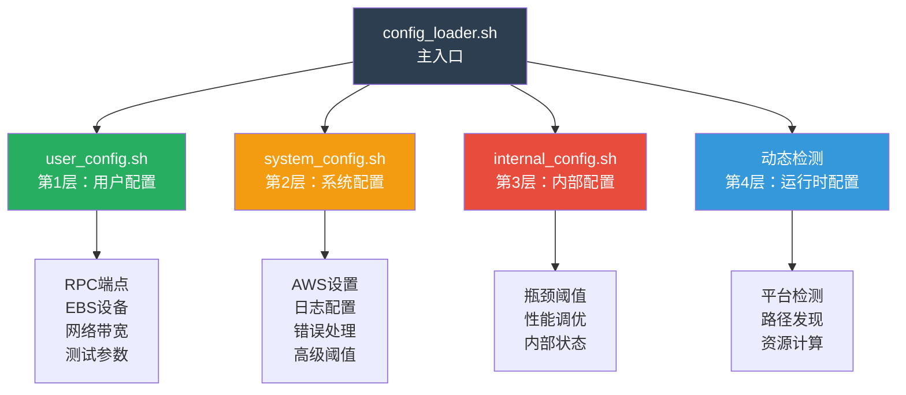

# 配置架构指南

## 概述

区块链节点基准测试框架使用**4层配置架构**，分离关注点并为不同用户角色提供灵活性。这种设计确保基础用户可以快速上手，而高级用户可以完全控制系统行为。

## 配置架构



## 第1层：用户配置 (`user_config.sh`)

**目标用户：** 所有框架用户  
**修改频率：** 频繁  
**用途：** 运行基准测试的基本设置

### 必需配置

#### 1. EBS设备配置
```bash
# DATA设备（LEDGER数据存储）
LEDGER_DEVICE="nvme1n1"

# ACCOUNTS设备（可选，用于账户数据存储）
ACCOUNTS_DEVICE="nvme2n1"

# DATA卷配置
DATA_VOL_TYPE="io2"                    # 选项："gp3" | "io2" | "instance-store"
DATA_VOL_SIZE="2000"                   # 卷大小（GB）
DATA_VOL_MAX_IOPS="30000"              # 最大IOPS
DATA_VOL_MAX_THROUGHPUT="700"          # 最大吞吐量（MiB/s）

# ACCOUNTS卷配置（可选）
ACCOUNTS_VOL_TYPE="io2"
ACCOUNTS_VOL_SIZE="500"
ACCOUNTS_VOL_MAX_IOPS="30000"
ACCOUNTS_VOL_MAX_THROUGHPUT="700"
```

**为什么重要：**
- 准确的EBS基准配置可实现精确的性能分析
- 框架将实际性能与配置基准进行对比
- 帮助识别存储瓶颈

#### 2. 网络配置
```bash
# EC2实例网络带宽（单位：Gbps）
NETWORK_MAX_BANDWIDTH_GBPS=25

# ENA网络监控
ENA_MONITOR_ENABLED=true
```

**为什么重要：**
- 网络带宽因EC2实例类型而异
- 实现准确的网络利用率计算
- ENA监控检测AWS网络限制

#### 3. 监控配置
```bash
# 统一监控间隔（秒）
MONITOR_INTERVAL=5              # 所有监控任务使用相同间隔
EBS_MONITOR_RATE=1              # EBS专用监控频率
```

#### 4. QPS测试配置
```bash
# 快速基准测试模式（基本QPS验证）
QUICK_INITIAL_QPS=1000
QUICK_MAX_QPS=1500
QUICK_QPS_STEP=500
QUICK_DURATION=60               # 每个QPS级别1分钟

# 标准基准测试模式（全面测试）
STANDARD_INITIAL_QPS=1000
STANDARD_MAX_QPS=5000
STANDARD_QPS_STEP=500
STANDARD_DURATION=180           # 每个QPS级别3分钟

# 密集基准测试模式（瓶颈检测）
INTENSIVE_INITIAL_QPS=1000
INTENSIVE_MAX_QPS=10000
INTENSIVE_QPS_STEP=250
INTENSIVE_DURATION=300          # 每个QPS级别5分钟
```

### 快速入门配置

**最小必需设置：**
1. 将 `LEDGER_DEVICE` 设置为您的DATA设备名称
2. 将 `DATA_VOL_MAX_IOPS` 和 `DATA_VOL_MAX_THROUGHPUT` 设置为与您的EBS配置匹配
3. 将 `NETWORK_MAX_BANDWIDTH_GBPS` 设置为与您的EC2实例类型匹配
4. 其他设置保持默认值

**r7a.24xlarge with io2卷的示例：**
```bash
LEDGER_DEVICE="nvme1n1"
DATA_VOL_TYPE="io2"
DATA_VOL_MAX_IOPS="30000"
DATA_VOL_MAX_THROUGHPUT="700"
NETWORK_MAX_BANDWIDTH_GBPS=25
```

## 第2层：系统配置 (`system_config.sh`)

**目标用户：** 系统管理员和高级用户  
**修改频率：** 偶尔  
**用途：** AWS特定设置和高级功能

### 关键配置区域

#### 1. 部署平台检测
```bash
# 平台类型（auto：自动检测，aws：AWS环境，other：其他平台）
DEPLOYMENT_PLATFORM=${DEPLOYMENT_PLATFORM:-"auto"}
```

#### 2. ENA网络监控字段
```bash
# 基于AWS ENA文档的ENA限制字段
ENA_ALLOWANCE_FIELDS=(
    "bw_in_allowance_exceeded"
    "bw_out_allowance_exceeded"
    "pps_allowance_exceeded"
    "conntrack_allowance_exceeded"
    "linklocal_allowance_exceeded"
    "conntrack_allowance_available"
)
```

#### 3. 日志管理
```bash
# 日志级别（0=DEBUG, 1=INFO, 2=WARN, 3=ERROR, 4=FATAL）
LOG_LEVEL=${LOG_LEVEL:-1}

# 日志轮转
MAX_LOG_SIZE=${MAX_LOG_SIZE:-"10M"}
MAX_LOG_FILES=${MAX_LOG_FILES:-5}
```

#### 4. 错误处理
```bash
# 错误恢复（在基准测试框架中禁用以确保准确性）
ERROR_RECOVERY_ENABLED=${ERROR_RECOVERY_ENABLED:-false}
ERROR_RECOVERY_DELAY=${ERROR_RECOVERY_DELAY:-10}
```

### 何时修改

在以下情况下修改 `system_config.sh`：
- 自定义日志详细程度或轮转
- 调整AWS特定监控字段
- 更改错误处理行为
- 配置高级平台检测

## 第3层：内部配置 (`internal_config.sh`)

**目标用户：** 框架开发者  
**修改频率：** 很少  
**用途：** 内部实现细节和性能调优

### 瓶颈检测阈值

```bash
# CPU和内存阈值
BOTTLENECK_CPU_THRESHOLD=85               # CPU > 85% = 瓶颈
BOTTLENECK_MEMORY_THRESHOLD=90            # 内存 > 90% = 瓶颈

# EBS阈值
BOTTLENECK_EBS_UTIL_THRESHOLD=90          # 利用率 > 90% = 瓶颈
BOTTLENECK_EBS_LATENCY_THRESHOLD=50       # 延迟 > 50ms = 瓶颈
BOTTLENECK_EBS_IOPS_THRESHOLD=90          # IOPS利用率 > 90% = 瓶颈
BOTTLENECK_EBS_THROUGHPUT_THRESHOLD=90    # 吞吐量利用率 > 90% = 瓶颈

# 网络阈值
BOTTLENECK_NETWORK_THRESHOLD=80           # 网络 > 80% = 瓶颈
BOTTLENECK_ERROR_RATE_THRESHOLD=5         # 错误率 > 5% = 瓶颈

# 瓶颈检测控制
BOTTLENECK_CONSECUTIVE_COUNT=3            # 连续检测次数阈值
BOTTLENECK_ANALYSIS_WINDOW=30             # 瓶颈分析时间窗口（秒）

# 区块链节点健康检查阈值
BLOCK_HEIGHT_DIFF_THRESHOLD=50            # 区块高度差异阈值
BLOCK_HEIGHT_TIME_THRESHOLD=300           # 区块时间差异阈值（秒）
```

#### 瓶颈检测停止规则

框架使用**三重验证机制**来决定是否停止测试：

**停止条件**：
```
条件1: 资源限制超标 (任一资源超过阈值)
AND
条件2: 连续3次检测
AND
条件3: 节点不健康 (区块高度延迟或RPC失败)
→ 停止测试
```

**继续条件**：
```
条件1 AND 条件2 满足，但条件3不满足 (节点健康)
→ 重置计数器，继续测试
```

**配置说明**：

1. **BOTTLENECK_CONSECUTIVE_COUNT** (默认: 3)
   - 需要连续检测到瓶颈的次数
   - 避免偶发性能波动导致误判
   - 建议值：3-5次

2. **BOTTLENECK_ANALYSIS_WINDOW** (默认: 30秒)
   - 离线分析时聚焦的时间窗口
   - 分析瓶颈发生前后N秒的数据
   - 用于深度分析瓶颈根因
   - 建议值：30-60秒

3. **BLOCK_HEIGHT_DIFF_THRESHOLD** (默认: 50)
   - 本地节点与主网的区块高度差异阈值
   - 超过此值表示节点同步落后
   - 建议值：50-100个区块

4. **BLOCK_HEIGHT_TIME_THRESHOLD** (默认: 300秒)
   - 本地节点区块时间与主网的时间差异阈值
   - 超过此值表示节点同步延迟
   - 建议值：300-600秒（5-10分钟）

**工作原理**：

```bash
# 每轮 QPS 测试后检查
# 条件1: 资源限制超标
if 检测到资源超标 (CPU/Memory/EBS/Network 超过阈值):
    BOTTLENECK_COUNT++
    
    # 条件2: 连续检测
    if BOTTLENECK_COUNT >= BOTTLENECK_CONSECUTIVE_COUNT:
        # 条件3: 节点健康检查
        if (block_height_diff > BLOCK_HEIGHT_DIFF_THRESHOLD) OR 
           (block_height_time_diff > BLOCK_HEIGHT_TIME_THRESHOLD):
            # 节点不健康 → 真正的性能瓶颈
            停止测试，保存瓶颈上下文
        else:
            # 节点健康 → 可能是误判（例如 iostat 100% 但 AWS EBS 利用率低）
            重置 BOTTLENECK_COUNT = 0
            继续测试
```
        if (block_height_diff > BLOCK_HEIGHT_DIFF_THRESHOLD) OR 
           (block_height_time_diff > BLOCK_HEIGHT_TIME_THRESHOLD):
            # 节点不健康 → 真正的性能瓶颈
            停止测试，保存瓶颈上下文
        else:
            # 节点健康 → 可能是误判（如 iostat 100% 但 AWS EBS 利用率低）
            重置 BOTTLENECK_COUNT = 0
            继续测试
```

**使用场景**：

- **提高阈值**：如果测试过早停止，可以增加 `BOTTLENECK_CONSECUTIVE_COUNT` 到 5
- **缩短窗口**：如果瓶颈分析数据过多，可以减少 `BOTTLENECK_ANALYSIS_WINDOW` 到 20秒
- **放宽节点检查**：如果节点同步较慢，可以增加 `BLOCK_HEIGHT_DIFF_THRESHOLD` 到 100

### 多级阈值系统

框架针对不同目的使用不同的阈值级别：

1. **实时瓶颈检测** (`ebs_bottleneck_detector.sh`)：
   - HIGH级别：基准阈值（90%，50ms）
   - CRITICAL级别：基准 + 5%（95%）或基准 × 2（100ms）

2. **离线性能分析** (`ebs_analyzer.sh`)：
   - WARNING级别：基准 × 0.8（72%利用率，20ms延迟）

### 何时修改

⚠️ **注意：** 仅在以下情况下修改 `internal_config.sh`：
- 理解框架的内部架构
- 需要调整瓶颈检测灵敏度
- 正在开发新功能
- 有特定的性能要求

## 第4层：动态配置（运行时）

**生成者：** `config_loader.sh` 在初始化期间  
**用途：** 自动检测环境并计算派生值

### 自动检测功能

#### 1. 平台检测
```bash
detect_deployment_platform() {
    # 检测AWS vs 非AWS环境
    # 相应调整ENA监控
}
```

#### 2. 路径发现
```bash
detect_deployment_paths() {
    # 发现项目根目录
    # 设置日志目录
    # 配置输出路径
}
```

#### 3. 资源计算
```bash
# 自动将Gbps转换为Mbps供内部使用
NETWORK_MAX_BANDWIDTH_MBPS=$((NETWORK_MAX_BANDWIDTH_GBPS * 1000))
```

## 配置加载顺序

框架按严格顺序加载配置：

```
1. config_loader.sh（入口点）
   ↓
2. user_config.sh（用户设置）
   ↓
3. system_config.sh（系统设置）
   ↓
4. internal_config.sh（内部设置）
   ↓
5. 动态检测（运行时计算）
```

**为什么顺序重要：**
- 后面的层可以覆盖前面的层
- 动态检测使用所有前面层的值
- 确保一致的配置状态

## 配置最佳实践

### 对于基础用户

1. **从默认值开始：** 仅修改 `user_config.sh`
2. **准确设置EBS基准：** 匹配您的实际AWS配置
3. **验证网络带宽：** 检查您的EC2实例规格
4. **使用适当的测试模式：**
   - 快速模式：初始测试（7分钟）
   - 标准模式：常规基准测试（15分钟）
   - 密集模式：瓶颈检测（最多2小时）

### 对于高级用户

1. **理解层分离：** 知道修改哪一层
2. **记录更改：** 注释您的修改
3. **增量测试：** 一次更改一个设置
4. **监控影响：** 配置更改后检查日志

### 对于开发者

1. **保持层架构：** 不要混合关注点
2. **将新设置添加到适当的层：**
   - 面向用户 → `user_config.sh`
   - 系统级别 → `system_config.sh`
   - 内部 → `internal_config.sh`
3. **更新文档：** 记录新的配置选项
4. **保持向后兼容性：** 使用默认值

## 配置验证

框架在启动时验证配置：

```bash
# 示例验证检查
- EBS设备存在性
- 网络带宽 > 0
- 有效的测试参数
- 所需工具已安装
```

**验证失败：**
- 框架退出并显示错误消息
- 检查日志以获取详细诊断
- 验证配置值

## 环境变量

可以通过环境变量覆盖配置：

```bash
# 覆盖用户配置
export LEDGER_DEVICE="nvme2n1"
export NETWORK_MAX_BANDWIDTH_GBPS=50

# 覆盖系统配置
export LOG_LEVEL=0  # 启用DEBUG日志

# 运行基准测试
./blockchain_node_benchmark.sh --standard
```

**优先级顺序：**
1. 环境变量（最高）
2. 配置文件
3. 默认值（最低）

## 故障排除

### 常见问题

#### 1. "EBS device not found"
**解决方案：** 验证 `LEDGER_DEVICE` 与实际设备名称匹配
```bash
lsblk  # 列出所有块设备
```

#### 2. "Invalid IOPS configuration"
**解决方案：** 检查EBS卷类型和IOPS限制
- gp3：3,000 - 16,000 IOPS
- io2：100 - 64,000 IOPS

#### 3. "Network monitoring disabled"
**解决方案：** 确保在AWS EC2上 `ENA_MONITOR_ENABLED=true`

#### 4. "Configuration already loaded" 警告
**解决方案：** 正常行为，防止重复加载
```bash
# 如需强制重新加载
export FORCE_CONFIG_RELOAD=true
```

## 高级主题

### RPC模式配置

框架支持两种RPC测试模式：

```bash
# 单一RPC方法测试（默认）
RPC_MODE="single"

# 混合RPC方法测试（全面）
RPC_MODE="mixed"
```

**单一模式：**
- 重复测试一个RPC方法
- 执行更快
- 专注的性能分析

**混合模式：**
- 测试多个RPC方法
- 真实的工作负载模拟
- 全面的性能概况

详见 [区块链测试特性](./blockchain-testing-features-zh.md)。

### 跨平台兼容性

框架设计为可在多个平台上运行，并自动适配：

**支持的平台：**
- ✅ **AWS 云**：完整功能支持，包括 ENA 网络监控
- ✅ **其他云**：禁用 ENA 监控
- ✅ **IDC（数据中心）**：本地基础设施
- ✅ **本地 Linux**：开发和测试环境

**支持的区块链节点：**
- Solana
- Ethereum
- BSC（币安智能链）
- Base
- Polygon
- Scroll
- Starknet
- Sui

**平台自动检测：**

框架自动检测部署平台：

```bash
# 自动平台检测（在 config_loader.sh 中）
detect_deployment_platform() {
    if [[ "$DEPLOYMENT_PLATFORM" == "auto" ]]; then
        # 尝试 AWS 元数据服务
        if curl -s -m 3 http://169.254.169.254/latest/meta-data/instance-id &>/dev/null; then
            DEPLOYMENT_PLATFORM="aws"
            ENA_MONITOR_ENABLED=true
        else
            DEPLOYMENT_PLATFORM="other"
            ENA_MONITOR_ENABLED=false
        fi
    fi
}
```

**网络接口自动检测：**

框架自动检测活跃的网络接口用于监控：

```bash
# 自动网络接口检测（在 config_loader.sh 中）
detect_network_interface() {
    # 优先级 1：检测活跃接口（eth/ens/enp 且状态为 UP）
    # 适用于所有平台：AWS、其他云、IDC、本地 Linux
    ena_interfaces=($(ip link show 2>/dev/null | grep -E "^[0-9]+: (eth|ens|enp)" | grep "state UP" | cut -d: -f2 | tr -d ' '))
    
    if [[ ${#ena_interfaces[@]} -gt 0 ]]; then
        NETWORK_INTERFACE="${ena_interfaces[0]}"
        return 0
    fi
    
    # 优先级 2：使用默认路由接口
    interface=$(ip route 2>/dev/null | grep default | awk '{print $5}' | head -1)
    
    # 优先级 3：回退到 eth0
    if [[ -z "$interface" ]]; then
        interface="eth0"
    fi
    
    NETWORK_INTERFACE="$interface"
}
```

**检测逻辑：**
1. **活跃接口检测**：查找名称为 `eth*`、`ens*` 或 `enp*` 且状态为 UP 的接口
2. **默认路由**：使用与默认路由关联的接口
3. **回退方案**：如果检测失败，默认使用 `eth0`

**跨平台兼容性：**
- ✅ AWS：检测 ENA 接口（eth0、eth1 等）
- ✅ 其他云：检测标准接口（eth0、ens3 等）
- ✅ IDC/本地：检测任何活跃的网络接口

**手动覆盖：**

如果自动检测在您的环境中不起作用：

```bash
# 在 user_config.sh 或环境变量中
export NETWORK_INTERFACE="ens5"  # 指定您的网络接口
```

**平台特定功能：**

| 功能 | AWS | 其他云 | IDC | 本地 Linux |
|------|-----|--------|-----|-----------|
| EBS 监控 | ✅ | ✅ | ✅ | ✅ |
| ENA 监控 | ✅ | ❌ | ❌ | ❌ |
| AWS 基线对比 | ✅ | ❌ | ❌ | ❌ |
| 区块高度监控 | ✅ | ✅ | ✅ | ✅ |
| QPS 测试 | ✅ | ✅ | ✅ | ✅ |
| 性能分析 | ✅ | ✅ | ✅ | ✅ |

**配置覆盖：**

如果自动检测失败，您可以手动指定平台：

```bash
# 在 user_config.sh 或环境变量中
export DEPLOYMENT_PLATFORM="aws"    # 强制 AWS 模式
export DEPLOYMENT_PLATFORM="other"  # 强制非 AWS 模式
```

### 区块链特定配置

```bash
# 区块链节点类型
BLOCKCHAIN_NODE="solana"  # 自动转换为小写

# 用于监控的进程名称
BLOCKCHAIN_PROCESS_NAMES=(
    "blockchain"
    "validator"
    "node.service"
)
```

框架自动适应不同的区块链节点。

## 总结

4层配置架构提供：

✅ **关注点分离：** 每层都有明确的目的  
✅ **灵活性：** 用户只修改他们需要的内容  
✅ **安全性：** 内部设置受保护，防止意外更改  
✅ **可扩展性：** 易于添加新的配置选项  
✅ **可维护性：** 清晰的结构便于长期维护

**快速参考：**
- **基本使用：** 仅修改 `user_config.sh`
- **高级使用：** 同时修改 `system_config.sh`
- **开发：** 所有层都可访问
- **运行时：** 动态检测处理其余部分

更多信息：
- [架构概览](./architecture-overview-zh.md)
- [监控机制](./monitoring-mechanism-zh.md)
- [区块链测试特性](./blockchain-testing-features-zh.md)
