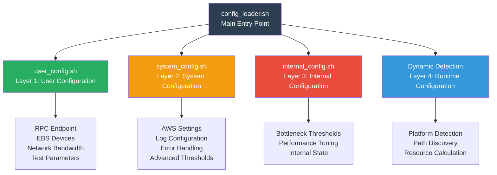

# Configuration Architecture Guide

## Overview

The Blockchain Node Benchmark Framework uses a **4-layer configuration architecture** that separates concerns and provides flexibility for different user roles. This design ensures that basic users can quickly get started while advanced users have full control over system behavior.

## Configuration Architecture



## Layer 1: User Configuration (`user_config.sh`)

**Target Users:** All framework users  
**Modification Frequency:** Frequent  
**Purpose:** Essential settings for running benchmarks

### Required Configuration

#### 1. EBS Device Configuration
```bash
# DATA device (LEDGER data storage)
LEDGER_DEVICE="nvme1n1"

# ACCOUNTS device (optional, for account data storage)
ACCOUNTS_DEVICE="nvme2n1"

# DATA volume configuration
DATA_VOL_TYPE="io2"                    # Options: "gp3" | "io2" | "instance-store"
DATA_VOL_SIZE="2000"                   # Volume size in GB
DATA_VOL_MAX_IOPS="30000"              # Maximum IOPS
DATA_VOL_MAX_THROUGHPUT="700"          # Maximum throughput in MiB/s

# ACCOUNTS volume configuration (optional)
ACCOUNTS_VOL_TYPE="io2"
ACCOUNTS_VOL_SIZE="500"
ACCOUNTS_VOL_MAX_IOPS="30000"
ACCOUNTS_VOL_MAX_THROUGHPUT="700"
```

**Why This Matters:**
- Accurate EBS baseline configuration enables precise performance analysis
- Framework compares actual performance against configured baselines
- Helps identify storage bottlenecks

#### 2. Network Configuration
```bash
# EC2 instance network bandwidth (in Gbps)
NETWORK_MAX_BANDWIDTH_GBPS=25

# ENA network monitoring
ENA_MONITOR_ENABLED=true
```

**Why This Matters:**
- Network bandwidth varies by EC2 instance type
- Enables accurate network utilization calculation
- ENA monitoring detects AWS network limitations

#### 3. Monitoring Configuration
```bash
# Unified monitoring interval (seconds)
MONITOR_INTERVAL=5              # All monitoring tasks use same interval
EBS_MONITOR_RATE=1              # EBS-specific monitoring frequency
```

#### 4. QPS Test Configuration
```bash
# Quick benchmark mode (basic QPS verification)
QUICK_INITIAL_QPS=1000
QUICK_MAX_QPS=1500
QUICK_QPS_STEP=500
QUICK_DURATION=60               # 1 minute per QPS level

# Standard benchmark mode (comprehensive testing)
STANDARD_INITIAL_QPS=1000
STANDARD_MAX_QPS=5000
STANDARD_QPS_STEP=500
STANDARD_DURATION=180           # 3 minutes per QPS level

# Intensive benchmark mode (bottleneck detection)
INTENSIVE_INITIAL_QPS=1000
INTENSIVE_MAX_QPS=10000
INTENSIVE_QPS_STEP=250
INTENSIVE_DURATION=300          # 5 minutes per QPS level
```

### Quick Start Configuration

**Minimum Required Settings:**
1. Set `LEDGER_DEVICE` to your DATA device name
2. Set `DATA_VOL_MAX_IOPS` and `DATA_VOL_MAX_THROUGHPUT` to match your EBS configuration
3. Set `NETWORK_MAX_BANDWIDTH_GBPS` to match your EC2 instance type
4. Keep other settings at default values

**Example for r7a.24xlarge with io2 volumes:**
```bash
LEDGER_DEVICE="nvme1n1"
DATA_VOL_TYPE="io2"
DATA_VOL_MAX_IOPS="30000"
DATA_VOL_MAX_THROUGHPUT="700"
NETWORK_MAX_BANDWIDTH_GBPS=25
```

## Layer 2: System Configuration (`system_config.sh`)

**Target Users:** System administrators and advanced users  
**Modification Frequency:** Occasional  
**Purpose:** AWS-specific settings and advanced features

### Key Configuration Areas

#### 1. Deployment Platform Detection
```bash
# Platform type (auto: auto-detect, aws: AWS environment, other: other platforms)
DEPLOYMENT_PLATFORM=${DEPLOYMENT_PLATFORM:-"auto"}
```

#### 2. ENA Network Monitoring Fields
```bash
# ENA allowance fields based on AWS ENA documentation
ENA_ALLOWANCE_FIELDS=(
    "bw_in_allowance_exceeded"
    "bw_out_allowance_exceeded"
    "pps_allowance_exceeded"
    "conntrack_allowance_exceeded"
    "linklocal_allowance_exceeded"
    "conntrack_allowance_available"
)
```

#### 3. Log Management
```bash
# Log level (0=DEBUG, 1=INFO, 2=WARN, 3=ERROR, 4=FATAL)
LOG_LEVEL=${LOG_LEVEL:-1}

# Log rotation
MAX_LOG_SIZE=${MAX_LOG_SIZE:-"10M"}
MAX_LOG_FILES=${MAX_LOG_FILES:-5}
```

#### 4. Error Handling
```bash
# Error recovery (disabled in benchmark framework for accuracy)
ERROR_RECOVERY_ENABLED=${ERROR_RECOVERY_ENABLED:-false}
ERROR_RECOVERY_DELAY=${ERROR_RECOVERY_DELAY:-10}
```

### When to Modify

Modify `system_config.sh` when you need to:
- Customize log verbosity or rotation
- Adjust AWS-specific monitoring fields
- Change error handling behavior
- Configure advanced platform detection

## Layer 3: Internal Configuration (`internal_config.sh`)

**Target Users:** Framework developers  
**Modification Frequency:** Rare  
**Purpose:** Internal implementation details and performance tuning

### Bottleneck Detection Thresholds

```bash
# CPU and Memory thresholds
BOTTLENECK_CPU_THRESHOLD=85               # CPU > 85% = bottleneck
BOTTLENECK_MEMORY_THRESHOLD=90            # Memory > 90% = bottleneck

# EBS thresholds
BOTTLENECK_EBS_UTIL_THRESHOLD=90          # Utilization > 90% = bottleneck
BOTTLENECK_EBS_LATENCY_THRESHOLD=50       # Latency > 50ms = bottleneck
BOTTLENECK_EBS_IOPS_THRESHOLD=90          # IOPS utilization > 90% = bottleneck
BOTTLENECK_EBS_THROUGHPUT_THRESHOLD=90    # Throughput utilization > 90% = bottleneck

# Network thresholds
BOTTLENECK_NETWORK_THRESHOLD=80           # Network > 80% = bottleneck
BOTTLENECK_ERROR_RATE_THRESHOLD=5         # Error rate > 5% = bottleneck

# Bottleneck Detection Control
BOTTLENECK_CONSECUTIVE_COUNT=3            # Consecutive detection count threshold
BOTTLENECK_ANALYSIS_WINDOW=30             # Bottleneck analysis time window (seconds)

# Blockchain Node Health Check Thresholds
BLOCK_HEIGHT_DIFF_THRESHOLD=50            # Block height difference threshold
BLOCK_HEIGHT_TIME_THRESHOLD=300           # Block time difference threshold (seconds)
```

#### Bottleneck Detection Stop Rules

The framework uses a **dual verification mechanism** to decide whether to stop testing:

**Stop Condition**:
```
Resource Bottleneck (3 consecutive detections) AND Node Unhealthy → Stop Testing
```

**Continue Condition**:
```
Resource Bottleneck (3 consecutive detections) AND Node Healthy → Reset Counter, Continue Testing
```

**Configuration Details**:

1. **BOTTLENECK_CONSECUTIVE_COUNT** (Default: 3)
   - Number of consecutive bottleneck detections required
   - Prevents false positives from transient performance spikes
   - Recommended: 3-5 times

2. **BOTTLENECK_ANALYSIS_WINDOW** (Default: 30 seconds)
   - Time window for offline bottleneck analysis
   - Analyzes data N seconds before and after bottleneck occurrence
   - Used for deep root cause analysis
   - Recommended: 30-60 seconds

3. **BLOCK_HEIGHT_DIFF_THRESHOLD** (Default: 50)
   - Block height difference threshold between local node and mainnet
   - Exceeding this indicates node sync lag
   - Recommended: 50-100 blocks

4. **BLOCK_HEIGHT_TIME_THRESHOLD** (Default: 300 seconds)
   - Time difference threshold between local node and mainnet block time
   - Exceeding this indicates node sync delay
   - Recommended: 300-600 seconds (5-10 minutes)

**How It Works**:

```bash
# Check after each QPS test round
if Resource Bottleneck Detected (CPU/Memory/EBS/Network exceeds threshold):
    BOTTLENECK_COUNT++
    
    if BOTTLENECK_COUNT >= BOTTLENECK_CONSECUTIVE_COUNT:
        # Check node health status
        if (block_height_diff > BLOCK_HEIGHT_DIFF_THRESHOLD) OR 
           (block_height_time_diff > BLOCK_HEIGHT_TIME_THRESHOLD):
            # Node unhealthy → Real performance bottleneck
            Stop testing, save bottleneck context
        else:
            # Node healthy → Possible false positive (e.g., iostat 100% but AWS EBS utilization low)
            Reset BOTTLENECK_COUNT = 0
            Continue testing
```

**Use Cases**:

- **Increase Threshold**: If testing stops too early, increase `BOTTLENECK_CONSECUTIVE_COUNT` to 5
- **Shorten Window**: If bottleneck analysis data is too large, reduce `BOTTLENECK_ANALYSIS_WINDOW` to 20 seconds
- **Relax Node Check**: If node sync is slow, increase `BLOCK_HEIGHT_DIFF_THRESHOLD` to 100

### Multi-Level Threshold System

The framework uses different threshold levels for different purposes:

1. **Real-time Bottleneck Detection** (`ebs_bottleneck_detector.sh`):
   - HIGH level: Base thresholds (90%, 50ms)
   - CRITICAL level: Base + 5% (95%) or Base × 2 (100ms)

2. **Offline Performance Analysis** (`ebs_analyzer.sh`):
   - WARNING level: Base × 0.8 (72% utilization, 20ms latency)

### When to Modify

⚠️ **Caution:** Only modify `internal_config.sh` if you:
- Understand the framework's internal architecture
- Need to tune bottleneck detection sensitivity
- Are developing new features
- Have specific performance requirements

## Layer 4: Dynamic Configuration (Runtime)

**Generated By:** `config_loader.sh` during initialization  
**Purpose:** Auto-detect environment and calculate derived values

### Auto-Detection Features

#### 1. Platform Detection
```bash
detect_deployment_platform() {
    # Detects AWS vs non-AWS environment
    # Adjusts ENA monitoring accordingly
}
```

#### 2. Path Discovery
```bash
detect_deployment_paths() {
    # Discovers project root
    # Sets up log directories
    # Configures output paths
}
```

#### 3. Resource Calculation
```bash
# Auto-converts Gbps to Mbps for internal use
NETWORK_MAX_BANDWIDTH_MBPS=$((NETWORK_MAX_BANDWIDTH_GBPS * 1000))
```

## Configuration Loading Order

The framework loads configurations in strict order:

```
1. config_loader.sh (entry point)
   ↓
2. user_config.sh (user settings)
   ↓
3. system_config.sh (system settings)
   ↓
4. internal_config.sh (internal settings)
   ↓
5. Dynamic detection (runtime calculations)
```

**Why This Order Matters:**
- Later layers can override earlier layers
- Dynamic detection uses values from all previous layers
- Ensures consistent configuration state

## Configuration Best Practices

### For Basic Users

1. **Start with defaults:** Only modify `user_config.sh`
2. **Set EBS baselines accurately:** Match your actual AWS configuration
3. **Verify network bandwidth:** Check your EC2 instance specifications
4. **Use appropriate test mode:**
   - Quick mode: Initial testing (7 minutes)
   - Standard mode: Regular benchmarks (15 minutes)
   - Intensive mode: Bottleneck detection (up to 2 hours)

### For Advanced Users

1. **Understand layer separation:** Know which layer to modify
2. **Document changes:** Comment your modifications
3. **Test incrementally:** Change one setting at a time
4. **Monitor impact:** Check logs after configuration changes

### For Developers

1. **Preserve layer architecture:** Don't mix concerns
2. **Add new settings to appropriate layer:**
   - User-facing → `user_config.sh`
   - System-level → `system_config.sh`
   - Internal → `internal_config.sh`
3. **Update documentation:** Document new configuration options
4. **Maintain backward compatibility:** Use default values

## Configuration Validation

The framework validates configuration at startup:

```bash
# Example validation checks
- EBS device existence
- Network bandwidth > 0
- Valid test parameters
- Required tools installed
```

**Validation Failures:**
- Framework exits with error message
- Check logs for detailed diagnostics
- Verify configuration values

## Environment Variables

Configuration can be overridden via environment variables:

```bash
# Override user configuration
export LEDGER_DEVICE="nvme2n1"
export NETWORK_MAX_BANDWIDTH_GBPS=50

# Override system configuration
export LOG_LEVEL=0  # Enable DEBUG logging

# Run benchmark
./blockchain_node_benchmark.sh --standard
```

**Priority Order:**
1. Environment variables (highest)
2. Configuration files
3. Default values (lowest)

## Troubleshooting

### Common Issues

#### 1. "EBS device not found"
**Solution:** Verify `LEDGER_DEVICE` matches actual device name
```bash
lsblk  # List all block devices
```

#### 2. "Invalid IOPS configuration"
**Solution:** Check EBS volume type and IOPS limits
- gp3: 3,000 - 16,000 IOPS
- io2: 100 - 64,000 IOPS

#### 3. "Network monitoring disabled"
**Solution:** Ensure `ENA_MONITOR_ENABLED=true` on AWS EC2

#### 4. "Configuration already loaded" warning
**Solution:** Normal behavior, prevents duplicate loading
```bash
# Force reload if needed
export FORCE_CONFIG_RELOAD=true
```

## Advanced Topics

### RPC Mode Configuration

The framework supports two RPC testing modes:

```bash
# Single RPC method testing (default)
RPC_MODE="single"

# Mixed RPC method testing (comprehensive)
RPC_MODE="mixed"
```

**Single Mode:**
- Tests one RPC method repeatedly
- Faster execution
- Focused performance analysis

**Mixed Mode:**
- Tests multiple RPC methods
- Realistic workload simulation
- Comprehensive performance profile

See [Blockchain Testing Features](./blockchain-testing-features.md) for details.

### Blockchain-Specific Configuration

```bash
# Blockchain node type
BLOCKCHAIN_NODE="solana"  # Automatically converted to lowercase

# Process names for monitoring
BLOCKCHAIN_PROCESS_NAMES=(
    "blockchain"
    "validator"
    "node.service"
)
```

The framework automatically adapts to different blockchain nodes.

## Summary

The 4-layer configuration architecture provides:

✅ **Separation of Concerns:** Each layer has a clear purpose  
✅ **Flexibility:** Users modify only what they need  
✅ **Safety:** Internal settings protected from accidental changes  
✅ **Extensibility:** Easy to add new configuration options  
✅ **Maintainability:** Clear structure for long-term maintenance

**Quick Reference:**
- **Basic usage:** Modify `user_config.sh` only
- **Advanced usage:** Also modify `system_config.sh`
- **Development:** All layers accessible
- **Runtime:** Dynamic detection handles the rest

For more information:
- [Architecture Overview](./architecture-overview.md)
- [Monitoring Mechanism](./monitoring-mechanism.md)
- [Blockchain Testing Features](./blockchain-testing-features.md)
