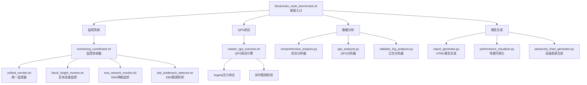
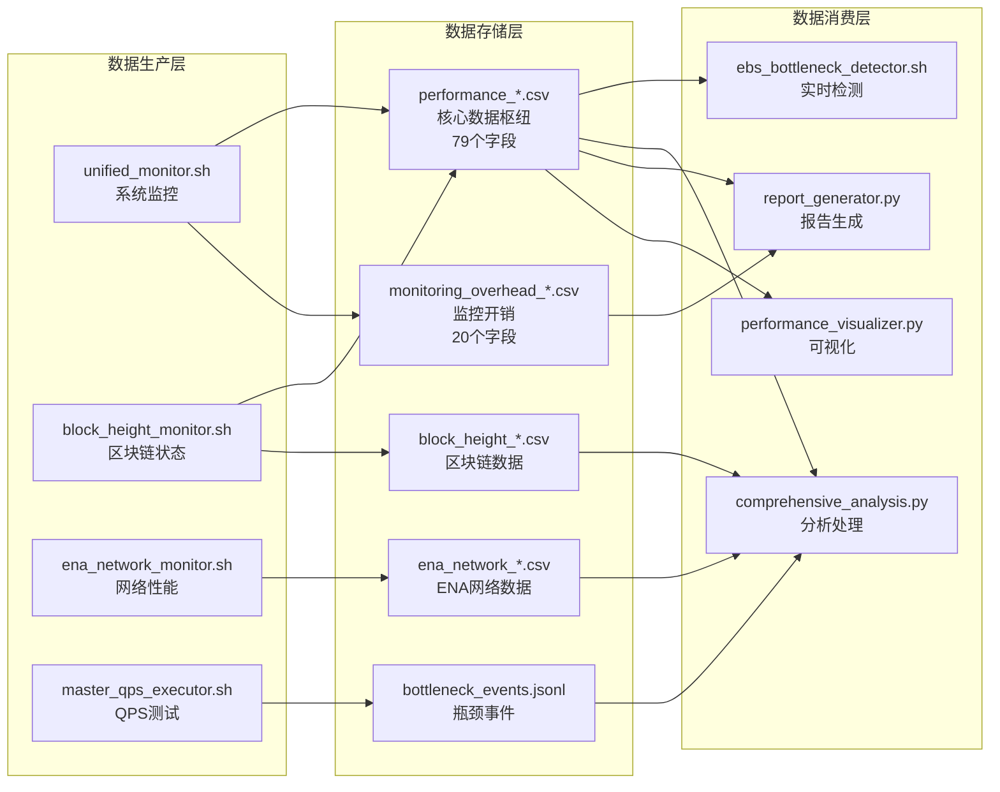
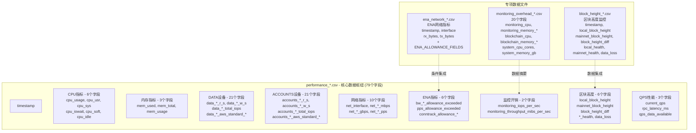
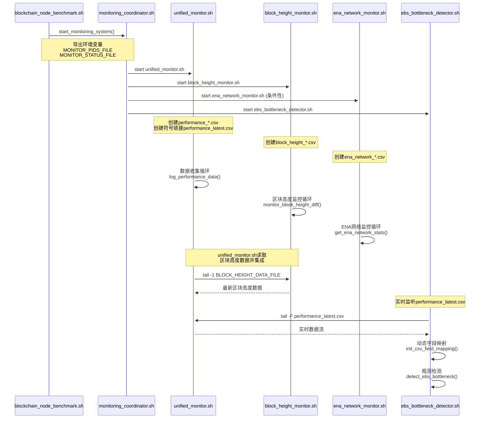
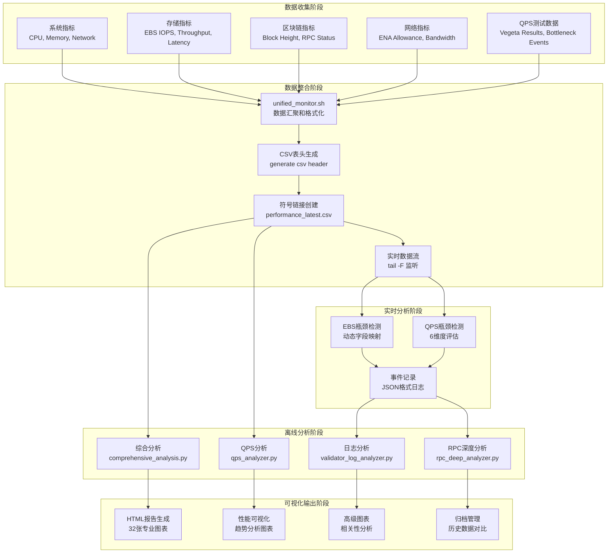

# 数据架构

## 概述

区块链节点基准测试框架实现了**多层数据架构**，高效地收集、处理和分析性能指标。系统通过协调监控系统生成**79字段性能数据**和**20字段监控开销数据**。

---

## 数据流架构

### 1. 整体架构流程



### 2. 数据流管道



### 3. 核心数据文件关系



### 4. 监控系统调用链



### 5. 数据处理和分析流程



### 6. 符号链接和文件轮转机制

```mermaid
graph LR
    subgraph "文件创建机制"
        A1[unified_monitor.sh启动]
        A2[生成时间戳文件名<br/>performance_YYYYMMDD_HHMMSS.csv]
        A3[创建符号链接<br/>performance_latest.csv]
        A4[写入CSV表头<br/>generate csv header]
    end
    
    subgraph "实时数据流"
        B1[数据收集循环<br/>log performance data]
        B2[写入时间戳文件<br/>safe write csv]
        B3[EBS检测器监听<br/>tail -F performance_latest.csv]
        B4[动态字段映射<br/>CSV_FIELD_MAP]
    end
    
    subgraph "文件轮转支持"
        C1[检测CSV格式变化<br/>timestamp格式验证]
        C2[重新初始化映射<br/>init csv field mapping]
        C3[符号链接自动跟随<br/>ln -sf 新文件]
        C4[无缝数据流切换<br/>tail -F 继续工作]
    end
    
    A1 --> A2
    A2 --> A3
    A3 --> A4
    A4 --> B1
    B1 --> B2
    B2 --> B3
    B3 --> B4
    
    B4 --> C1
    C1 --> C2
    C2 --> C3
    C3 --> C4
```



---

## 数据文件结构

### 归档目录结构

```
archives/run_*_YYYYMMDD_HHMMSS/
├── logs/
│   ├── performance_*.csv              # 主性能数据 (79个字段)
│   ├── monitoring_overhead_*.csv      # 监控开销数据 (20个字段)
│   ├── block_height_monitor_*.csv     # 区块高度监控
│   ├── ena_network_*.csv              # ENA网络监控
│   ├── blockchain_node_benchmark.log  # 主执行日志
│   └── unified_monitor.log            # 监控系统日志
├── reports/
│   ├── performance_report_en_*.html   # 英文HTML报告
│   ├── performance_report_zh_*.html   # 中文HTML报告
│   └── *.png                          # 32张专业图表
├── vegeta_results/
│   └── vegeta_*qps_*.json            # 每个级别的QPS测试结果
├── tmp/
│   ├── targets_single.json            # 单一RPC方法目标
│   ├── targets_mixed.json             # 混合RPC方法目标
│   └── monitoring_status.json         # 监控系统状态
└── test_summary.json                  # 测试摘要元数据
```

---

## 核心数据文件

### 1. 性能数据文件

**文件模式**: `logs/performance_*.csv`  
**总字段数**: 79个字段  
**更新频率**: 每5秒（可配置）

#### 字段分类

| 分类 | 字段数 | 描述 |
|------|--------|------|
| **时间戳** | 1 | 数据采集时间戳 |
| **CPU指标** | 6 | cpu_usage, cpu_usr, cpu_sys, cpu_iowait, cpu_soft, cpu_idle |
| **内存指标** | 3 | mem_used, mem_total, mem_usage |
| **DATA设备EBS** | 21 | IOPS, 吞吐量, 延迟, 利用率, AWS标准指标 |
| **ACCOUNTS设备EBS** | 21 | 与DATA设备相同结构 |
| **网络指标** | 10 | 接口, 带宽 (Mbps/Gbps), 每秒包数 |
| **ENA网络** | 6 | 配额超限计数器, 连接跟踪 |
| **监控开销** | 2 | IOPS和吞吐量开销 |
| **区块高度** | 6 | 本地/主网高度, 差值, 健康状态, 数据丢失 |
| **QPS性能** | 3 | 当前QPS, RPC延迟, 数据可用性 |

### 2. 监控开销数据文件

**文件模式**: `logs/monitoring_overhead_*.csv`  
**总字段数**: 20个字段  
**更新频率**: 每5秒

#### 字段分类

| 分类 | 字段数 | 描述 |
|------|--------|------|
| **时间戳** | 1 | 数据采集时间戳 |
| **监控系统** | 4 | CPU, 内存 (百分比/MB), 进程数 |
| **区块链节点** | 4 | CPU, 内存 (百分比/MB), 进程数 |
| **系统资源** | 3 | CPU核心数, 内存 (GB), 磁盘 (GB) |
| **系统使用率** | 3 | CPU使用率, 内存使用率, 磁盘使用率 |
| **内存详情** | 5 | 缓存, 缓冲区, 匿名页, 映射, 共享内存 |

### 3. 测试摘要文件

**文件模式**: `test_summary.json`  
**格式**: JSON

```json
{
    "run_id": "run_*_YYYYMMDD_HHMMSS",
    "benchmark_mode": "quick|standard|intensive",
    "start_time": "YYYY-MM-DD HH:MM:SS",
    "end_time": "YYYY-MM-DD HH:MM:SS",
    "duration_minutes": 0,
    "max_successful_qps": 5000,
    "bottleneck_detected": false,
    "bottleneck_types": [],
    "bottleneck_summary": "none|cpu|memory|ebs|network",
    "test_parameters": {
        "initial_qps": 1000,
        "max_qps": 5000,
        "qps_step": 500,
        "duration_per_level": 600
    },
    "data_size": {
        "logs_mb": 3,
        "reports_mb": 34,
        "vegeta_results_mb": 1,
        "total_mb": 38
    }
}
```

### 4. Vegeta QPS测试结果

**文件模式**: `vegeta_results/vegeta_*qps_*.json`  
**格式**: JSON

```json
{
    "latencies": {
        "mean": 139674,
        "50th": 123974,
        "90th": 169127,
        "95th": 192415,
        "99th": 354598,
        "max": 41183837,
        "min": 59940
    },
    "requests": 600000,
    "rate": 1000.001044157757,
    "throughput": 1000.0007889739558,
    "success": 1,
    "status_codes": {
        "200": 600000
    },
    "errors": []
}
```

---

## 文件命名规范

### 时间戳格式

- **模式**: `YYYYMMDD_HHMMSS`
- **示例**: `20251025_150834`
- **时区**: UTC或本地系统时间

### 文件模式

| 文件类型 | 模式 | 示例 |
|---------|------|------|
| 性能数据 | `performance_*.csv` | `performance_20251025_150834.csv` |
| 监控开销 | `monitoring_overhead_*.csv` | `monitoring_overhead_20251025_150834.csv` |
| 区块高度 | `block_height_monitor_*.csv` | `block_height_monitor_20251025_150834.csv` |
| ENA网络 | `ena_network_*.csv` | `ena_network_20251025_150834.csv` |
| Vegeta结果 | `vegeta_*qps_*.json` | `vegeta_1000qps_20251025_150834.json` |
| HTML报告 | `performance_report_{lang}_*.html` | `performance_report_zh_20251025_150834.html` |

---

## 数据使用示例

### Python分析

```python
import pandas as pd

# 加载主性能数据
df = pd.read_csv('logs/performance_*.csv')
print(f"总字段数: {len(df.columns)}")  # 79个字段

# 加载监控开销数据
overhead_df = pd.read_csv('logs/monitoring_overhead_*.csv')
print(f"开销字段数: {len(overhead_df.columns)}")  # 20个字段
```

### Shell脚本

```bash
# 统计总字段数
head -1 logs/performance_*.csv | tr ',' '\n' | wc -l  # 79

# 提取特定列
awk -F',' '{print $1,$77,$78}' logs/performance_*.csv  # timestamp, current_qps, rpc_latency_ms
```

---

## 相关文档

- [架构概览](./architecture-overview.md)
- [配置指南](./configuration-guide.md)
- [监控机制](./monitoring-mechanism.md)
- [区块链测试特性](./blockchain-testing-features.md)
