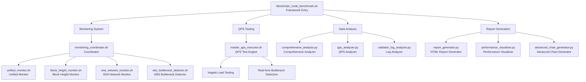
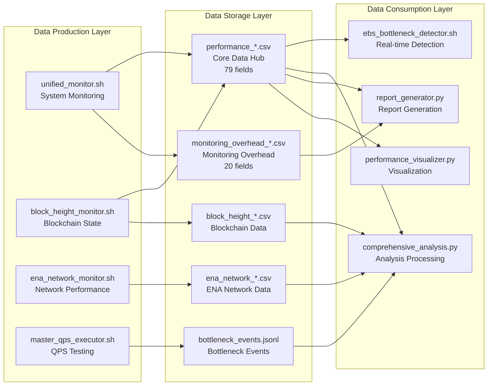
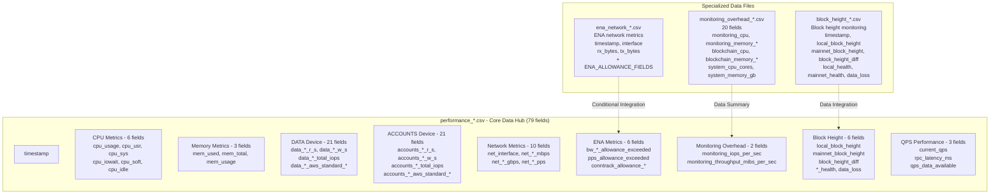
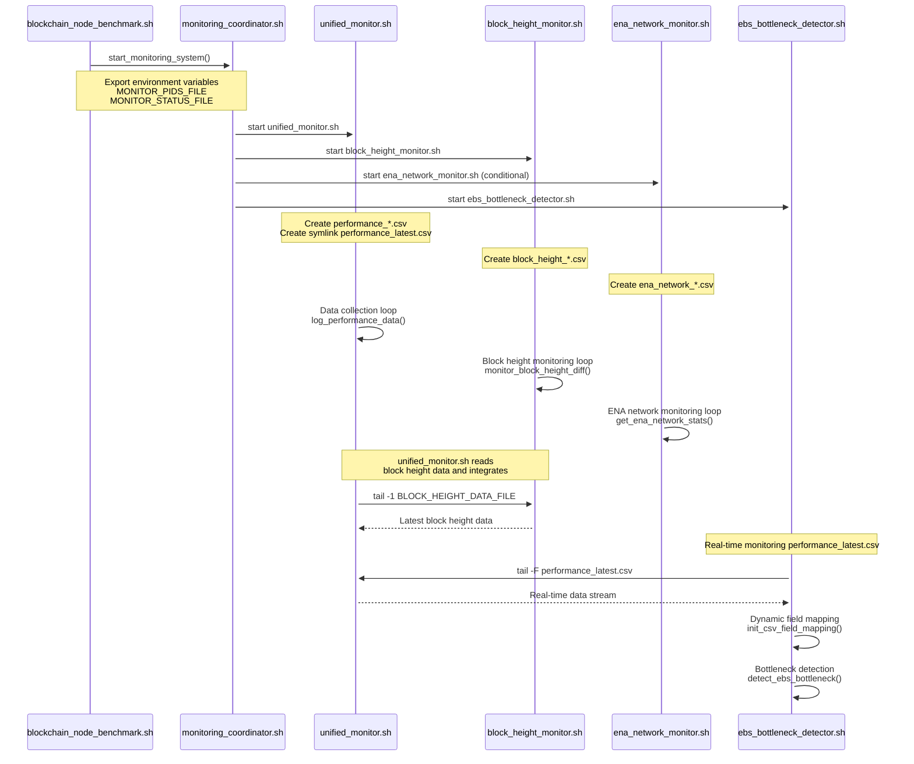

# Data Architecture

## Overview

The Blockchain Node Benchmark Framework implements a **multi-layer data architecture** that efficiently collects, processes, and analyzes performance metrics. The system generates **79-field performance data** and **20-field monitoring overhead data** through a coordinated monitoring system.

---

## Data Flow Architecture

### 1. Overall Architecture Flow



### 2. Data Flow Pipeline



### 3. Core Data File Relationships



### 4. Monitoring System Call Chain



### 5. Data Processing and Analysis Flow

```mermaid
graph TB
    subgraph "Data Collection Stage"
        A1[System Metrics<br/>CPU, Memory, Network]
        A2[Storage Metrics<br/>EBS IOPS, Throughput, Latency]
        A3[Blockchain Metrics<br/>Block Height, RPC Status]
        A4[Network Metrics<br/>ENA Allowance, Bandwidth]
        A5[QPS Test Data<br/>Vegeta Results, Bottleneck Events]
    end
    
    subgraph "Data Integration Stage"
        B1[unified_monitor.sh<br/>Data aggregation and formatting]
        B2[CSV header generation<br/>generate_csv_header()]
        B3[Symlink creation<br/>performance_latest.csv]
        B4[Real-time data stream<br/>tail -F monitoring]
    end
    
    subgraph "Real-time Analysis Stage"
        C1[EBS Bottleneck Detection<br/>Dynamic field mapping]
        C2[QPS Bottleneck Detection<br/>6-dimensional evaluation]
        C3[Event Recording<br/>JSON format logging]
    end
    
    subgraph "Offline Analysis Stage"
        D1[Comprehensive Analysis<br/>comprehensive_analysis.py]
        D2[QPS Analysis<br/>qps_analyzer.py]
        D3[Log Analysis<br/>validator_log_analyzer.py]
        D4[RPC Deep Analysis<br/>rpc_deep_analyzer.py]
    end
    
    subgraph "Visualization Output Stage"
        E1[HTML Report Generation<br/>32 professional charts]
        E2[Performance Visualization<br/>Trend analysis charts]
        E3[Advanced Charts<br/>Correlation analysis]
        E4[Archive Management<br/>Historical data comparison]
    end
    
    A1 --> B1
    A2 --> B1
    A3 --> B1
    A4 --> B1
    A5 --> B1
    
    B1 --> B2
    B2 --> B3
    B3 --> B4
    
    B4 --> C1
    B4 --> C2
    C1 --> C3
    C2 --> C3
    
    B3 --> D1
    B3 --> D2
    C3 --> D3
    C3 --> D4
    
    D1 --> E1
    D2 --> E2
    D3 --> E3
    D4 --> E4
```

### 6. Symlink and File Rotation Mechanism

```mermaid
graph LR
    subgraph "File Creation Mechanism"
        A1[unified_monitor.sh startup]
        A2[Generate timestamped filename<br/>performance_YYYYMMDD_HHMMSS.csv]
        A3[Create symlink<br/>performance_latest.csv]
        A4[Write CSV header<br/>generate_csv_header()]
    end
    
    subgraph "Real-time Data Stream"
        B1[Data collection loop<br/>log_performance_data()]
        B2[Write to timestamped file<br/>safe_write_csv()]
        B3[EBS detector monitoring<br/>tail -F performance_latest.csv]
        B4[Dynamic field mapping<br/>CSV_FIELD_MAP]
    end
    
    subgraph "File Rotation Support"
        C1[Detect CSV format changes<br/>timestamp format validation]
        C2[Reinitialize mapping<br/>init_csv_field_mapping()]
        C3[Symlink auto-follow<br/>ln -sf new file]
        C4[Seamless data stream switch<br/>tail -F continues working]
    end
    
    A1 --> A2
    A2 --> A3
    A3 --> A4
    A4 --> B1
    B1 --> B2
    B2 --> B3
    B3 --> B4
    
    B4 --> C1
    C1 --> C2
    C2 --> C3
    C3 --> C4
```

---

## Data File Structure

### Archive Directory Structure

```
archives/run_*_YYYYMMDD_HHMMSS/
├── logs/
│   ├── performance_*.csv              # Main performance data (79 fields)
│   ├── monitoring_overhead_*.csv      # Monitoring overhead data (20 fields)
│   ├── block_height_monitor_*.csv     # Block height monitoring
│   ├── ena_network_*.csv              # ENA network monitoring
│   ├── blockchain_node_benchmark.log  # Main execution log
│   └── unified_monitor.log            # Monitoring system log
├── reports/
│   ├── performance_report_en_*.html   # English HTML report
│   ├── performance_report_zh_*.html   # Chinese HTML report
│   └── *.png                          # 32 professional charts
├── vegeta_results/
│   └── vegeta_*qps_*.json            # QPS test results per level
├── tmp/
│   ├── targets_single.json            # Single RPC method targets
│   ├── targets_mixed.json             # Mixed RPC method targets
│   └── monitoring_status.json         # Monitoring system status
└── test_summary.json                  # Test summary metadata
```

---

## Core Data Files

### 1. Performance Data File

**File Pattern**: `logs/performance_*.csv`  
**Total Fields**: 79 fields  
**Update Frequency**: Every 5 seconds (configurable)

#### Field Categories

| Category | Fields | Description |
|----------|--------|-------------|
| **Timestamp** | 1 | Data collection timestamp |
| **CPU Metrics** | 6 | cpu_usage, cpu_usr, cpu_sys, cpu_iowait, cpu_soft, cpu_idle |
| **Memory Metrics** | 3 | mem_used, mem_total, mem_usage |
| **DATA Device EBS** | 21 | IOPS, throughput, latency, utilization, AWS standard metrics |
| **ACCOUNTS Device EBS** | 21 | Same structure as DATA device |
| **Network Metrics** | 10 | Interface, bandwidth (Mbps/Gbps), packets per second |
| **ENA Network** | 6 | Allowance exceeded counters, connection tracking |
| **Monitoring Overhead** | 2 | IOPS and throughput overhead |
| **Block Height** | 6 | Local/mainnet height, diff, health status, data loss |
| **QPS Performance** | 3 | Current QPS, RPC latency, data availability |

### 2. Monitoring Overhead Data File

**File Pattern**: `logs/monitoring_overhead_*.csv`  
**Total Fields**: 20 fields  
**Update Frequency**: Every 5 seconds

#### Field Categories

| Category | Fields | Description |
|----------|--------|-------------|
| **Timestamp** | 1 | Data collection timestamp |
| **Monitoring System** | 4 | CPU, memory (percent/MB), process count |
| **Blockchain Node** | 4 | CPU, memory (percent/MB), process count |
| **System Resources** | 3 | CPU cores, memory (GB), disk (GB) |
| **System Usage** | 3 | CPU usage, memory usage, disk usage |
| **Memory Details** | 5 | Cached, buffers, anon pages, mapped, shared memory |

### 3. Test Summary File

**File Pattern**: `test_summary.json`  
**Format**: JSON

```json
{
    "run_id": "run_*_YYYYMMDD_HHMMSS",
    "benchmark_mode": "quick|standard|intensive",
    "start_time": "YYYY-MM-DD HH:MM:SS",
    "end_time": "YYYY-MM-DD HH:MM:SS",
    "duration_minutes": 0,
    "max_successful_qps": 5000,
    "bottleneck_detected": false,
    "bottleneck_types": [],
    "bottleneck_summary": "none|cpu|memory|ebs|network",
    "test_parameters": {
        "initial_qps": 1000,
        "max_qps": 5000,
        "qps_step": 500,
        "duration_per_level": 600
    },
    "data_size": {
        "logs_mb": 3,
        "reports_mb": 34,
        "vegeta_results_mb": 1,
        "total_mb": 38
    }
}
```

### 4. Vegeta QPS Test Results

**File Pattern**: `vegeta_results/vegeta_*qps_*.json`  
**Format**: JSON

```json
{
    "latencies": {
        "mean": 139674,
        "50th": 123974,
        "90th": 169127,
        "95th": 192415,
        "99th": 354598,
        "max": 41183837,
        "min": 59940
    },
    "requests": 600000,
    "rate": 1000.001044157757,
    "throughput": 1000.0007889739558,
    "success": 1,
    "status_codes": {
        "200": 600000
    },
    "errors": []
}
```

---

## File Naming Conventions

### Timestamp Format

- **Pattern**: `YYYYMMDD_HHMMSS`
- **Example**: `20251025_150834`
- **Timezone**: UTC or local system time

### File Patterns

| File Type | Pattern | Example |
|-----------|---------|---------|
| Performance Data | `performance_*.csv` | `performance_20251025_150834.csv` |
| Monitoring Overhead | `monitoring_overhead_*.csv` | `monitoring_overhead_20251025_150834.csv` |
| Block Height | `block_height_monitor_*.csv` | `block_height_monitor_20251025_150834.csv` |
| ENA Network | `ena_network_*.csv` | `ena_network_20251025_150834.csv` |
| Vegeta Results | `vegeta_*qps_*.json` | `vegeta_1000qps_20251025_150834.json` |
| HTML Reports | `performance_report_{lang}_*.html` | `performance_report_en_20251025_150834.html` |

---

## Data Usage Examples

### Python Analysis

```python
import pandas as pd

# Load main performance data
df = pd.read_csv('logs/performance_*.csv')
print(f"Total fields: {len(df.columns)}")  # 79 fields

# Load monitoring overhead data
overhead_df = pd.read_csv('logs/monitoring_overhead_*.csv')
print(f"Overhead fields: {len(overhead_df.columns)}")  # 20 fields
```

### Shell Script

```bash
# Count total fields
head -1 logs/performance_*.csv | tr ',' '\n' | wc -l  # 79

# Extract specific columns
awk -F',' '{print $1,$77,$78}' logs/performance_*.csv  # timestamp, current_qps, rpc_latency_ms
```

---

## Related Documentation

- [Architecture Overview](./architecture-overview.md)
- [Configuration Guide](./configuration-guide.md)
- [Monitoring Mechanism](./monitoring-mechanism.md)
- [Blockchain Testing Features](./blockchain-testing-features.md)
