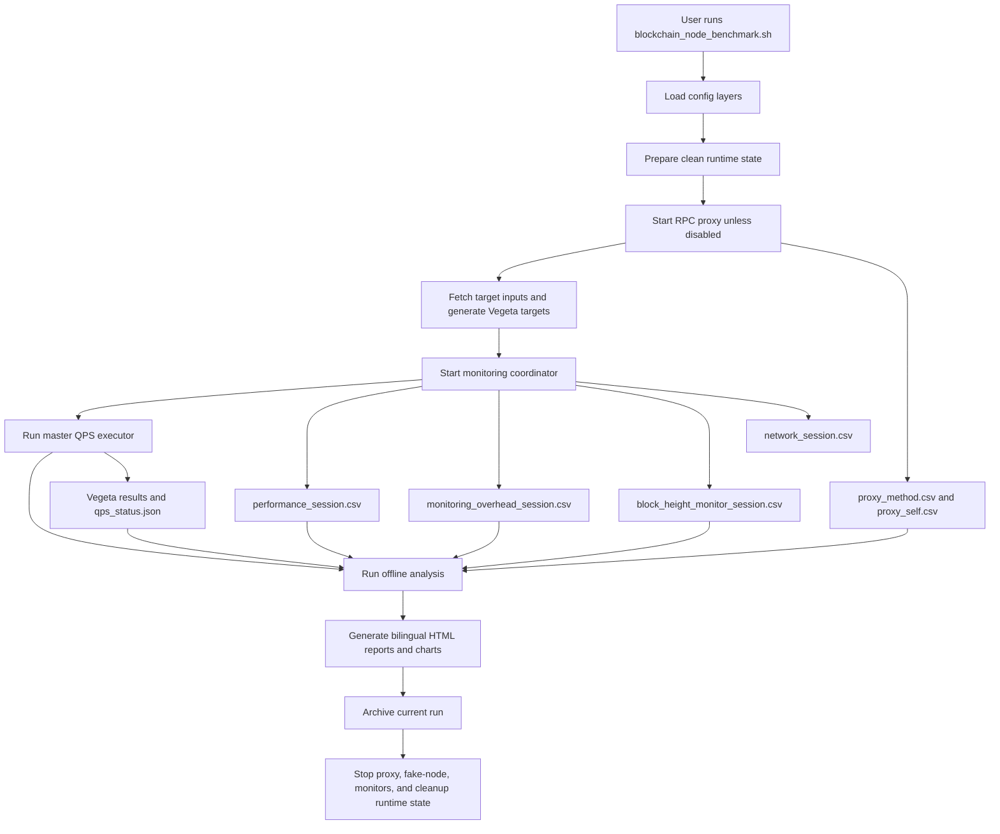
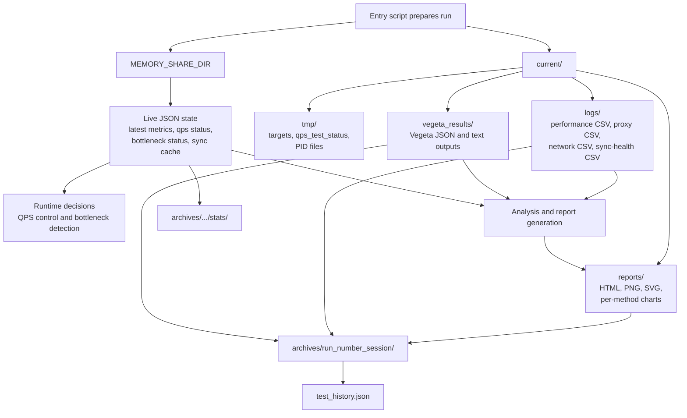
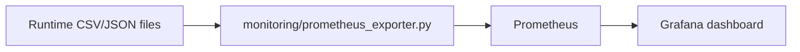

# Framework Flow and Data Lifecycle

[中文](../zh/framework-flow.md) | [English](framework-flow.md)

This document describes the current end-to-end runtime path of
`blockchain-node-benchmark`: from the entry command, through RPC workload
generation and monitoring, to HTML reports, archives, and the optional
Prometheus/Grafana data stream.

It is intentionally based on the current code path rather than older design
notes. The key entry points are:

- `blockchain_node_benchmark.sh`
- `config/config_loader.sh`
- `core/master_qps_executor.sh`
- `monitoring/monitoring_coordinator.sh`
- `monitoring/unified_monitor.sh`
- `monitoring/block_height_monitor.sh`
- `tools/target_generator.sh`
- `analysis/*.py`
- `visualization/report_generator.py`
- `tools/benchmark_archiver.sh`
- `monitoring/prometheus_exporter.py`

## High-Level Runtime Flow



The runtime is built around file contracts. Collectors write timestamped CSV and
JSON artifacts. Analysis and reporting consume those artifacts by path, not by
calling collectors directly.

## Step 1: Configuration Loading

`blockchain_node_benchmark.sh` sources `config/config_loader.sh` before doing
real work. The loader builds the runtime environment in this order:

1. `config/user_config.sh`: user-owned values such as `LOCAL_RPC_URL`,
   `BLOCKCHAIN_NODE`, `BLOCKCHAIN_PROCESS_NAMES`, disk baselines, machine
   metadata, network bandwidth, and optional chain-specific endpoint overrides.
2. `config/provider_disk_config.sh`: provider disk baseline normalization.
3. `config/system_config.sh`: system defaults and internal thresholds.
4. `config/internal_config.sh`: benchmark and monitor defaults, including
   block-height health thresholds.
5. `config/deployment_mode_detector.sh`: runtime mode detection for VM,
   Docker, and Kubernetes.
6. `config/runtime_paths.sh`: host path and cgroup path resolution.
7. `config/chains/<chain>.json`: the selected chain template, RPC workload
   methods, parameter formats, proxy extraction rules, and sync-health model.

The loader also creates the runtime filesystem:

```text
<deployment-root>/blockchain-node-benchmark-result/
  current/
    logs/
    reports/
    vegeta_results/
    tmp/
    errors/
    python_errors/
  archives/
  test_history.json
```

The default in-memory state directory is:

```text
/dev/shm/blockchain-node-benchmark
```

For containerized observability, `MEMORY_SHARE_DIR` can be pointed to a shared
mounted directory so the exporter container can read live JSON artifacts.

## File Contract and Data Lifecycle



`current/` is disposable and belongs to the active run. `MEMORY_SHARE_DIR`
contains live state for runtime decisions and may be cleaned at startup or after
archiving. `archives/` is the durable output boundary for reports, logs, Vegeta
results, selected runtime state, and run summaries.

## Step 2: Clean Startup State

At startup, `blockchain_node_benchmark.sh` calls `prepare_clean_runtime_state`.
It removes stale per-run state before creating a new benchmark lifecycle:

- `performance_latest.csv`
- `proxy_method.csv`
- `proxy_self.csv`
- proxy logs
- monitor PID files
- block-height cache and stale health flags
- bottleneck JSON files
- event-manager lock/notification files
- stale memory-share PID/lock/flag files

This is important because the framework uses long-running background processes.
A clean startup prevents a previous run from making the next run look healthy
while reading stale data.

## Step 3: RPC Workload Generation

`prepare_benchmark_data` performs two actions:

1. `tools/fetch_active_accounts.py` creates account-like target inputs under
   `current/tmp/active_accounts.txt` when the file does not already exist.
2. `tools/target_generator.sh` converts those inputs into Vegeta target files:
   - `current/tmp/targets_single.json`
   - `current/tmp/targets_mixed.json`

The selected workload mode is controlled by `RPC_MODE` or CLI flags:

- `single`: use the chain template's `rpc_methods.single`.
- `mixed`: use `rpc_methods.mixed_weighted` and generate requests according to
  configured weights. The weights are a workload distribution, not a comparison
  between single and mixed mode.

The generated requests are adapter-driven. The chain template and
`tools/chain_adapters/` decide how to build JSON-RPC, REST, Substrate,
Tendermint, Bitcoin JSON-RPC, or Hedera dual-route requests.

## Step 4: RPC Proxy and Per-Method Attribution

The normal runtime path starts a local RPC proxy unless `--no-proxy` is used.
The proxy reads `proxy_extraction` from the selected chain template and records
per-request method metadata:

```text
current/logs/proxy_method.csv
current/logs/proxy_self.csv
current/logs/rpc_proxy.log
```

The proxy is intentionally in the workload path:

```text
Vegeta target -> proxy -> real node or fake-node
```

`analysis/per_method_attribution.py` and the report generator use
`proxy_method.csv` together with the unified monitor CSV to produce per-method
QPS, request-to-response P50/P90/P99 latency, RPC failure-rate,
success/failure count, and resource-attribution charts.

The proxy does not persist full RPC response bodies. It only parses a limited
response prefix in memory and writes lightweight success fields to
`proxy_method.csv`:

- `transport_success`: HTTP status is 2xx or 3xx.
- `rpc_success`: transport succeeded and, for JSON-RPC, the response does not
  contain an `error` object.
- `rpc_error_code` / `rpc_error_message`: compact failure summary when
  available.

Only workload RPC methods configured in the selected `single` or `mixed` mode
are counted for per-method attribution. Sync-health probes are excluded by
matching methods against the chain template workload list.

## Step 5: Monitoring Lifecycle

`start_monitoring_system` writes `current/tmp/qps_test_status` and starts
`monitoring/monitoring_coordinator.sh start`.

The coordinator starts these monitors:

- `unified_monitor.sh`: main CSV aggregator.
- `network_monitor.sh`: provider-aware NIC metrics.
- `block_height_monitor.sh`: chain sync-health and block-height data.
- `disk_bottleneck_detector.sh`: real-time disk bottleneck detection.

The monitor lifecycle is controlled by the `qps_test_status` marker. The
unified monitor follows that marker, collecting until the QPS executor finishes
and the entry script removes it.

## Step 6: Unified Performance CSV

`monitoring/unified_monitor.sh` writes:

```text
current/logs/performance_<session>.csv
current/logs/performance_latest.csv -> performance_<session>.csv
```

The CSV header is generated from the active runtime configuration. It contains
these groups:

- CPU: total usage, user, system, iowait, softirq, idle.
- Memory: used, total, usage percent.
- Disk: DATA and optional ACCOUNTS device metrics from `iostat`, including
  provider-normalized IOPS and throughput fields.
- Network: interface throughput and packet-rate fields.
- Provider NIC: AWS ENA counters when enabled; GCP/generic collectors otherwise
  use provider-specific network files and generic CSV fields.
- Monitoring overhead summary: monitoring IOPS and throughput.
- Sync health: local height, target height, diff, health fields, sync mode,
  status, reported lag, freshness, and probe error.
- QPS runtime fields: current QPS, RPC latency, and availability flag.
- cgroup fields: VM/Docker/Kubernetes cgroup counters when available.
- Cloud provider marker.

The unified CSV is the main data hub for analysis and report generation.
Consumers read columns by name, because optional provider fields may vary.

## Step 7: System Resource Calculations

The framework calculates resource signals from operating-system tools and
runtime files:

- CPU comes from `mpstat` and is represented as percentage utilization.
- Memory comes from `free` and `/proc/meminfo`.
- Disk comes from `iostat -x`; DATA and ACCOUNTS devices are configured in
  `config/user_config.sh`.
- Disk IOPS and throughput are normalized with provider-aware rules. GCP and
  generic platforms mostly use observed IOPS/throughput directly. AWS EBS can
  normalize large I/O operations into provider-accounted IOPS.
- Network comes from `sar -n DEV` plus provider-specific NIC collectors.
- Kubernetes/Docker/VM cgroup counters come from `monitoring/cgroup_collector.py`
  through a fail-soft wrapper.
- Block height and sync-health fields come from `block_height_monitor.sh` and
  the chain adapter sync-health model.

The framework treats unavailable metrics as degraded signals rather than
silently inventing values. For example, Docker or local mock tests may generate
a valid report with empty disk charts if no real block device is visible.

## Step 8: Monitoring Overhead and Observer Cost

The framework measures its own monitoring cost in two ways.

The unified CSV includes:

```text
monitoring_iops_per_sec
monitoring_throughput_mibs_per_sec
```

`monitoring/lib/monitoring_overhead.sh` discovers monitoring processes and
reads `/proc/<pid>/io`. It calculates deltas for:

- read/write bytes
- read/write syscall counts
- derived IOPS per second
- derived throughput in MiB/s

The dedicated overhead CSV is:

```text
current/logs/monitoring_overhead_<session>.csv
```

`monitoring/lib/monitoring_overhead_csv.sh` writes a 20-field row containing:

- monitoring process CPU, memory, and process count
- blockchain node process CPU, memory, and process count
- static system capacity: CPU cores, memory, disk size
- dynamic system state: CPU usage, memory usage, disk usage, cache, buffers,
  anonymous pages, mapped memory, and shared memory

This allows the report to distinguish:

- resources used by the blockchain node
- resources used by the monitoring framework itself
- the remaining system resources

## Step 9: Sync Health and Node Health

`monitoring/block_height_monitor.sh` writes:

```text
current/logs/block_height_monitor_<session>.csv
/dev/shm/blockchain-node-benchmark/block_height_monitor_cache.json
/dev/shm/blockchain-node-benchmark/block_height_time_exceeded.flag
```

Each chain template defines `_meta.sync_health`. Supported sync-health modes
include:

- `absolute_gap`: compare local and target numeric heights.
- `conditional_gap`: use a sync object only while the node reports catching up.
- `reported_lag`: use node-reported lag, such as slots behind.
- `freshness_only`: evaluate probe success and whether local progress is stale.
- `health_only`: use boolean or coarse health output.

The framework reuses these thresholds where possible:

- `BLOCK_HEIGHT_DIFF_THRESHOLD`
- `BLOCK_HEIGHT_TIME_THRESHOLD`
- `BLOCK_HEIGHT_MONITOR_RATE`

`bottleneck_detector.sh` reads the block-height CSV/cache instead of running an
independent hardcoded height path. This keeps bottleneck decisions tied to the
same sync-health signal that appears in reports.

## Step 10: QPS Execution

`core/master_qps_executor.sh` owns the Vegeta loop. It supports:

- `--quick`
- `--standard`
- `--intensive`
- `--single`
- `--mixed`
- custom `--initial-qps`, `--max-qps`, `--step-qps`, and `--duration`

During the run it writes Vegeta outputs under:

```text
current/vegeta_results/
```

Runtime QPS state and bottleneck state are written to memory-share files such
as:

```text
/dev/shm/blockchain-node-benchmark/qps_status.json
/dev/shm/blockchain-node-benchmark/bottleneck_status.json
```

The entry script removes the `qps_test_status` marker after QPS execution, then
waits briefly so monitors can flush final data.

## Step 11: Analysis and Chart Generation

`execute_data_analysis` uses `performance_latest.csv` as the primary input. If
the file is missing or header-only, it switches to degraded report generation.

Current analysis paths include:

- `analysis/comprehensive_analysis.py`
- `analysis/cpu_disk_correlation_analyzer.py`
- `analysis/qps_analyzer.py`
- `analysis/rpc_deep_analyzer.py`
- `tools/disk_analyzer.sh`
- `analysis/per_method_attribution.py` through the report generator

The exact chart set depends on available input fields. The report generator
shows available charts and lists missing ones instead of assuming every chart
can be generated in every environment.

Important examples:

- Disk charts require valid `iostat` samples and configured disk devices.
- CPU/disk correlation requires enough numeric CPU and disk samples.
- Per-method charts require `proxy_method.csv` and workload methods from the
  selected chain template.
- Block-height charts require block-height or sync-health samples.

## Step 12: HTML Reports

`visualization/report_generator.py` creates bilingual HTML reports from the
current run:

```text
current/reports/*.html
current/reports/*.png
current/reports/per_method_charts/
```

The report includes:

- configuration and environment metadata
- data quality summary
- system-level bottleneck criteria
- disk analysis
- monitoring overhead analysis
- sync-health/block-height section
- per-method workload attribution
- available PNG charts
- notices for missing chart inputs

The HTML report is a report consumer, not a source of truth. If a section is
empty, check the upstream CSV/JSON artifact first.

## Step 13: Archiving

After reports are generated, `tools/benchmark_archiver.sh --archive` moves the
current run into:

```text
<data-dir>/archives/run_<number>_<session>/
```

It also writes:

```text
archives/run_<number>_<session>/test_summary.json
archives/run_<number>_<session>/stats/
<data-dir>/test_history.json
```

Archived content includes logs, reports, Vegeta results, selected memory-share
state, and a run summary. The next run starts with a clean `current/`
directory while historical runs remain under `archives/`.

## Optional Prometheus and Grafana Flow

Prometheus/Grafana is intentionally optional and disabled by default.



The exporter:

- reads `latest_metrics.json`, `block_height_monitor_cache.json`,
  `bottleneck_status.json`, `qps_status.json`, and `proxy_method.csv`;
- exposes a bounded Prometheus text-format snapshot;
- filters per-method metrics to workload methods from the selected chain
  template;
- does not query blockchain RPC endpoints;
- does not write benchmark state;
- does not replace CSV/HTML reports.

Use:

```bash
OBSERVABILITY_STACK_ENABLED=true deploy/observability/start.sh
deploy/observability/stop.sh
```

The observability stack is useful for live dashboards during a run, while the
archived HTML report remains the durable benchmark artifact.

`OBSERVABILITY_STACK_ENABLED` is defined in `config/user_config.sh` and defaults
to `false`. The benchmark entry command never starts Prometheus or Grafana by
itself.

## Operational Boundaries

- The entry command owns benchmark execution and local monitor lifecycle.
- Kubernetes cluster resources are not created automatically by the entry
  command. Deploy `deploy/k8s/` first and validate with
  `deploy/k8s/validate.sh`.
- fake-node is for deterministic closed-loop validation and should use recorded
  fixtures that match `chain + method + response`.
- Prometheus/Grafana is read-only and opt-in.
- Runtime RPC response body capture during Vegeta pressure tests is not part of
  the benchmark path. The proxy records success/failure summaries only. Use
  `tools/fake-node/record_rpc_fixtures.sh` for deliberate fixture recording.
- Result archives are the durable output; `current/` is disposable per run.
