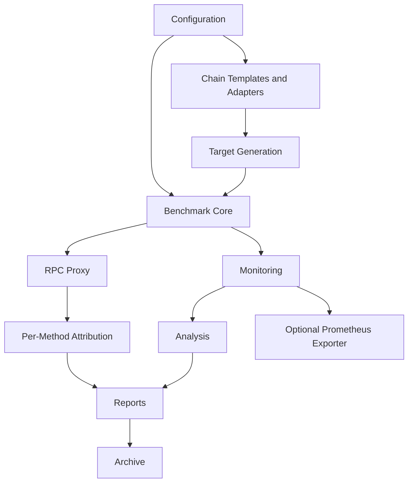
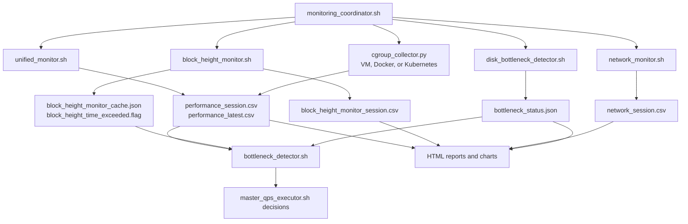

# Module Guide

[中文](../zh/module-guide.md) | [English](module-guide.md)

This guide explains the main modules in the current framework, their
responsibilities, inputs, outputs, and extension boundaries.

## Module Map



## Source Directory Layout

```text
blockchain-node-benchmark/
  blockchain_node_benchmark.sh      Main entry command and lifecycle owner
  config/                           User config, runtime detection, chain templates
  core/                             QPS executor and shared shell functions
  lib/                              Entry-level lifecycle helpers such as proxy startup
  monitoring/                       System, sync-health, network, cgroup, and overhead collectors
  analysis/                         Offline analysis and attribution scripts
  visualization/                    HTML report and chart generation
  tools/                            Target generation, fake-node, proxy, archive, audits
  deploy/k8s/                       Kubernetes collector deployment manifests and validation
  deploy/observability/             Optional Prometheus/Grafana stack
  docs/                             Current user/developer documentation
  tests/                            Regression, smoke, lifecycle, schema, and deployment tests
```

For the end-to-end runtime sequence, see `framework-flow.md`.

## Configuration

Main files:

- `config/user_config.sh`
- `config/config_loader.sh`
- `config/system_config.sh`
- `config/internal_config.sh`
- `config/deployment_mode_detector.sh`
- `config/runtime_paths.sh`
- `config/chains/*.json`

Responsibilities:

- Keep user-required settings in `user_config.sh`.
- Detect cloud provider and runtime mode.
- Resolve VM/Docker/Kubernetes host paths.
- Register output directories and runtime files.
- Load the selected chain template.
- Export paths and configuration values for shell, Python, Go proxy, and
  monitoring subprocesses.

Primary outputs:

- `BASE_DATA_DIR`
- `CURRENT_TEST_DIR`
- `LOGS_DIR`
- `REPORTS_DIR`
- `VEGETA_RESULTS_DIR`
- `TMP_DIR`
- `ARCHIVES_DIR`
- `MEMORY_SHARE_DIR`
- `UNIFIED_LOG`
- `PERFORMANCE_LATEST_CSV`
- `BLOCK_HEIGHT_DATA_FILE`
- `QPS_STATUS_FILE`
- `BOTTLENECK_STATUS_FILE`
- chain-derived RPC method and sync-health settings

Extension boundary:

- Add user-facing knobs to `user_config.sh` only when users need to set them
  for normal operation.
- Keep derived paths and detection logic out of `user_config.sh`.
- Add new chain behavior through `config/chains/<chain>.json` and adapters,
  not hardcoded shell `case` blocks.

## Chain Templates and Adapters

Main files:

- `config/chains/*.json`
- `tools/chain_adapters/`
- `tools/fake-node/configs/*.yaml`
- `tools/fake-node/fixtures/<chain>/*.json`

Responsibilities:

- Register each supported chain.
- Define single and mixed workload methods.
- Define weighted mixed workload distribution.
- Define parameter formats and REST paths.
- Define sync-health mode and probe semantics.
- Build real requests for JSON-RPC, REST, Substrate, Tendermint, Bitcoin, and
  Hedera families.
- Keep fake-node responses matched by `chain + method + fixture`.

Primary outputs:

- adapter-generated RPC requests
- Vegeta target request bodies
- fake-node fixture mappings
- sync-health probe request and parser behavior

Extension boundary:

- If a new chain uses an existing request envelope and response shape, add only
  a chain template and fixtures.
- If it needs a new request envelope, routing rule, authentication model, or
  sync-height parser, extend `tools/chain_adapters/<family>.py` or add a new
  family deliberately.
- Do not reuse a response fixture only because two methods share parameter
  names such as `address` or `tx_hash`.

## Benchmark Core

Main files:

- `blockchain_node_benchmark.sh`
- `core/master_qps_executor.sh`
- `core/common_functions.sh`
- `tools/target_generator.sh`
- `tools/fetch_active_accounts.py`

Responsibilities:

- Validate deployment environment.
- Prepare clean runtime state.
- Prepare target input data.
- Generate single or mixed Vegeta target files.
- Start monitors.
- Run QPS ramping.
- Stop the benchmark when configured limits or bottleneck conditions are met.
- Trigger analysis, report generation, archive, and cleanup.

Primary outputs:

- `current/tmp/active_accounts.txt`
- `current/tmp/targets_single.json`
- `current/tmp/targets_mixed.json`
- `current/vegeta_results/*`
- memory-share QPS and bottleneck status JSON

Extension boundary:

- Add new workload modes only if target generation, proxy attribution,
  reporting, and tests are updated together.
- Keep chain-specific request details in adapters and templates.

## RPC Proxy

Main files:

- `lib/proxy_lifecycle.sh`
- `tools/proxy/`
- `config/chains/*.json` `proxy_extraction`

Responsibilities:

- Start a local reverse proxy in front of the real node or fake-node.
- Extract method names from JSON-RPC or REST requests.
- Write per-request method, status, RPC success/failure, request-to-response
  latency, and proxy self-metrics.
- Keep per-method attribution independent from the backend node.
- It does not record full RPC response bodies during a Vegeta run.

Primary outputs:

- `current/logs/proxy_method.csv`
- `current/logs/proxy_self.csv`
- `current/logs/rpc_proxy.log`

`proxy_method.csv` includes both transport-level and RPC-level success fields.
For JSON-RPC, HTTP 200 responses with an `error` object are counted as RPC
failures. The report uses these fields for per-method failure rate and
success/failure charts. The same proxy latency field is used for per-method
P50/P90/P99 latency percentile charts.

Extension boundary:

- Add or adjust extraction DSL in chain templates for new request shapes.
- Extend proxy extractor code only when the DSL cannot express the protocol.
- If full runtime response-body capture is added later, implement it as an
  explicit opt-in proxy feature with body-size limits, sampling, redaction
  guidance, and separate output files. Do not mix response bodies into
  `proxy_method.csv`.

## Monitoring



Main files:

- `monitoring/monitoring_coordinator.sh`
- `monitoring/unified_monitor.sh`
- `monitoring/block_height_monitor.sh`
- `monitoring/network_monitor.sh`
- `tools/disk_bottleneck_detector.sh`
- `monitoring/lib/*.sh`
- `monitoring/cgroup_collector.py`
- `deploy/k8s/`

Responsibilities:

- Start and stop monitor processes under one coordinator.
- Produce the unified performance CSV.
- Produce dedicated block-height/sync-health CSV.
- Produce provider-aware network data.
- Produce monitoring-overhead CSV.
- Write latest JSON metrics to memory share.
- Expose cgroup/container metrics for VM, Docker, and Kubernetes paths.
- Run real-time disk bottleneck detection.

Primary outputs:

- `current/logs/performance_<session>.csv`
- `current/logs/performance_latest.csv`
- `current/logs/block_height_monitor_<session>.csv`
- `current/logs/network_<session>.csv`
- `current/logs/monitoring_overhead_<session>.csv`
- `/dev/shm/blockchain-node-benchmark/latest_metrics.json`
- `/dev/shm/blockchain-node-benchmark/unified_metrics.json`
- `/dev/shm/blockchain-node-benchmark/block_height_monitor_cache.json`
- `/dev/shm/blockchain-node-benchmark/bottleneck_status.json`

Extension boundary:

- Add new collectors behind `monitoring/monitoring_coordinator.sh` only when
  lifecycle, PID cleanup, CSV schema, and smoke tests are defined.
- Keep collector output append-only or additive where possible so report
  consumers can remain column-name driven.
- For Kubernetes, deploy `deploy/k8s/` first. The framework entry command does
  not create cluster resources.

## Analysis

Main files:

- `analysis/comprehensive_analysis.py`
- `analysis/cpu_disk_correlation_analyzer.py`
- `analysis/qps_analyzer.py`
- `analysis/rpc_deep_analyzer.py`
- `analysis/per_method_attribution.py`
- `analysis/degraded_report.py`
- `tools/disk_analyzer.sh`

Responsibilities:

- Validate performance CSV presence and shape.
- Analyze QPS, latency, success rate, and performance cliffs.
- Analyze disk capacity, latency, utilization, normalized IOPS, and throughput.
- Analyze CPU/disk correlation when enough valid data exists.
- Analyze RPC behavior and sync-health fields.
- Generate per-method workload attribution from proxy data and monitor data.
- Generate a degraded HTML report when monitor data is missing or header-only.

Primary outputs:

- analysis Markdown/JSON files under `current/reports/`
- PNG charts under `current/reports/`
- per-method CSV/chart artifacts under report output paths

Extension boundary:

- Analysis should consume existing artifacts; it should not start monitors or
  query blockchain nodes.
- Missing data should become an explicit degraded state or report notice.

## Visualization and HTML Reports

Main files:

- `visualization/report_generator.py`
- `visualization/advanced_chart_generator.py`
- `visualization/performance_visualizer.py`
- `visualization/disk_chart_generator.py`
- `visualization/per_method_charts.py`
- `visualization/per_method_report.py`
- `visualization/device_manager.py`

Responsibilities:

- Generate bilingual HTML reports.
- Render available PNG charts.
- Show configuration and environment metadata.
- Show data quality summary.
- Show monitoring overhead and observer-cost analysis.
- Show system-level bottleneck criteria.
- Show per-method workload attribution.
- Show missing chart notices when the upstream data is unavailable.

Primary outputs:

- `current/reports/*.html`
- `current/reports/*.png`
- `current/reports/per_method_charts/*`

Extension boundary:

- Reports should explain missing data instead of hiding it.
- Reports should read `config/user_config.sh` metadata and runtime artifacts;
  they should not mutate benchmark state.

## Archiving

Main file:

- `tools/benchmark_archiver.sh`

Responsibilities:

- Move the completed `current/` run into `archives/run_<number>_<session>/`.
- Copy selected memory-share status files into `archives/.../stats/`.
- Generate `test_summary.json`.
- Update `test_history.json`.
- Provide list, compare, cleanup, and rebuild-history operations.

Primary outputs:

- `archives/run_<number>_<session>/`
- `archives/run_<number>_<session>/test_summary.json`
- `archives/run_<number>_<session>/stats/`
- `test_history.json`

Extension boundary:

- Archive should run after reports are generated.
- `current/` is disposable; `archives/` is durable.

## Optional Observability

Main files:

- `monitoring/prometheus_exporter.py`
- `deploy/observability/`
- `deploy/observability/grafana/`

Responsibilities:

- Read existing runtime CSV/JSON artifacts.
- Expose Prometheus metrics on `/metrics`.
- Provide a local Prometheus and Grafana stack.
- Keep live dashboards separate from benchmark execution.

Primary outputs:

- Prometheus scrape data
- Grafana dashboard panels

Extension boundary:

- The exporter is read-only.
- It must not query blockchain RPC endpoints.
- It must not write benchmark state.
- It must remain opt-in and disabled by default through
  `OBSERVABILITY_STACK_ENABLED=false`.

## Fake-Node Closed-Loop Testing

Main files:

- `tools/fake-node/`
- `tools/fake-node/record_rpc_fixtures.sh`
- `tools/fake-node/check_fixture_coverage.py`
- `tools/fake-node/runtime_probe.py`
- `tools/fake-node/runtime_probe_block_height.py`

Responsibilities:

- Replay recorded real RPC responses.
- Validate request-building and response-shape assumptions without running 36
  real blockchain nodes.
- Support full local smoke tests for chain templates, target generation, proxy
  extraction, sync health, and report generation.

Primary outputs:

- fixture coverage reports
- runtime probe results
- deterministic fake-node responses during local benchmark smoke tests

Extension boundary:

- Every new workload RPC method should have a fake-node mapping and a recorded
  fixture before it is trusted for closed-loop tests.
- Placeholders should not be treated as production-quality fixtures.
