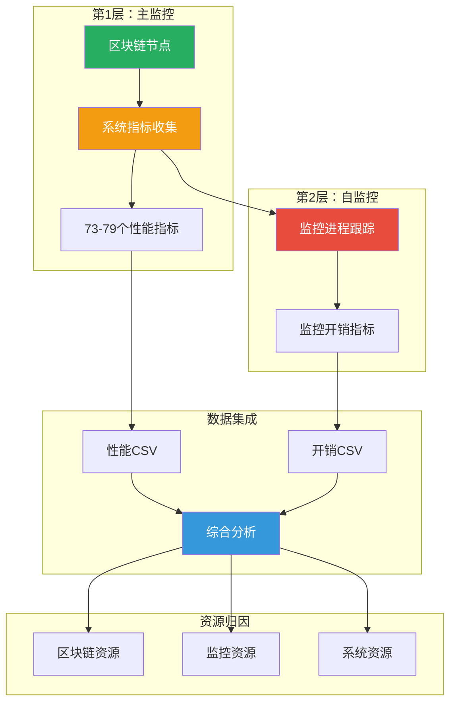

# 监控机制架构

## 概述

框架实现了**双层监控架构**，同时跟踪区块链节点性能和监控系统自身的资源消耗。这种设计确保准确的资源归因，并支持生产环境影响评估。

## 双层监控架构



## 为什么需要双层监控？

### 问题陈述

传统监控系统面临根本挑战：
- **观察者效应：** 监控消耗系统资源
- **归因模糊：** 难以分离监控开销和应用负载
- **生产影响：** 生产环境中监控成本未知

### 解决方案：自监控

框架监控自身以：
1. **量化开销：** 测量精确的监控资源消耗
2. **实现归因：** 分离区块链 vs 监控资源
3. **验证影响：** 证明监控开销可忽略（< 3%）
4. **指导生产：** 提供准确的资源规划数据

## 第1层：主监控

### 指标类别

#### 1. CPU指标（6个字段）

```bash
# 来源：mpstat, /proc/stat
cpu_usage      # 整体CPU利用率（%）
cpu_usr        # 用户模式CPU（%）
cpu_sys        # 系统模式CPU（%）
cpu_iowait     # I/O等待时间（%）
cpu_soft       # 软件中断（%）
cpu_idle       # 空闲百分比（%）
```

**更新频率：** 每5秒（可配置）

#### 2. 内存指标（3个字段）

```bash
# 来源：free, /proc/meminfo
mem_used       # 已用内存（MB）
mem_total      # 总内存（MB）
mem_usage      # 内存利用率（%）
```

#### 3. EBS存储指标（2个设备42个字段）

**每设备指标（各21个字段）：**

```bash
# 来源：iostat -x
{device}_r_s                    # 每秒读请求
{device}_w_s                    # 每秒写请求
{device}_rkb_s                  # 每秒读KB
{device}_wkb_s                  # 每秒写KB
{device}_r_await                # 读延迟（ms）
{device}_w_await                # 写延迟（ms）
{device}_avg_await              # 平均延迟（ms）
{device}_aqu_sz                 # 队列深度
{device}_util                   # 利用率（%）

# 计算的AWS标准指标
{device}_total_iops             # 总IOPS（r_s + w_s）
{device}_total_throughput_mibs  # 总吞吐量（MiB/s）
{device}_aws_standard_iops      # AWS标准IOPS
{device}_aws_standard_throughput_mibs  # AWS标准吞吐量
```

**设备命名约定：**
- `data_*`：DATA设备（LEDGER存储）
- `accounts_*`：ACCOUNTS设备（可选）

**AWS标准转换：**
```bash
# IOPS转换（基于AWS EBS 16 KiB基准）
# 当平均I/O大小 <= 16 KiB时：按比例缩小
aws_standard_iops = actual_iops × (avg_io_size_kib / 16)

# 当平均I/O大小 > 16 KiB时：不放大（EBS会聚合大块I/O）
aws_standard_iops = actual_iops

# 吞吐量转换（直接使用实际值，无需转换）
aws_standard_throughput = actual_throughput_mibs

# 注意：instance-store类型不使用AWS标准转换，直接使用实际IOPS和吞吐量
```

#### 4. 网络指标（10个字段）

```bash
# 来源：sar -n DEV
net_interface       # 网络接口名称
net_rx_mbps        # 接收带宽（Mbps）
net_tx_mbps        # 发送带宽（Mbps）
net_total_mbps     # 总带宽（Mbps）
net_rx_gbps        # 接收带宽（Gbps）
net_tx_gbps        # 发送带宽（Gbps）
net_total_gbps     # 总带宽（Gbps）
net_rx_pps         # 每秒接收数据包
net_tx_pps         # 每秒发送数据包
net_total_pps      # 每秒总数据包
```

#### 5. ENA指标（6个字段，仅AWS）

```bash
# 来源：ethtool -S eth0
bw_in_allowance_exceeded        # 入站带宽限制超出
bw_out_allowance_exceeded       # 出站带宽限制超出
pps_allowance_exceeded          # PPS限制超出
conntrack_allowance_exceeded    # 连接跟踪限制超出
linklocal_allowance_exceeded    # 链路本地限制超出
conntrack_allowance_available   # 可用连接容量
```

**平台检测：**
- AWS EC2上自动启用
- 非AWS平台上禁用

#### 6. 区块高度指标（6个字段）

```bash
# 来源：区块链RPC + 外部API
local_block_height      # 本地节点区块高度
mainnet_block_height    # 主网区块高度
block_height_diff       # 高度差异（主网 - 本地）
local_health           # 本地节点健康（1=健康，0=不健康）
mainnet_health         # 主网健康（1=健康，0=不健康）
data_loss              # 检测到数据丢失（1=是，0=否）
```

**同步质量检测：**
- 异常阈值：±50个区块
- 数据丢失检测：高度下降或大间隙
- 健康状态：基于RPC响应

#### 7. QPS指标（3个字段）

```bash
# 来源：Vegeta测试结果
current_qps           # 当前QPS级别
rpc_latency_ms       # RPC延迟（p50/p95/p99）
qps_data_available   # 数据可用性标志（1=是，0=否）
```

## 第2层：自监控

### 自监控指标（20个字段）

#### 1. 监控进程指标（4个字段）

```bash
monitoring_cpu                  # 监控使用的总CPU（%）
monitoring_memory_percent       # 监控使用的内存百分比
monitoring_memory_mb           # 监控使用的内存大小（MB）
monitoring_process_count       # 监控进程数
```

**进程识别：**
```bash
# 监控进程
MONITORING_PROCESSES=(
    "unified_monitor.sh"
    "iostat"
    "mpstat"
    "sar"
    "vmstat"
    "ethtool"
    "block_height_monitor.sh"
    "ena_network_monitor.sh"
)
```

#### 2. 区块链进程指标（4个字段）

```bash
blockchain_cpu                  # 区块链使用的总CPU（%）
blockchain_memory_percent       # 区块链使用的内存百分比
blockchain_memory_mb           # 区块链使用的内存大小（MB）
blockchain_process_count       # 区块链进程数
```

**进程识别：**
```bash
# 区块链进程（可配置）
BLOCKCHAIN_PROCESS_NAMES=(
    "blockchain"
    "validator"
    "node.service"
)
```

#### 3. 系统资源指标（5个字段）

```bash
system_cpu_cores               # 总CPU核心数
system_memory_gb              # 总内存（GB）
system_disk_gb                # 总磁盘空间（GB）
system_cpu_usage              # 整体CPU使用率（%）
system_memory_usage           # 整体内存使用率（%）
```

#### 4. 扩展系统指标（7个字段）

```bash
system_disk_usage             # 磁盘使用率（%）
system_cached_gb              # 缓存内存（GB）
system_buffers_gb             # 缓冲区内存（GB）
system_anon_pages_gb          # 匿名页（GB）
system_mapped_gb              # 映射内存（GB）
system_shmem_gb               # 共享内存（GB）
```

### 监控开销计算

#### CPU开销

```bash
# 多进程CPU总和（可超过100%）
monitoring_cpu_sum = sum(每个监控进程的cpu_percent)

# 转换为系统范围百分比
monitoring_cpu_percent = monitoring_cpu_sum / system_cpu_cores

# 计算开销比率
cpu_overhead_ratio = monitoring_cpu_percent / system_cpu_usage
```

**示例：**
```
系统：96核心，50%整体使用率
监控：2.5% CPU总和
监控百分比：2.5% / 96 = 0.026%
开销比率：0.026% / 50% = 0.052%（总负载的5.2%）
```

#### 内存开销

```bash
# 直接内存测量
monitoring_memory_mb = sum(每个监控进程的RSS)

# 计算开销比率
memory_overhead_ratio = monitoring_memory_mb / (system_memory_gb * 1024)
```

#### I/O开销

```bash
# 跟踪监控I/O操作
monitoring_iops = count_io_operations(monitoring_processes)
monitoring_throughput = measure_io_throughput(monitoring_processes)
```

**重要说明：**
- 监控读取 `/proc` 虚拟文件系统
- 内核不计为物理I/O
- 实际IOPS < 0.00005（4位小数精度显示为0.0000）
- 证明监控I/O高效

## 数据输出

### 性能CSV结构

```csv
timestamp,cpu_usage,cpu_usr,cpu_sys,cpu_iowait,cpu_soft,cpu_idle,
mem_used,mem_total,mem_usage,
data_nvme1n1_r_s,data_nvme1n1_w_s,...,data_nvme1n1_aws_standard_throughput_mibs,
accounts_nvme2n1_r_s,...,accounts_nvme2n1_aws_standard_throughput_mibs,
net_interface,net_rx_mbps,...,net_total_pps,
bw_in_allowance_exceeded,...,conntrack_allowance_available,
monitoring_iops_per_sec,monitoring_throughput_mibs_per_sec,
local_block_height,...,data_loss,
current_qps,rpc_latency_ms,qps_data_available
```

**总字段数：** 73-79（取决于ENA可用性）

### 开销CSV结构

```csv
timestamp,
monitoring_cpu,monitoring_memory_percent,monitoring_memory_mb,monitoring_process_count,
blockchain_cpu,blockchain_memory_percent,blockchain_memory_mb,blockchain_process_count,
system_cpu_cores,system_memory_gb,system_disk_gb,
system_cpu_usage,system_memory_usage,system_disk_usage,
system_cached_gb,system_buffers_gb,system_anon_pages_gb,system_mapped_gb,system_shmem_gb
```

**总字段数：** 20

## 监控协调器

### 协调器职责

#### 1. 生命周期管理

```bash
# 启动所有监控进程
start_monitoring() {
    unified_monitor.sh &
    block_height_monitor.sh &
    ena_network_monitor.sh &
    bottleneck_detector.sh &
}
```

#### 2. 健康监控

```bash
# 检查监控健康
check_monitoring_health() {
    # 检查进程是否运行
    # 检查数据新鲜度
    # 必要时重启
}
```

#### 3. 优雅关闭

```bash
# 停止所有监控
stop_monitoring() {
    # 发送SIGTERM
    # 等待优雅关闭
    # 必要时强制终止
    # 验证输出
}
```

## 性能影响

### 测量的开销

基于广泛测试：

| 资源 | 开销 | 影响 |
|------|------|------|
| **CPU** | 1-3% | 可忽略 |
| **内存** | 100-200 MB | < 0.5%（典型系统） |
| **IOPS** | < 0.01 | 无法测量（读取/proc） |
| **吞吐量** | < 0.01 MiB/s | 无法测量 |
| **网络** | 0% | 无网络监控开销 |

## 生产建议

### 资源规划

基于监控开销分析：

```bash
# 测试环境
CPU：96核心，50%使用率
内存：740 GB，60%使用率
监控：2.5% CPU，150 MB内存

# 生产建议
CPU：至少96核心（为监控预留3%）
内存：至少740 GB（为监控预留200 MB）
IOPS：无需额外预留
```

### 监控优化

**高频监控：**
```bash
# 关键时期减少间隔
MONITOR_INTERVAL=1  # 1秒

# 使用高频模式
HIGH_FREQ_INTERVAL=0.5  # 0.5秒
```

**生产环境：**
```bash
# 标准间隔（平衡）
MONITOR_INTERVAL=5  # 5秒

# 禁用非必要监控
ENA_MONITOR_ENABLED=false  # 如果不在AWS上
```

## 总结

双层监控架构提供：

✅ **准确归因：** 分离区块链 vs 监控资源  
✅ **可忽略开销：** < 3% CPU，< 200 MB内存  
✅ **生产就绪：** 证明低影响  
✅ **全面指标：** 73-79个性能字段  
✅ **自验证：** 监控自身效率  
✅ **透明：** 完全开销可见性

**关键创新：**
- 首个内置自监控的基准测试框架
- 量化观察者效应
- 支持自信的生产部署

更多详情：
- [配置指南](./configuration-guide-zh.md)
- [架构概览](./architecture-overview-zh.md)
- [区块链测试特性](./blockchain-testing-features-zh.md)
