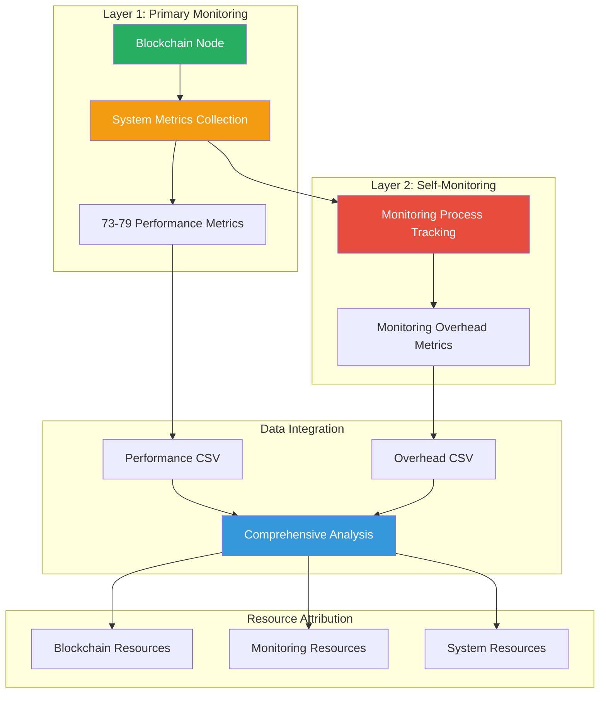
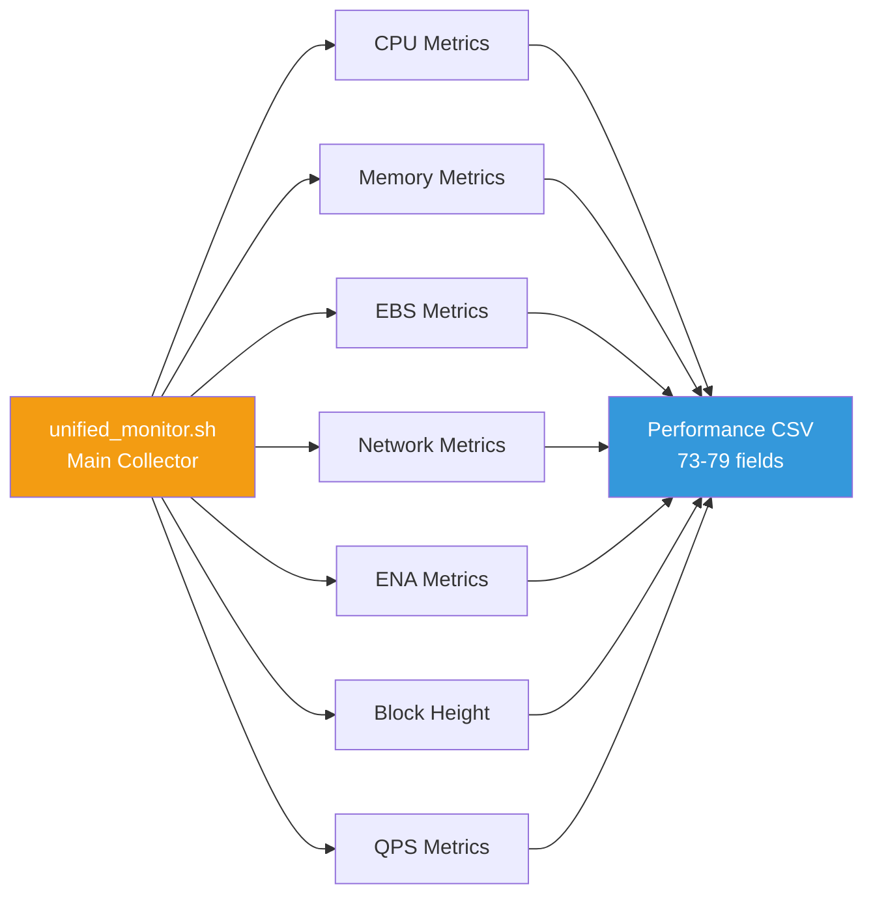
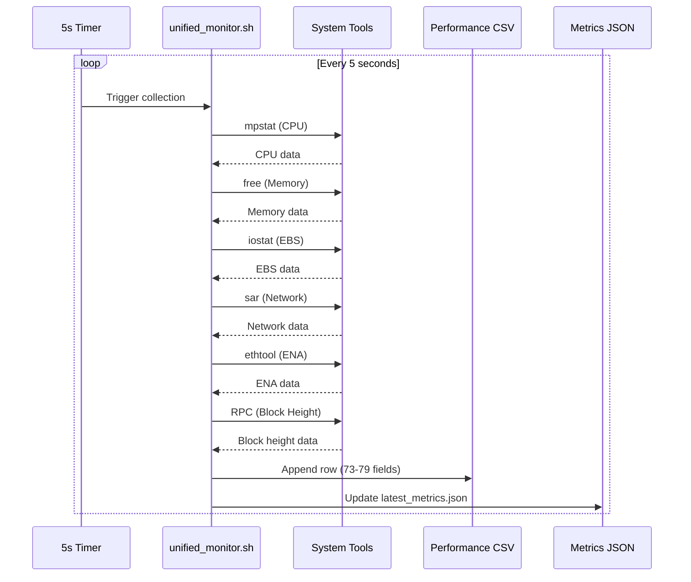
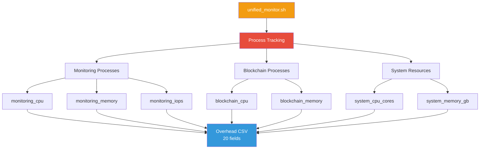
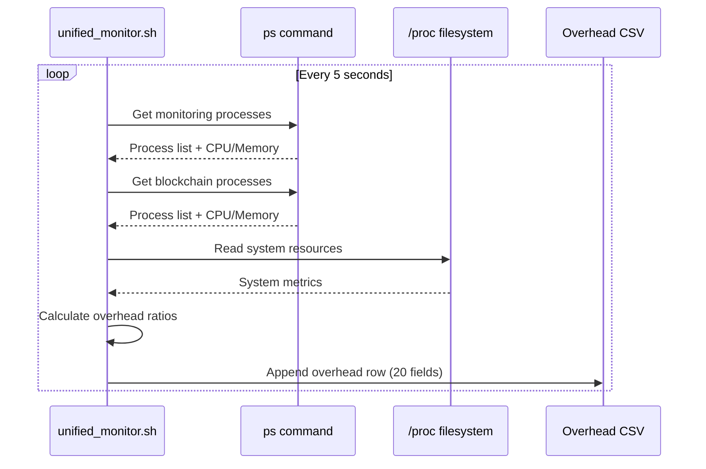
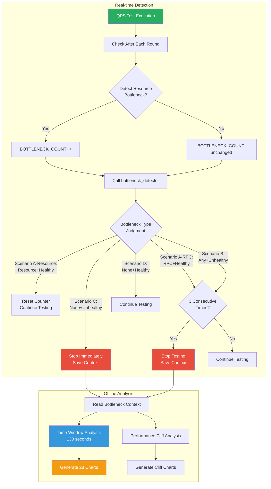
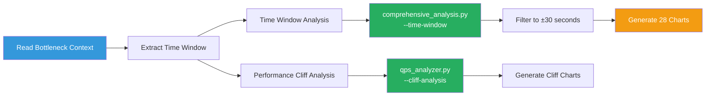
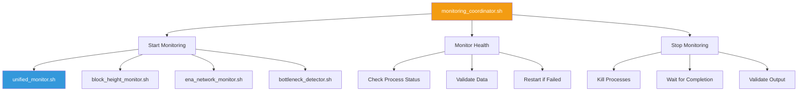

# Monitoring Mechanism Architecture

## Overview

The framework implements a **dual-layer monitoring architecture** that simultaneously tracks both the blockchain node performance and the monitoring system's own resource consumption. This design ensures accurate resource attribution and enables production environment impact assessment.

## Dual-Layer Monitoring Architecture



## Why Dual-Layer Monitoring?

### Problem Statement

Traditional monitoring systems face a fundamental challenge:
- **Observer Effect:** Monitoring consumes system resources
- **Attribution Ambiguity:** Hard to separate monitoring overhead from application load
- **Production Impact:** Unknown monitoring cost in production environments

### Solution: Self-Monitoring

The framework monitors itself to:
1. **Quantify Overhead:** Measure exact monitoring resource consumption
2. **Enable Attribution:** Separate blockchain vs monitoring resources
3. **Validate Impact:** Prove monitoring overhead is negligible (< 3%)
4. **Guide Production:** Provide accurate resource planning data

## Layer 1: Primary Monitoring

### Architecture



### Metric Categories

#### 1. CPU Metrics (6 fields)

```bash
# Collected from: mpstat, /proc/stat
cpu_usage      # Overall CPU utilization (%)
cpu_usr        # User mode CPU (%)
cpu_sys        # System mode CPU (%)
cpu_iowait     # I/O wait time (%)
cpu_soft       # Software interrupt (%)
cpu_idle       # Idle percentage (%)
```

**Collection Method:**
```bash
mpstat 1 1 | awk '/Average:/ {print 100-$NF}'  # cpu_usage
```

**Update Frequency:** Every 5 seconds (configurable)

#### 2. Memory Metrics (3 fields)

```bash
# Collected from: free, /proc/meminfo
mem_used       # Used memory (MB)
mem_total      # Total memory (MB)
mem_usage      # Memory utilization (%)
```

**Collection Method:**
```bash
free -m | awk '/Mem:/ {print $3,$2,($3/$2)*100}'
```

#### 3. EBS Storage Metrics (42 fields for 2 devices)

**Per-Device Metrics (21 fields each):**

```bash
# Collected from: iostat -x
{device}_r_s                    # Read requests per second
{device}_w_s                    # Write requests per second
{device}_rkb_s                  # Read KB per second
{device}_wkb_s                  # Write KB per second
{device}_r_await                # Read latency (ms)
{device}_w_await                # Write latency (ms)
{device}_avg_await              # Average latency (ms)
{device}_aqu_sz                 # Queue depth
{device}_util                   # Utilization (%)

# Calculated AWS Standard Metrics
{device}_total_iops             # Total IOPS (r_s + w_s)
{device}_total_throughput_mibs  # Total throughput (MiB/s)
{device}_aws_standard_iops      # AWS standard IOPS
{device}_aws_standard_throughput_mibs  # AWS standard throughput
```

**Device Naming Convention:**
- `data_*`: DATA device (LEDGER storage)
- `accounts_*`: ACCOUNTS device (optional)

**AWS Standard Conversion:**
```bash
# IOPS Conversion (based on AWS EBS 16 KiB baseline)
# When avg I/O size <= 16 KiB: scale down proportionally
aws_standard_iops = actual_iops × (avg_io_size_kib / 16)

# When avg I/O size > 16 KiB: no scaling up (EBS aggregates large I/Os)
aws_standard_iops = actual_iops

# Throughput Conversion (use actual value, no conversion needed)
aws_standard_throughput = actual_throughput_mibs

# Note: instance-store type does not use AWS standard conversion, 
# uses actual IOPS and throughput directly
```

**Collection Method:**
```bash
iostat -x 1 1 | awk '/nvme/ {print $0}'
```

#### 4. Network Metrics (10 fields)

```bash
# Collected from: sar -n DEV
net_interface       # Network interface name
net_rx_mbps        # Receive bandwidth (Mbps)
net_tx_mbps        # Transmit bandwidth (Mbps)
net_total_mbps     # Total bandwidth (Mbps)
net_rx_gbps        # Receive bandwidth (Gbps)
net_tx_gbps        # Transmit bandwidth (Gbps)
net_total_gbps     # Total bandwidth (Gbps)
net_rx_pps         # Receive packets per second
net_tx_pps         # Transmit packets per second
net_total_pps      # Total packets per second
```

**Collection Method:**
```bash
sar -n DEV 1 1 | awk '/Average:/ && /eth0/ {print $0}'
```

**Utilization Calculation:**
```bash
network_util = (net_total_mbps / NETWORK_MAX_BANDWIDTH_MBPS) * 100
```

#### 5. ENA Metrics (6 fields, AWS only)

```bash
# Collected from: ethtool -S eth0
bw_in_allowance_exceeded        # Inbound bandwidth limit exceeded
bw_out_allowance_exceeded       # Outbound bandwidth limit exceeded
pps_allowance_exceeded          # PPS limit exceeded
conntrack_allowance_exceeded    # Connection tracking limit exceeded
linklocal_allowance_exceeded    # Link-local limit exceeded
conntrack_allowance_available   # Available connection capacity
```

**Collection Method:**
```bash
ethtool -S eth0 | grep -E "allowance|conntrack"
```

**Platform Detection:**
- Automatically enabled on AWS EC2
- Disabled on non-AWS platforms

#### 6. Block Height Metrics (6 fields)

```bash
# Collected from: blockchain RPC + external API
local_block_height      # Local node block height
mainnet_block_height    # Mainnet block height
block_height_diff       # Height difference (mainnet - local)
local_health           # Local node health (1=healthy, 0=unhealthy)
mainnet_health         # Mainnet health (1=healthy, 0=unhealthy)
data_loss              # Data loss detected (1=yes, 0=no)
```

**Collection Method:**
```bash
# Local height
curl -s http://localhost:8899 -X POST -H "Content-Type: application/json" \
  -d '{"jsonrpc":"2.0","id":1,"method":"getBlockHeight"}' | jq -r '.result'

# Mainnet height (external API)
curl -s https://api.mainnet-beta.solana.com -X POST ...
```

**Sync Quality Detection:**
- Anomaly threshold: ±50 blocks
- Data loss detection: Height decrease or large gap
- Health status: Based on RPC response

#### 7. QPS Metrics (3 fields)

```bash
# Collected from: Vegeta test results
current_qps           # Current QPS level
rpc_latency_ms       # RPC latency (p50/p95/p99)
qps_data_available   # Data availability flag (1=yes, 0=no)
```

**Collection Method:**
```bash
# From Vegeta JSON output
jq -r '.latencies.mean' vegeta_results.json
```

### Data Collection Pipeline



## Layer 2: Self-Monitoring

### Architecture



### Self-Monitoring Metrics (20 fields)

#### 1. Monitoring Process Metrics (4 fields)

```bash
monitoring_cpu                  # Total CPU used by monitoring (%)
monitoring_memory_percent       # Memory percentage used by monitoring
monitoring_memory_mb           # Memory size used by monitoring (MB)
monitoring_process_count       # Number of monitoring processes
```

**Process Identification:**
```bash
# Monitoring processes
MONITORING_PROCESSES=(
    "unified_monitor.sh"
    "iostat"
    "mpstat"
    "sar"
    "vmstat"
    "ethtool"
    "block_height_monitor.sh"
    "ena_network_monitor.sh"
)
```

**Collection Method:**
```bash
# Sum CPU of all monitoring processes
ps aux | grep -E "iostat|mpstat|sar|unified_monitor" | \
  awk '{sum+=$3} END {print sum}'
```

#### 2. Blockchain Process Metrics (4 fields)

```bash
blockchain_cpu                  # Total CPU used by blockchain (%)
blockchain_memory_percent       # Memory percentage used by blockchain
blockchain_memory_mb           # Memory size used by blockchain (MB)
blockchain_process_count       # Number of blockchain processes
```

**Process Identification:**
```bash
# Blockchain processes (configurable)
BLOCKCHAIN_PROCESS_NAMES=(
    "blockchain"
    "validator"
    "node.service"
)
```

#### 3. System Resource Metrics (5 fields)

```bash
system_cpu_cores               # Total CPU cores
system_memory_gb              # Total memory (GB)
system_disk_gb                # Total disk space (GB)
system_cpu_usage              # Overall CPU usage (%)
system_memory_usage           # Overall memory usage (%)
```

#### 4. Extended System Metrics (7 fields)

```bash
system_disk_usage             # Disk usage (%)
system_cached_gb              # Cached memory (GB)
system_buffers_gb             # Buffer memory (GB)
system_anon_pages_gb          # Anonymous pages (GB)
system_mapped_gb              # Mapped memory (GB)
system_shmem_gb               # Shared memory (GB)
```

### Monitoring Overhead Calculation

#### CPU Overhead

```bash
# Multi-process CPU sum (can exceed 100%)
monitoring_cpu_sum = sum(cpu_percent for each monitoring process)

# Convert to system-wide percentage
monitoring_cpu_percent = monitoring_cpu_sum / system_cpu_cores

# Calculate overhead ratio
cpu_overhead_ratio = monitoring_cpu_percent / system_cpu_usage
```

**Example:**
```
System: 96 cores, 50% overall usage
Monitoring: 2.5% CPU sum
Monitoring percentage: 2.5% / 96 = 0.026%
Overhead ratio: 0.026% / 50% = 0.052% (5.2% of total load)
```

#### Memory Overhead

```bash
# Direct memory measurement
monitoring_memory_mb = sum(RSS for each monitoring process)

# Calculate overhead ratio
memory_overhead_ratio = monitoring_memory_mb / (system_memory_gb * 1024)
```

#### I/O Overhead

```bash
# Track monitoring I/O operations
monitoring_iops = count_io_operations(monitoring_processes)
monitoring_throughput = measure_io_throughput(monitoring_processes)
```

**Important Note:**
- Monitoring reads `/proc` virtual filesystem
- Kernel doesn't count as physical I/O
- Actual IOPS < 0.00005 (shows as 0.0000 with 4 decimal precision)
- Proves monitoring is I/O-efficient

### Self-Monitoring Data Flow



## Data Output

### Performance CSV Structure

```csv
timestamp,cpu_usage,cpu_usr,cpu_sys,cpu_iowait,cpu_soft,cpu_idle,
mem_used,mem_total,mem_usage,
data_nvme1n1_r_s,data_nvme1n1_w_s,...,data_nvme1n1_aws_standard_throughput_mibs,
accounts_nvme2n1_r_s,...,accounts_nvme2n1_aws_standard_throughput_mibs,
net_interface,net_rx_mbps,...,net_total_pps,
bw_in_allowance_exceeded,...,conntrack_allowance_available,
monitoring_iops_per_sec,monitoring_throughput_mibs_per_sec,
local_block_height,...,data_loss,
current_qps,rpc_latency_ms,qps_data_available
```

**Total Fields:** 73-79 (depends on ENA availability)

### Overhead CSV Structure

```csv
timestamp,
monitoring_cpu,monitoring_memory_percent,monitoring_memory_mb,monitoring_process_count,
blockchain_cpu,blockchain_memory_percent,blockchain_memory_mb,blockchain_process_count,
system_cpu_cores,system_memory_gb,system_disk_gb,
system_cpu_usage,system_memory_usage,system_disk_usage,
system_cached_gb,system_buffers_gb,system_anon_pages_gb,system_mapped_gb,system_shmem_gb
```

**Total Fields:** 20

### JSON Metrics (Real-time)

```json
{
  "timestamp": "2025-10-26T00:00:00+08:00",
  "cpu_usage": 45.2,
  "mem_usage": 62.8,
  "ebs_util": 78.5,
  "ebs_latency": 12.3,
  "network_util": 35.6,
  "current_qps": 5000,
  "monitoring_overhead": {
    "cpu_percent": 2.1,
    "memory_mb": 150,
    "iops": 0.0001
  }
}
```

**Purpose:** Real-time bottleneck detection

## Bottleneck Detection Mechanism

The framework implements a **dual bottleneck monitoring mechanism**, combining real-time detection and offline analysis to accurately identify performance bottlenecks while avoiding false positives.

### Dual Monitoring Architecture



### Real-time Detection Mechanism

**Purpose**: Detect bottlenecks during testing and decide whether to stop

**Detection Frequency**: After each QPS test round (~11 minute intervals)

**Detection Dimensions (8 dimensions)**:
1. **CPU**: Usage > 85%
2. **Memory**: Usage > 90%
3. **EBS**: AWS Standard IOPS/Throughput > 90% baseline
4. **Network**: Utilization > 80%
5. **RPC Success Rate**: < 95% (**Necessary Condition**)
6. **RPC Latency**: P99 > 1000ms (**Necessary Condition**)
7. **RPC Error Rate**: > 5%
8. **RPC Connection**: Connection failure detection

**Five Scenario Logic**:

The framework uses `bottleneck_detector.sh` and `master_qps_executor.sh` to implement precise judgment across five scenarios:

**Scenario A-Resource - Resource Bottleneck + Node Healthy → False Positive**
```bash
Resource bottleneck detected (CPU/Memory/EBS/Network exceeded)
    ↓
BOTTLENECK_COUNT++
    ↓
Call bottleneck_detector.sh to check node health
    ↓
Node healthy (block_height_time_exceeded.flag ≠ 1)
    ↓
Judged as false positive → Reset BOTTLENECK_COUNT = 0 → Continue testing
```

**Scenario A-RPC - RPC Performance Bottleneck + Node Healthy → True Bottleneck (Necessary Condition)**
```bash
RPC performance bottleneck detected (success rate < 95% OR latency > 1000ms)
    ↓
BOTTLENECK_COUNT++
    ↓
Call bottleneck_detector.sh to check RPC performance
    ↓
Even if node is healthy, RPC performance violation constitutes true bottleneck
    ↓
Accumulate count, stop after 3 consecutive times → Save bottleneck context
```

**Scenario B - Any Bottleneck + Node Unhealthy → True Bottleneck**
```bash
Any bottleneck detected (resource or RPC)
    ↓
BOTTLENECK_COUNT++
    ↓
Call bottleneck_detector.sh to check node health
    ↓
Node unhealthy (block_height_diff > 50 for > 300s)
    ↓
Accumulate count, stop after 3 consecutive times → Save bottleneck context
```

**Scenario C - Node Persistently Unhealthy (No Bottleneck) → Node Failure**
```bash
Resource metrics normal (CPU/Memory/EBS/Network all < threshold)
RPC performance normal (success rate >= 95% AND latency <= 1000ms)
    ↓
Call bottleneck_detector.sh to check node health
    ↓
Node persistently unhealthy (block_height_diff > 50 for > 300s)
    ↓
Stop testing immediately, save bottleneck context (type: Node_Unhealthy)
```

**Scenario D - Normal Operation**
```bash
Resource metrics normal + RPC performance normal + Node healthy → Continue testing
```

**Key Configuration**:
```bash
BOTTLENECK_CONSECUTIVE_COUNT=3          # Consecutive detection count
BOTTLENECK_ANALYSIS_WINDOW=30           # Time window (seconds)
BLOCK_HEIGHT_DIFF_THRESHOLD=50          # Block height difference threshold
BLOCK_HEIGHT_TIME_THRESHOLD=300         # Block time difference threshold (seconds)
SUCCESS_RATE_THRESHOLD=95               # RPC success rate threshold (%)
MAX_LATENCY_THRESHOLD=1000              # RPC latency threshold (ms)
```

**Why Node Health Check?**

Avoid false positives (Scenario A-Resource):
- iostat shows 100% utilization
- But AWS EBS actual utilization only 18.8%
- Node syncing normally, no block height delay
- **Conclusion**: Not a real bottleneck, reset counter and continue

Detect node failures (Scenario C):
- Even with normal resource metrics (CPU 50%, Memory 60%)
- But node persistently unhealthy (block height behind > 50 for > 300s)
- **Conclusion**: Node crash/network partition/data corruption, stop immediately

**Why RPC Performance is a Necessary Condition?**

RPC performance violation (Scenario A-RPC):
- RPC success rate 7% < 95% OR latency 27081ms > 1000ms
- Even if node is healthy (block height syncing normally)
- **Conclusion**: RPC service unavailable, constitutes system bottleneck, accumulate count

Difference from resource bottlenecks:
- **Resource Bottleneck**: Requires node health verification (may be false positive)
- **RPC Performance Bottleneck**: No verification needed (necessary condition, directly constitutes bottleneck)

```bash
# Condition 1: Resource Limit Exceeded
if Resource Exceeds Threshold (CPU>85% OR Memory>90% OR EBS>90% OR Network>80% OR Error>5%):
    BOTTLENECK_COUNT++
    
    # Condition 2: Consecutive Detection
    if BOTTLENECK_COUNT >= 3:
        # Condition 3: Node Health Check
        if (block_height_diff > 50) OR (block_height_time_diff > 300):
            # Node unhealthy → Real performance bottleneck
            Stop testing
            Save bottleneck context (including analysis_window)
        else:
            # Node healthy → Possible false positive
            Reset BOTTLENECK_COUNT = 0
            Continue testing
```

**Three Conditions Explained**:
1. **Condition 1 - Resource Limit Exceeded**: Any resource metric exceeds threshold
2. **Condition 2 - Consecutive Detection**: Resource exceeded detected 3 consecutive times
3. **Condition 3 - Node Unhealthy**: Block height delay or RPC failure

**Only when all three conditions are met**, the system identifies it as a real system-level bottleneck and stops testing.

**Key Configuration**:
```bash
BOTTLENECK_CONSECUTIVE_COUNT=3          # Consecutive detection count
BOTTLENECK_ANALYSIS_WINDOW=30           # Time window (seconds)
BLOCK_HEIGHT_DIFF_THRESHOLD=50          # Block height difference threshold
BLOCK_HEIGHT_TIME_THRESHOLD=300         # Block time difference threshold (seconds)
```

**Why Node Health Check?**

Avoid false positive scenarios:
- iostat shows 100% utilization
- But AWS EBS actual utilization is only 18.8%
- Node sync is normal, block height has no delay
- **Conclusion**: Not a real bottleneck, continue testing

### Offline Analysis Mechanism

**Purpose**: Deep analysis based on saved bottleneck context after testing

**Trigger Condition**: `BOTTLENECK_DETECTED == true`

**Analysis Flow**:



**Time Window Focus**:

Using `BOTTLENECK_ANALYSIS_WINDOW=30` seconds:
- **Bottleneck Time**: 2025-10-26 13:50:36
- **Analysis Window**: 13:50:06 - 13:50:36 (±30 seconds)
- **Data Filtering**: Extract these 60 seconds from all data
- **Deep Analysis**: Focus on detailed metrics at bottleneck occurrence

**Generated Analysis**:
1. **Bottleneck Correlation Analysis**: Identify root cause
2. **Performance Trend Analysis**: Performance changes before/after bottleneck
3. **Resource Utilization Analysis**: Resource usage across dimensions
4. **Optimization Recommendations**: Specific suggestions based on bottleneck type

### Bottleneck Context Data

**Save Location**: `qps_status.json`

**Data Structure**:
```json
{
  "bottleneck_detected": true,
  "detection_time": "2025-10-26T13:50:36+08:00",
  "max_successful_qps": 6000,
  "bottleneck_qps": 6250,
  "bottleneck_reasons": "DATA AWS IOPS: 27000/30000 (90%)",
  "severity": "medium",
  "analysis_window": {
    "start_time": "2025-10-26T13:50:06+08:00",
    "end_time": "2025-10-26T13:50:36+08:00",
    "window_seconds": 30
  },
  "recommendations": [...]
}
```

### Data Flow Integrity

**Real-time Detection → Offline Analysis**:

```
1. Bottleneck Detection (master_qps_executor.sh::check_bottleneck_during_test)
   ├─ Detect resource bottlenecks (CPU/Memory/EBS/Network/QPS)
   ├─ Unconditionally call trigger_immediate_bottleneck_analysis()
   │   └─ Call bottleneck_detector.sh detect
   │       ├─ Detect resource bottlenecks (7 dimensions)
   │       ├─ Detect RPC connection failures
   │       ├─ Read block_height_time_exceeded.flag
   │       ├─ Judge 4 scenarios
   │       └─ Return 0 (true bottleneck) or 1 (false positive/normal)
   │
   ├─ Process based on return value
   │   ├─ Scenario A: Reset BOTTLENECK_COUNT
   │   ├─ Scenario B: Accumulate count, save_bottleneck_context() after 3 times
   │   ├─ Scenario C: Immediately save_bottleneck_context()
   │   └─ Scenario D: Continue testing
   │
   └─ save_bottleneck_context()
       └─ Save to qps_status.json
           ├─ detection_time
           ├─ analysis_window (using BOTTLENECK_ANALYSIS_WINDOW)
           ├─ max_successful_qps
           ├─ bottleneck_qps
           └─ bottleneck_reasons (may include "Node_Unhealthy")

2. Offline Analysis (blockchain_node_benchmark.sh)
   └─ Read qps_status.json
       ├─ execute_bottleneck_window_analysis()
       │   └─ comprehensive_analysis.py --time-window
       │       └─ filter_data_by_time_window()
       │           └─ Filter to ±30 seconds around bottleneck
       │
       └─ execute_performance_cliff_analysis()
           └─ qps_analyzer.py --cliff-analysis
```

### Monitoring Mechanism Advantages

1. **Avoid False Positives**: Four-scenario precise judgment (Scenario A: Resource bottleneck + Node healthy → Reset counter)
2. **Detect Node Failures**: Independent detection of node unhealthy (Scenario C: No resource bottleneck + Node unhealthy → Stop immediately)
3. **Precise Location**: Time window focuses on bottleneck moment (±30 seconds)
4. **Deep Analysis**: Offline analysis provides detailed root cause
5. **Complete Data**: Save complete bottleneck context
6. **Traceable**: All bottleneck events logged to JSONL
7. **RPC Connection Monitoring**: Independent detection of RPC connection failures (no cache dependency)

## Monitoring Coordinator

### Architecture



### Coordinator Responsibilities

#### 1. Lifecycle Management

```bash
# Start all monitoring processes
start_monitoring() {
    unified_monitor.sh &
    UNIFIED_PID=$!
    
    block_height_monitor.sh &
    BLOCK_HEIGHT_PID=$!
    
    if [[ "$ENA_MONITOR_ENABLED" == "true" ]]; then
        ena_network_monitor.sh &
        ENA_PID=$!
    fi
    
    bottleneck_detector.sh &
    DETECTOR_PID=$!
    
    log_info "All monitoring processes started"
}
```

#### 2. Health Monitoring

```bash
# Check monitoring health
check_monitoring_health() {
    # Check if processes are running
    if ! kill -0 $UNIFIED_PID 2>/dev/null; then
        log_error "unified_monitor.sh died, restarting..."
        restart_unified_monitor
    fi
    
    # Check data freshness
    local last_update=$(stat -c %Y "$PERFORMANCE_CSV")
    local now=$(date +%s)
    if (( now - last_update > 30 )); then
        log_warn "Performance data stale, checking monitoring..."
    fi
}
```

#### 3. Graceful Shutdown

```bash
# Stop all monitoring
stop_monitoring() {
    log_info "Stopping monitoring processes..."
    
    # Send SIGTERM
    kill -TERM $UNIFIED_PID $BLOCK_HEIGHT_PID $ENA_PID $DETECTOR_PID 2>/dev/null
    
    # Wait for graceful shutdown (max 10s)
    local timeout=10
    while (( timeout > 0 )); do
        if ! any_monitoring_running; then
            break
        fi
        sleep 1
        ((timeout--))
    done
    
    # Force kill if needed
    if any_monitoring_running; then
        log_warn "Force killing monitoring processes"
        kill -KILL $UNIFIED_PID $BLOCK_HEIGHT_PID $ENA_PID $DETECTOR_PID 2>/dev/null
    fi
    
    # Validate output
    validate_monitoring_data
}
```

## Performance Impact

### Measured Overhead

Based on extensive testing:

| Resource | Overhead | Impact |
|----------|----------|--------|
| **CPU** | 1-3% | Negligible |
| **Memory** | 100-200 MB | < 0.5% on typical systems |
| **IOPS** | < 0.01 | Unmeasurable (reads /proc) |
| **Throughput** | < 0.01 MiB/s | Unmeasurable |
| **Network** | 0% | No network monitoring overhead |

### Validation Method

```python
# From comprehensive_analysis.py
def calculate_monitoring_impact():
    overhead_df = pd.read_csv('monitoring_overhead.csv')
    perf_df = pd.read_csv('performance.csv')
    
    # CPU impact
    cpu_impact = overhead_df['monitoring_cpu'].mean() / \
                 overhead_df['system_cpu_usage'].mean()
    
    # Memory impact
    mem_impact = overhead_df['monitoring_memory_mb'].mean() / \
                 (overhead_df['system_memory_gb'].mean() * 1024)
    
    return {
        'cpu_impact_percent': cpu_impact * 100,
        'memory_impact_percent': mem_impact * 100,
        'conclusion': 'Negligible' if cpu_impact < 0.05 else 'Significant'
    }
```

## Production Recommendations

### Resource Planning

Based on monitoring overhead analysis:

```bash
# Test Environment
CPU: 96 cores, 50% usage
Memory: 740 GB, 60% usage
Monitoring: 2.5% CPU, 150 MB memory

# Production Recommendation
CPU: At least 96 cores (reserve 3% for monitoring)
Memory: At least 740 GB (reserve 200 MB for monitoring)
IOPS: No additional reservation needed
```

### Monitoring Optimization

**For High-Frequency Monitoring:**
```bash
# Reduce interval for critical periods
MONITOR_INTERVAL=1  # 1 second

# Use high-frequency mode
HIGH_FREQ_INTERVAL=0.5  # 0.5 seconds
```

**For Production Environments:**
```bash
# Standard interval (balanced)
MONITOR_INTERVAL=5  # 5 seconds

# Disable non-essential monitoring
ENA_MONITOR_ENABLED=false  # If not on AWS
```

## Summary

The dual-layer monitoring architecture provides:

✅ **Accurate Attribution:** Separate blockchain vs monitoring resources  
✅ **Negligible Overhead:** < 3% CPU, < 200 MB memory  
✅ **Production Ready:** Proven low impact  
✅ **Comprehensive Metrics:** 73-79 performance fields  
✅ **Self-Validating:** Monitors its own efficiency  
✅ **Transparent:** Full overhead visibility

**Key Innovation:**
- First benchmark framework with built-in self-monitoring
- Quantifies observer effect
- Enables confident production deployment

For more details:
- [Configuration Guide](./configuration-guide.md)
- [Architecture Overview](./architecture-overview.md)
- [Blockchain Testing Features](./blockchain-testing-features.md)
