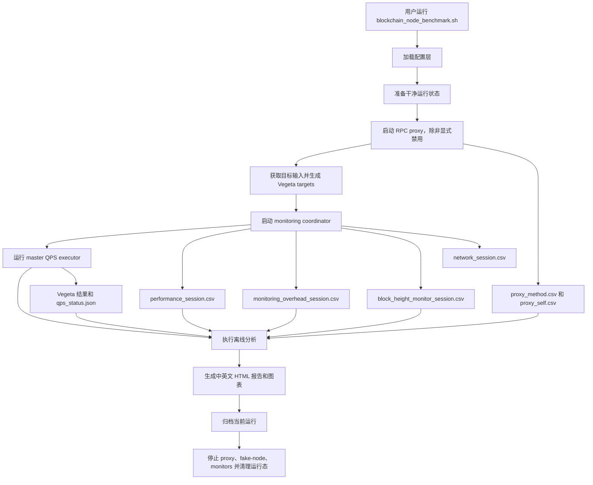
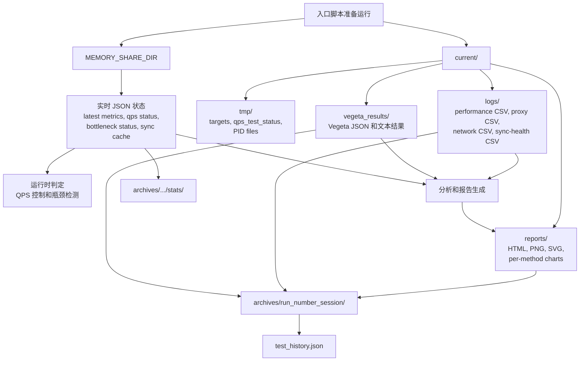
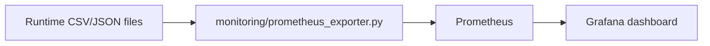

# 框架流程与数据生命周期

[中文](framework-flow.md) | [English](../en/framework-flow.md)

本文档描述 `blockchain-node-benchmark` 当前维护中的端到端运行路径：从入口脚本、
RPC workload 生成、监控采集，到 HTML 报告、归档和可选 Prometheus/Grafana
数据流。

关键入口：

- `blockchain_node_benchmark.sh`
- `config/config_loader.sh`
- `core/master_qps_executor.sh`
- `monitoring/monitoring_coordinator.sh`
- `monitoring/unified_monitor.sh`
- `monitoring/block_height_monitor.sh`
- `tools/target_generator.sh`
- `analysis/*.py`
- `visualization/report_generator.py`
- `tools/benchmark_archiver.sh`
- `monitoring/prometheus_exporter.py`

## 高层运行流程



框架以文件契约为核心。collector 写入带时间戳的 CSV/JSON，analysis 和 report
按路径消费这些文件，而不是直接调用 collector。

## 文件契约与生命周期



`current/` 属于当前运行，是可丢弃目录。`MEMORY_SHARE_DIR` 存放运行时决策使用
的实时状态，启动和归档后可能被清理。`archives/` 是持久输出边界，保存报告、
日志、Vegeta 结果、选定运行态和 run summary。

## 关键阶段

1. `config/config_loader.sh` 加载 `config/user_config.sh`、provider disk 配置、
   internal/system 默认值、runtime path、deployment mode 和选定 chain template。
2. `prepare_clean_runtime_state` 清理上次运行残留的 symlink、proxy CSV、PID、
   block-height cache、bottleneck 状态和 lock/flag 文件。
3. `tools/fetch_active_accounts.py` 和 `tools/target_generator.sh` 准备 single 或
   weighted mixed Vegeta target。
4. RPC traffic 默认经过 proxy，proxy 写入 `proxy_method.csv` 和 `proxy_self.csv`。
5. `monitoring/monitoring_coordinator.sh` 启动 unified monitor、network monitor、
   block-height/sync-health monitor、cgroup collector 和 disk bottleneck detector。
6. `core/master_qps_executor.sh` 执行 QPS ramp，并写入 Vegeta 结果和 QPS 状态。
7. analysis 和 visualization 消费 CSV/JSON，生成图表和中英文 HTML。
8. `tools/benchmark_archiver.sh` 将 `current/` 移动到 `archives/run_*`，并写入
   `test_summary.json` 和 `test_history.json`。

## 可选 Prometheus/Grafana 流程

Prometheus/Grafana 默认关闭。启用后，exporter 只读取已有运行产物，不查询区块链
RPC，也不写 benchmark 状态。



使用：

```bash
OBSERVABILITY_STACK_ENABLED=true deploy/observability/start.sh
deploy/observability/stop.sh
```

HTML 归档报告仍然是持久 benchmark 产物；Prometheus/Grafana 主要用于运行期间
观察实时状态。
