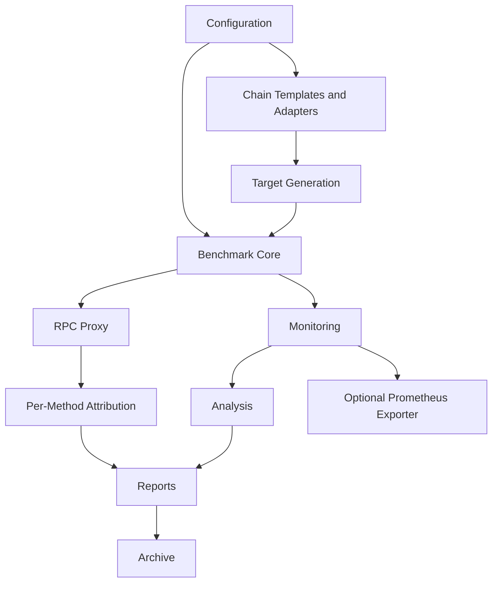
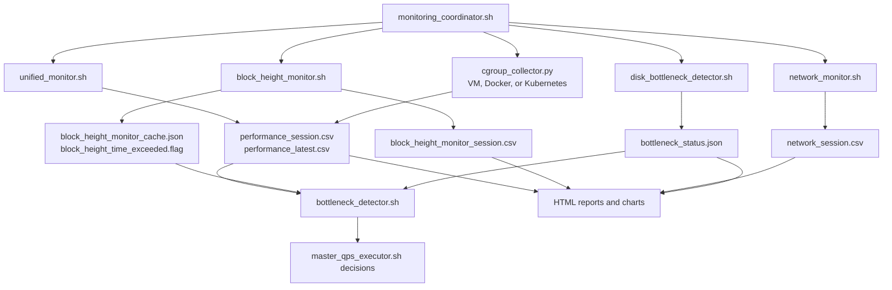

# 模块说明

[中文](module-guide.md) | [English](../en/module-guide.md)

本文档说明当前框架主要模块的职责、输入、输出和扩展边界。

## 模块图



## 源码目录

```text
blockchain-node-benchmark/
  blockchain_node_benchmark.sh      主入口和生命周期 owner
  config/                           用户配置、runtime detection、chain templates
  core/                             QPS executor 和共享 shell 函数
  lib/                              proxy 启动等入口生命周期 helper
  monitoring/                       系统、sync-health、网络、cgroup、overhead collectors
  analysis/                         离线分析和归因脚本
  visualization/                    HTML 报告和图表生成
  tools/                            target generation、fake-node、proxy、archive、audit
  deploy/k8s/                       Kubernetes collector manifests 和验证脚本
  deploy/observability/             可选 Prometheus/Grafana 栈
  docs/                             当前维护的用户/开发者文档
  tests/                            regression、smoke、lifecycle、schema、deployment tests
```

## 配置模块

主要文件：

- `config/user_config.sh`
- `config/config_loader.sh`
- `config/system_config.sh`
- `config/internal_config.sh`
- `config/deployment_mode_detector.sh`
- `config/runtime_paths.sh`
- `config/chains/*.json`

职责：

- 将用户必须配置的值集中在 `user_config.sh`。
- 检测 cloud provider 和 runtime mode。
- 解析 VM/Docker/Kubernetes host path。
- 注册输出目录和运行态文件。
- 加载选定 chain template。
- 向 shell、Python、Go proxy 和监控子进程导出配置。

扩展边界：

- 只有用户正常运行必须关心的变量才放进 `user_config.sh`。
- 派生路径和自动检测逻辑不要放进 `user_config.sh`。
- 新链行为应通过 `config/chains/<chain>.json` 和 adapter 增加，不应写入
  shell `case` 硬编码。

## Chain Templates 和 Adapters

主要文件：

- `config/chains/*.json`
- `tools/chain_adapters/`
- `tools/fake-node/configs/*.yaml`
- `tools/fake-node/fixtures/<chain>/*.json`

职责：

- 注册支持的链。
- 定义 single 和 mixed workload method。
- 定义 weighted mixed workload 分布。
- 定义 parameter format、REST path 和 sync-health 模型。
- 为 JSON-RPC、REST、Substrate、Tendermint、Bitcoin JSON-RPC 和 Hedera
  dual family 构造真实请求。
- 保持 fake-node 响应按 `chain + method + fixture` 匹配。

扩展边界：

- 新链如果复用现有请求 envelope 和响应形状，通常只需要新增 chain template 和
  fixture。
- 如果需要新的 envelope、路由、认证或高度解析方式，再扩展 adapter 或新增 family。
- 不能因为两个 method 都有 `address` 或 `tx_hash` 参数就复用响应 fixture。

## Benchmark Core

主要文件：

- `blockchain_node_benchmark.sh`
- `core/master_qps_executor.sh`
- `core/common_functions.sh`
- `tools/target_generator.sh`
- `tools/fetch_active_accounts.py`

职责：

- 校验运行环境。
- 清理启动状态。
- 准备 target 输入数据。
- 生成 single/mixed Vegeta target。
- 启动监控。
- 运行 QPS ramp。
- 根据配置限制或瓶颈条件停止测试。
- 触发 analysis、report、archive 和 cleanup。

## RPC Proxy

主要文件：

- `lib/proxy_lifecycle.sh`
- `tools/proxy/`
- `config/chains/*.json` 中的 `proxy_extraction`

职责：

- 在 Vegeta 与真实节点/fake-node 之间启动本地 reverse proxy。
- 从 JSON-RPC 或 REST 请求中抽取 method name。
- 写入 method、HTTP status、RPC success/failure、request-to-response latency
  和 proxy self metrics。
- 让 per-method attribution 不依赖 backend node。
- Vegeta 压测期间不保存完整 RPC response body，只保存轻量成功/失败摘要。
- 报告使用同一个 proxy latency 字段生成 per-method P50/P90/P99 延迟分位数图。

## Monitoring



职责：

- 由 `monitoring_coordinator.sh` 统一启动和停止监控进程。
- 生成 unified performance CSV、sync-health CSV、network CSV 和 monitoring
  overhead CSV。
- 将最新 JSON metrics 写入 `MEMORY_SHARE_DIR`。
- 支持 VM、Docker、Kubernetes 的 cgroup/container 指标。
- 执行实时瓶颈检测。

扩展边界：

- 新 collector 必须定义生命周期、PID cleanup、CSV schema 和 smoke test。
- collector 输出尽量追加字段，不要破坏按列名消费的 report/analysis。
- Kubernetes 资源必须先通过 `deploy/k8s/` 部署；主入口不会自动创建集群资源。

## Analysis、Report、Archive 和 Observability

- `analysis/` 只消费已有 artifact，不启动 monitor，也不查询节点。
- `visualization/` 生成中英文 HTML、图表、数据质量摘要和缺失数据提示。
- `tools/benchmark_archiver.sh` 在报告生成后将 `current/` 移到
  `archives/run_<number>_<session>/`。
- `monitoring/prometheus_exporter.py` 只读暴露 Prometheus metrics，默认关闭，
  不替代 CSV/HTML 报告。

## fake-node 闭环测试

主要文件：

- `tools/fake-node/`
- `tools/fake-node/record_rpc_fixtures.sh`
- `tools/fake-node/check_fixture_coverage.py`
- `tools/fake-node/runtime_probe.py`
- `tools/fake-node/runtime_probe_block_height.py`

新增 workload RPC method 时，应同时补 fake-node mapping 和真实录制 fixture；
placeholder 不能被视为生产质量 fixture。
